# Architecture and design

These are living design documents. They describe the intended composition and
security boundaries, but may also record implementation status. Treat an
unqualified design statement as direction, not proof that the feature exists;
consult the [manual status appendix](../manual-v2/charlotte.pdf) and
[`reference/`](../reference/README.md) for implemented contracts.

The system keeps kernel mechanism, isolated services, generated application
logic, and external managed infrastructure at explicit boundaries.

## Core architecture

- [Sitas and Xous co-design](sitas-xous.md) — capabilities, endpoints, memory
  objects, completion queues, isolated services, and shard-local execution.
- [Networking](networking.md) — native message-oriented distributed services,
  transport layering, discovery, and compatibility networking.
- [Distributed L2 ingress](distributed-l2-ingress.md) — one cluster TCP VIP,
  Raft-derived backend eligibility, rendezvous flow placement, direct server
  return, membership epochs, and bounded failure semantics.
- [Async syscall ABI](async-syscall-abi.md) — the evolution of the completion
  capability ABI; its early proposal sections are historical and its later
  sections record the implemented prototype.
- [Persistent storage](persistent-storage.md) — block protocol, userspace NVMe,
  object storage, and Raft persistence.
- [Live upgrade](live-upgrade.md) — supervisor-mediated state handoff and
  generation replacement.

## Security and cluster direction

- [Authorization policy](authorization-policy.md) — controlled capability
  issuance and the policy/name-service boundary.
- [Cluster artifacts and placement](cluster-artifacts-and-placement.md) —
  signed artifact admission, placement records, and honest remaining limits.
- [Deployment secrets and the development/operations boundary](deployment-secrets-and-operations.md)
  — independently authorized artifacts and encrypted operational connector
  bindings, including implementation status and rollout plan.
- [Real-hardware roadmap](real-hardware-roadmap.md) — progression from QEMU
  server models to SystemReady hardware.
- [EL2 capability root](el2-capability-root.md) — an exploratory security
  design, not an implemented contract.
