# Cluster artifacts, blessing, and placement

This note records the implemented trust, notification, pull, and placement
model, and separates it from the remaining cluster vision in manual Chapter
19.

## Artifact admission

Cluster nodes do not build software or resolve package dependencies. A host
build produces self-contained, architecture-native ELFs in separate AArch64
and x86-64 bundles. Every staged name must occur exactly once in
[`artifact-policy.tsv`](../../crates/catten-services/artifact-policy.tsv), then
`tools/cluster-sign` writes a CLS2 `SHT_NOTE` record and signs the resulting
ELF with the off-cluster Ed25519 private key.

CLS2 signs these fields together with all other ELF bytes:

| Field | Purpose |
|---|---|
| logical name | prevents a signed artifact from being substituted under another store/service name |
| artifact class | distinguishes ordinary services, bootstrap code, drivers, and administration code |
| release and rollback counter | provides a monotonic policy input for future update/rollback enforcement |
| policy flags | includes explicit permission for parallel instances, statelessness, and no runtime code fetch |
| signing-key id | prevents ambiguous interpretation under the wrong trust anchor |
| provenance digest | optionally links the ELF to a retained SBOM, source attestation, or build statement |
| Ed25519 signature | authenticates the metadata and the complete ELF, with only this field zeroed while hashing |

This does not certify that third-party code is correct. It does make the
admission decision explicit and reproducible. Once admitted, a component and
its bundled dependencies can be exchanged within the cluster as an immutable
object; nodes need not fetch executable dependencies from an Internet package
registry. Production policy still needs SBOM generation, vulnerability review,
reproducible builds, source attestations, and key custody.

## Signed deployment descriptors

The ELF signature and the deployment decision are different trust statements.
An ELF signature binds code to an artifact name. A `CDEPLOY4` descriptor binds
that artifact's complete SHA-256 to an opaque central-object-store key, a
monotonic deployment sequence, a selected node (or zero for automatic
singleton placement), a per-thread stack allocation, a maximum active-thread
count, a cooperative shutdown grace period, and a bounded list of named client (`SEND`/`CALL`) or publication
capability grants. The descriptor is separately signed by the offline cluster
Ed25519 authority. Tampering with placement, an object key, either resource
limit, the shutdown deadline, or a grant therefore fails verification even when the referenced ELF
remains validly signed.

The stack allocation is expressed in 4 KiB pages and inherited by every thread
created in the protected domain. The platform currently accepts 1 through 64
pages (4 KiB through 256 KiB) per thread. It rejects zero, an excessive value,
or a non-canonical descriptor; it never silently clamps the developer's
request. The active-thread limit includes the bootstrap thread and accepts 1
through 64. Publication beyond it aborts the protection domain under the
current fail-closed spawn ABI. Legacy `CDEPLOY1` descriptors remain readable
with the former four-page (16 KiB) and 16-thread defaults. `CDEPLOY2` retains
its signed stack allocation and receives the 16-thread compatibility default.
`CDEPLOY3` retains both execution limits and receives the five-second shutdown
compatibility default. New release tooling emits only `CDEPLOY4` and signs all
three values. Shutdown grace accepts zero through 300,000 milliseconds; zero
selects immediate forced retirement.

This is deliberately a two-role decision. Development and generation know the
component's call depth, local variables, language/runtime needs, expected
concurrency, and time needed to finish or abort in-flight work, so they propose
and review all three resource values in the deployment plan. The deployment
signer approves those requests alongside placement and capability grants. The
kernel then enforces the exact signed limits; an application cannot increase
them after launch.

Descriptors contain no object-store endpoint, bucket credentials, Kafka
credentials, or TLS client identity. The object key is interpreted through a
locally configured S3 connector whose capability and secret profile remain in
the platform service. This makes the intended management-plane flow:

1. CI builds and signs a self-contained ELF off-cluster.
2. CI uploads the immutable ELF to the centrally managed object store.
3. CI signs a small deployment descriptor referring to the object's key and
   digest and declaring its per-thread stack pages, thread quota, and shutdown
   grace period, then
   notifies the cluster with that descriptor.
4. A node pulls through its preconfigured S3 capability, verifies both
   signatures and the digest, and launches the application.

The normal network-enabled service set starts `clusterctl`, the node agent,
and `deployd`. `deployd` accepts a bounded `POST /v1/deployments` on guest TCP
port 7444. Its body is exactly one signed descriptor; no upload bytes or
credentials traverse Raft. Under QEMU's default user network, host port
`${CATTEN_DEPLOY_HOST_PORT:-8081}` forwards to this listener. The host tool can
submit it directly:

```text
cluster-sign deployment-notify orders.cdep 127.0.0.1:8081
```

Several generated components can be operated as one readiness wait without
giving the generator or application object-store credentials:



```text
cluster-sign deployment-apply 127.0.0.1:8081 120 \
  receive.cdep transform.cdep publish.cdep
```

The compatibility command decodes the complete set and rejects duplicate
artifact names before mutation, then submits each signed descriptor and waits
until every exact generation is ready. Its descriptors are independently
committed, so a later failure can leave an earlier prefix committed; exact
retries are safe because descriptor admission is idempotent.

The preferred multi-component form is a signed release envelope:

```text
cluster-sign release-sign orders.crelease orders 42 <private-key-hex> \
  receive.cdep transform.cdep publish.cdep
cluster-sign release-apply orders.crelease 127.0.0.1:8081 120
```

`CRELEASE` binds a monotonic release identity to the exact ordered descriptor
bytes. The cluster verifies the outer and nested signatures, relays a request
received by a follower to the current leader, resolves automatic placement,
and admits the whole set in one Raft command. Catalog preflight rejects a stale
or conflicting release or component before changing the deployment map; v9
snapshots retain the release record. Admission is atomic, while S3 fetch,
launch, publication, and readiness remain independently reconciled after the
commit. Coordinated rollback and richer rollout policy still require a release
controller.



The listener is intentionally plaintext because the signed descriptor is the
authorization and integrity envelope and contains no secret. Network policy or
TLS termination may still be required to hide deployment metadata and prevent
unauthenticated connection exhaustion. Old signed descriptors cannot roll a
deployment back: `clusterctl` rejects lower sequences and rejects different
bytes at an already committed sequence; an identical notification is
idempotent.

An operator may contact any member. A follower relays the bounded deployment
submission over its source-validated peer route to the current Raft leader and
correlates the committed result back to the ingress request. Automatic
singleton placement is resolved by that leader rather than by whichever node
received the HTTP connection.

`tools/cluster-sign deployment-sign` and `deployment-verify` implement the
canonical bounded wire format used by the kernel and userspace. For example:

```text
cluster-sign deployment-sign orders.cdep orders releases/orders-a5.elf \
  <artifact-sha256> 0 7 16 8 15000 <private-key-hex> \
  kafka/orders/input=call kafka/orders/output=client
```

The private key stays off-cluster. Nodes and `grantctl` hold only the public
verification key.

## Capability-scoped application launch

The scoped launch API consumes a signed ELF and signed descriptor together. It
checks that the descriptor's artifact name and digest match the ELF, copies the
descriptor into a read-only launch profile, and gives the application only a
connection to the node's `grantctl` endpoint. It does not give the application
a name-service connection.

For each acquisition, the application uses the owned
`catten_services::grant_client` helper. `grantctl` verifies the descriptor,
binds its artifact name to the kernel-authenticated caller principal, rejects
stale or conflicting descriptor revisions, and checks the exact named grant.
It then uses its private name-service connection to obtain re-delegable
authority and replies with only the requested `SEND`/`CALL` rights. A service
may instead use an exact `publish` grant to register its endpoint through the
controller without receiving name-service or mint authority. Temporary
re-delegable connections are owned and closed by the controller.

## Enforcement points

Trust is checked more than once because the callers protect different
boundaries:

1. `clusterctl OP_NOTIFY` verifies the descriptor signature, name, target,
   and monotonic sequence before proposing it to Raft. The legacy
   `OP_UPLOAD` path separately verifies the ELF signature and requested name
   before modifying the local object store.
2. The kernel service-store resolver verifies that the object found under a
   name was signed for that name before caching it.
3. A deployment record pins the full SHA-256 of the selected stored bytes, so
   replacing an object at the same name cannot mutate an existing generation.
4. For descriptor deployments, the assigned node agent pulls the opaque key
   through its locally provisioned S3 connector, then verifies the descriptor,
   ELF signature, digest, key, and name before invoking its scoped deployment
   syscall.
5. The kernel consumes and snapshots both memory objects, repeats descriptor,
   name/signature, digest, and ELF validation, and only then maps the exact ELF
   in a new address space with `grantctl` as its sole bootstrap service.

The agent is a desired-state reconciler rather than an artifact-specific
launcher. It enumerates all signed deployment names, launches assignments for
its node, and waits for each spawned ELF to register its own endpoint before
publishing it. Up to 64 deployed domains may coexist on a node. Each is keyed
by the stable principal derived from its full, at-most-48-byte signed name; on
reassignment or generation change the agent aborts and reclaims only that
domain. Endpoint closure drives generation-fenced distributed removal.

The current automatic placement policy is intentionally small: `node_key = 0`
selects the current Raft leader for a singleton descriptor. This removes offline
knowledge of a node key from the common one-replica release flow, but it is not
a general scheduler. Cluster-level planning must next model node capacity,
labels and failure domains, affinity/anti-affinity, replicas, health/readiness,
rescheduling, rollout surge/unavailability, and rollback decisions. Those
decisions belong above the node reconciler and should be committed as desired
state through Raft.

Only the reuse-safe address-space identity selected by the supervisor may use
the spawn/retire syscalls. Merely registering the name `agent` grants no
authority.

## Initial block-device image

`scripts/make-nvme-image.py` writes the blessed bundle into a version-3 object
store. AArch64 embeds the small bootstrap set needed to reach the object store
and reads other service bytes from it on first use. The x86 parity suite
currently embeds its complete tested service set and also stages the same
signed artifacts in the persistent image. The historical script name does not
restrict that image to NVMe: the x86 runner can attach it through NVMe, AHCI,
or virtio-blk.

`scripts/run-aarch64.sh` and `scripts/run-x86_64.sh` fingerprint every blessed
ELF. They recreate an instance image when the fingerprint changes, accept
`--fresh-storage` to force recreation, and require `--reuse-storage` to retain
a stale service store deliberately. The producer detects an object-id
collision within the bundle. The current 48-bit derived name-id remains a
prototype limitation; a production catalog needs collision resolution or full
content addressing.

## Placement contract

`charlotte_launch::placement::PlacementPolicy` represents:

- desired replicas (or every eligible node);
- maximum instances of the component on one node;
- minimum distinct nodes;
- an affinity group for co-locating tightly dependent components;
- an anti-affinity group for separation and availability.

Validation rejects concurrent instances unless CLS2 includes
`FLAG_PARALLEL_INSTANCES`. Co-location is therefore a joint decision between
the blessed component contract and cluster placement state, not an unchecked
operator override.

The distinction matters: dependencies between components may justify placing
one instance of each together, while replicas of the same component may need
separate failure domains. A policy can express both constraints rather than
treating “affinity” as one Boolean.

Agent lifecycle stages are synchronization state, not diagnostic text. The
agent publishes them to its shared status page with release stores and the
kernel verifier consumes them with acquire loads. During cross-node migration,
this guarantees that successful domain retirement becomes visible before the
agent exits, independent of which LP runs the verifier.

## Honest remaining boundary

The current Raft deployment map still contains one active node assignment per
artifact, and the distributed name catalog has one active owner per name. The
policy type and parallel-safety gate are implemented, but a placement
controller, replica-set assignments, multi-owner lookup/load balancing, and
observed-dependency migration are not.

Raft agreement does not authenticate a raw DNS mutation. The network ingress
does: it admits only a descriptor signed by the offline cluster authority and
then enters through the administration service. The raw internal DNS mutation
opcode and legacy local-upload/deploy IPC remain available to trusted tests,
so production policy must ensure ordinary applications never receive those
connections.

The signed notification, follower-to-leader admission relay, Raft descriptor
replication, central S3 pull, grant-controller mediation, and scoped kernel
launch are implemented. The agent handles full 48-byte artifact names and up
to 64 independently reconciled application domains per node. The S3 connector
must still be provisioned separately before notifying the cluster. The management endpoint
now reports generation-safe `committed`, `replacing`, and `ready` rollout
conditions, and the QEMU runner has a RustFS-backed end-to-end deployment
fixture. Multi-owner placement and load balancing, authenticated audit
identities beyond the signing key, and a production release controller remain
open.
