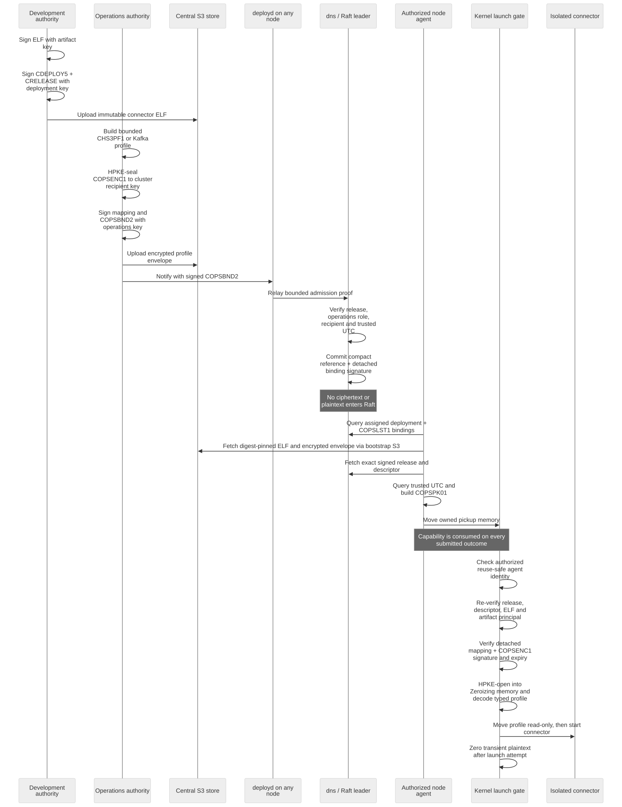

# Deployment secrets and the development/operations boundary

CharlotteOS should let development teams define and sign application behavior
without learning production infrastructure credentials. The operations team
should be able to bind that behavior to managed Kafka and object-store services
without being able to replace the application executable. The cluster is the
run-time authority that joins those two independently authorized inputs and
hands applications only attenuated capabilities.

This document records the target model, the implemented admission and
node-pickup path, and the production hardening that remains. It is not a claim
that private-key custody, rotation, audit, or connector rollout is production
ready.

## Separation of responsibilities

| Role | Supplies | Must not receive |
| --- | --- | --- |
| Development and CI | signed ELF, logical service requirements, protocol and authority shape | production broker/store credentials or cluster decryption keys |
| Operations | environment-specific connector profile, logical-name binding, expiry and rollout policy | artifact-signing private key or application memory |
| Cluster control plane | verification, policy intersection, placement, replay protection and capability grants | either off-cluster private signing key |
| Connector service | one read-only profile and broker/store-facing network authority | authority to grant itself to applications |
| Application | named, attenuated Kafka/S3 endpoint capabilities | connector profile, credentials, CA/client identity, or ambient network authority |

The artifact signature says *this is approved executable behavior*. The
operational signature says *this logical connector may use this environment
binding*. Neither statement is sufficient by itself. Cluster policy intersects
them and mints the capability actually delivered to the application.



Endpoint addresses are often not confidential, but they remain operational
configuration and may reveal network structure. Credentials, private keys and
tokens are confidential. The format treats the complete connector profile as
confidential so operators do not have to maintain two subtly different paths.

## Keys and cryptographic domains

Do not reuse the existing Ed25519 artifact key for encryption. Signing requires
the private key to remain with the signer and distributes the public key to
verifiers; decryption requires the private key to remain in the destination
cluster. Reusing bytes across algorithms also couples rotation and compromise
domains.

The planned hierarchy therefore has distinct keys:

- an artifact-signing Ed25519 authority held by development/CI;
- an operational-binding Ed25519 authority held by operations;
- an X25519 HPKE recipient key whose private half is available only inside the
  cluster's privileged provisioning boundary.

They may be issued and audited under the same organisational PKI or KMS, but
they are different keys with different policies. Production deployments should
ultimately seal the cluster recipient private key to measured boot, an HSM/KMS,
TPM, Arm CCA realm, or equivalent facility. A file-backed key is development
tooling, not the final custody design.

## End-to-end flow

```text
development / CI                         operations
  build ELF                                select Kafka/S3 service
  sign immutable artifact                 prepare connector-only profile
  declare logical requirements            bind cluster + exact release
          |                                encrypt to cluster HPKE key
          |                                sign with operations key
          +-------------------+--------------------+
                              |
                    cluster admission controller
                    verify both authorities
                    enforce sequence/expiry/policy
                    commit desired state
                              |
                    privileged secrets boundary
                    decrypt directly into bounded,
                    transient launch memory
                              |
                    connector gets profile;
                    application gets only a
                    role-attenuated capability
```

Transport TLS is still required where peer authentication, traffic-analysis
resistance or denial-of-service controls matter. Envelope encryption protects
the profile while it crosses storage, release tooling, ingress and replicated
state; TLS protects each live connection. They solve different problems.

## Implemented foundation: `COPSENC1`

`charlotte_launch::operations` now defines a bounded, `no_std` operational
profile envelope. `cluster-sign` can generate separate keys, seal a profile,
verify its signature and open it for development testing.

The version-one suite is RFC 9180 HPKE base mode with
X25519/HKDF-SHA-256/ChaCha20-Poly1305, followed by an Ed25519 operational
signature. The authenticated and signed context includes:

- a nonzero monotonic sequence and Unix expiry time;
- connector kind (`s3` or `kafka`) and printable logical profile name;
- a nonzero 32-byte cluster identity;
- the exact nonzero release-envelope SHA-256;
- recipient and operational signing key identifiers;
- all ciphertext and HPKE material.

Profiles are nonempty and at most 64 KiB; names are at most 256 bytes; lengths
are checked before allocation or decryption. Authentication failure zeroes the
caller-provided plaintext slice. The envelope deliberately contains no generic
key/value parser: after admission, the selected connector's existing bounded
profile decoder remains the format authority.

For a local tooling exercise, create distinct operational signing and cluster
recipient keys, then seal an existing connector profile:

```sh
cluster-sign operations-signing-generate ops-signing.key ops-signing.pub
cluster-sign operations-recipient-generate cluster-recipient.key cluster-recipient.pub
cluster-sign operations-seal kafka-orders.cops kafka/orders/transactional kafka \
  <cluster-id-hex> <release-sha256> 1 <expires-unix> \
  cluster-recipient.pub ops-signing.key kafka.profile
cluster-sign operations-verify kafka-orders.cops ops-signing.pub
```

Secret key files are created with mode `0600`; public files use `0644`. The
tool refuses to replace existing key files. Real key generation and envelope
creation should move behind organisational KMS/HSM APIs rather than exporting
private keys to a CI workspace.

`operations-open` exists to test interoperability and recovery policy. It
writes a newly created `0600` file. It is not the intended cluster interface:
the cluster must decrypt into transient owned memory and consume that memory in
a connector launch without publishing plaintext to a filesystem or ordinary
service API.

## Joining development and operations: `COPSBND2`

An operational envelope binds the SHA-256 of an exact, already signed
`CRELEASE`. Putting the operational-envelope digest back into that same release
would create a cryptographic cycle. CharlotteOS therefore does not extend
`CRELEASE1` with secret-profile references.

`charlotte_launch::operations_bundle` instead defines `COPSBND2`, a separate
operator-signed admission proof. It contains:

- the exact signed release;
- a nonzero monotonic revision of the complete operational set;
- the cluster and recipient identities;
- up to eight signed encrypted envelopes;
- for each envelope, the exact connector artifact receiving it and the opaque
  central-object-store key from which a node will later fetch it.

The outer operational signature prevents an intermediary from remapping a
valid profile to another connector or object key. Each mapping also carries a
detached operational signature over its compact cluster/release/bundle
context, connector target, object key, and envelope digest. That small proof
is replicated with the reference, allowing the final kernel gate to verify the
mapping without putting the full bundle or ciphertext in Raft. Verification checks both
independent signatures, the cluster, recipient, exact release digest, expiry,
unique profile/target/object names, and that every target is a component of the
release. The bundle is bounded to 1 MiB and is an admission transport proof,
not replicated state.

`cluster-sign operations-bundle-sign` and `operations-bundle-verify` implement
the host-side format. Bundle creation takes target/object/envelope triples:

```sh
cluster-sign operations-bundle-sign orders.copsbundle 1 <cluster-id-hex> \
  <release-public-key-hex> ops-signing.key cluster-recipient.pub orders.crelease \
  kafka operations/orders-kafka.cops kafka-orders.cops
cluster-sign operations-bundle-verify orders.copsbundle <cluster-id-hex> \
  <release-public-key-hex> ops-signing.pub cluster-recipient.pub <now-unix>
```

The replicated catalog now has a version-eleven compact representation for a
verified bundle. It stores the release, bundle digest and sequence, connector
target, profile name, object key, encrypted-envelope digest, expiry, key IDs,
and per-profile sequence. It does not store the large admission bundle,
ciphertext, or plaintext. Updates are atomic with the release deployment,
reject stale/conflicting sequences, retain inactive tombstones, retire bindings
when their release advances, and survive snapshots. Only the DNS leader
constructs this compact command, after full bundle verification against
role-specific launch trust and trusted UTC; ordinary clients cannot submit it
directly.

## Implemented cluster ingress and public trust roles

`CTRUST1` is a fixed, bounded launch-owned public trust configuration. It names
the cluster identity and separate artifact, deployment/release, operations and
X25519 recipient roles. It contains no private material. Reusing the operations
key or recipient key across the other cryptographic domains is rejected. The
development image currently uses its existing Ed25519 development key for both
artifact and deployment roles, but they are separate fields so a production
launcher can provision them independently. Trust-policy rotation is identified
by a nonzero sequence; replicated rotation policy remains future work.

`deployd` accepts `COPSBND2` at `POST /v1/operations`, and the host tool exposes
`operations-bundle-notify`. A request may enter through any member. A follower
only validates bounded framing and source-correlated transport; it sends the
complete signed proof to the current leader using 32-bit relmsg v3 framing. The
leader always re-verifies:

- the release authority and every nested deployment;
- the independent operations authority and outer connector mapping;
- cluster ID and recipient public key;
- expiry using the existing NTP-backed time service;
- all structural bounds before constructing the compact Raft command.

Admission fails closed while UTC is unavailable. The relayed proof can exceed
64 KiB but reserves framing room below relmsg's 1 MiB ceiling. Neither the full
bundle nor its ciphertext enters the Raft log.

For the default development cluster, derive its ID and notify an already signed
bundle with:

```sh
cluster-sign cluster-id charlotte
cluster-sign operations-bundle-notify orders.copsbundle 127.0.0.1:8081
```

The version-controlled `dev-operations-key.*` and `dev-recipient-key.*` files
are QEMU fixtures analogous to the existing artifact development key. They
must never be used in a real environment. Production provisioning must replace
the public launch trust and keep both private keys in the responsible
organisational KMS/cluster secrets boundary.

## Privileged object retrieval, decryption, and launch

The node agent now reconciles active operational bindings separately from
ordinary applications. `dns::OP_OPERATIONAL_LIST` returns a bounded `COPSLST1`
view of locally applied compact Raft state: release/profile/target names,
central object key, generations, expiry, key identifiers, and authenticated
digests. It returns neither the encrypted envelope nor plaintext. The agent
uses its separately provisioned bootstrap S3 capability to fetch the exact
envelope and connector ELF, checks their lengths and SHA-256 digests, obtains
trusted UTC from the time service, and reads the signed release and descriptor
already retained by the catalog.

Those inputs are encoded into one bounded `COPSPK01` memory object and moved to
the `SpawnOperationalConnector` kernel gate. The capability is consumed on
every submitted outcome. The gate is callable only by the reuse-safe address
space identity explicitly authorized as the node deployment agent; registering
an endpoint named `agent` does not grant this authority. Before HPKE open, the
kernel independently verifies:

- the role-separated deployment signature on both release and descriptor;
- exact descriptor membership in the signed release and the release digest;
- the CLS2 artifact signature, name, and descriptor digest using the artifact
  authority;
- cluster, profile kind/name, sequence, expiry, recipient/signing key IDs, and
  encrypted-envelope digest against the compact binding;
- the detached compact-binding and operational-envelope signatures;
- expiry against UTC obtained by the authorized node agent immediately before
  invoking the kernel gate.

HPKE plaintext is opened into a `Zeroizing<Vec<u8>>` held by the kernel. The
selected Kafka or S3 bounded profile decoder must accept it before launch. The
supervisor transaction then copies it into a kernel-owned memory object, moves
that capability read-only into the new connector, writes typed length metadata,
and starts the connector only after bootstrap and profile transfer succeed.
The transient kernel buffer is zeroed immediately after the launch attempt.
No plaintext is returned to the agent, name service, catalog, object store,
general application IPC, logs, or status pages. Kafka already used this
immutable profile contract; S3 now uses the bounded `CHS3PF1` wire profile as
well, while retaining manifest decoding only for legacy static boots. Both
connectors zeroize their retained credential/private-key copies on drop.

The default development image installs the version-controlled recipient-key
fixture inside the kernel boundary. Production launchers must instead call
`launch_deployment_plane_with_operational_key` with key material obtained from
their sealed platform/KMS path; `launch_deployment_plane_with_trust` deliberately
installs public verification policy without enabling decryption. The private
key is checked against `CTRUST1`, stored in zeroizing kernel memory, and never
placed in an EL0 manifest.



## Admission and storage rules

The encrypted envelope can be uploaded to the central object store and named by
a release, or submitted directly to a bounded notification endpoint. Upload and
notification are transport choices; admission rules are the security boundary.
The cluster must:

1. verify the independently trusted development and operations signatures;
2. require the envelope's cluster ID and release digest to match admission
   context exactly;
3. reject expired, duplicate-conflicting and non-monotonic sequences;
4. authorize the logical requirement/profile-name binding;
5. store only compact ciphertext references and digests in Raft logs and
   snapshots, and never plaintext in diagnostics or crash dumps;
6. decrypt only on a node selected to launch the connector;
7. transfer the profile through owned, bounded, read-only launch memory, then
   zero the transient plaintext;
8. grant the application only the connector endpoint and role allowed by the
   signed deployment policy.

Operational rotation should install a new connector generation, prove it
ready, move grants, drain the old generation, and then retire its profile.
Rollback must not make an expired or lower-sequence binding admissible again.

## Delivery plan and status

1. **Envelope and host tooling — implemented foundation.** `COPSENC1`, HPKE,
   independent operational signing, strict bounds and codec tests exist.
2. **Role-aware trust configuration — implemented foundation; replicated
   rotation policy not implemented.** `CTRUST1` separately identifies artifact,
   deployment, operations and recipient roles in launch-owned policy. The
   development artifact/deployment roles still share the existing demo key.
3. **Release binding — implemented foundation.** `COPSBND2` avoids a digest
   cycle while joining one exact release to operator-signed encrypted profiles,
   connector targets and central-object-store keys.
4. **Cluster admission and replicated replay fencing — implemented
   foundation.** `/v1/operations`, follower relay, leader-side dual-authority
   verification, trusted-UTC expiry and Catalog V11 compact fences are wired.
   Authenticated transport, admission audit and replicated trust rotation are
   still production-hardening work.
5. **Privileged retrieval, decryption and launch — implemented foundation.**
   The authorized node agent fetches digest-pinned ciphertext and release
   inputs; the kernel re-verifies both public trust roles and release
   membership, opens HPKE into transient zeroizing memory, validates the
   connector-specific profile, and moves it read-only into the connector.
6. **Rotation, recovery and audit — not implemented.** Define recipient-key
   rollover, loss recovery, generation replacement, redacted observability and
   KMS/measured-boot integration.

The bootstrap S3 connector used to retrieve central artifacts and envelopes is
still separately provisioned; otherwise configuring that same retrieval path
would be circular. Connector generation readiness, grant cutover/draining,
recipient-key rotation, and production KMS/measured-boot custody remain the
next operational layer.

## Review checklist

- Are artifact, operational-signing and recipient-decryption keys distinct?
- Is an envelope bound to one cluster and one exact release?
- Can operations change application bytes, or can development select production
  credentials? Both answers must be no.
- Does plaintext ever enter Raft, logs, status output, object keys or application
  IPC?
- Does every failure path zero and release transient plaintext and owned launch
  resources?
- Are sequence, expiry, key rotation and connector-generation rollback rules
  explicit?
- Does the application receive a role-scoped endpoint rather than ambient
  connector or network authority?
