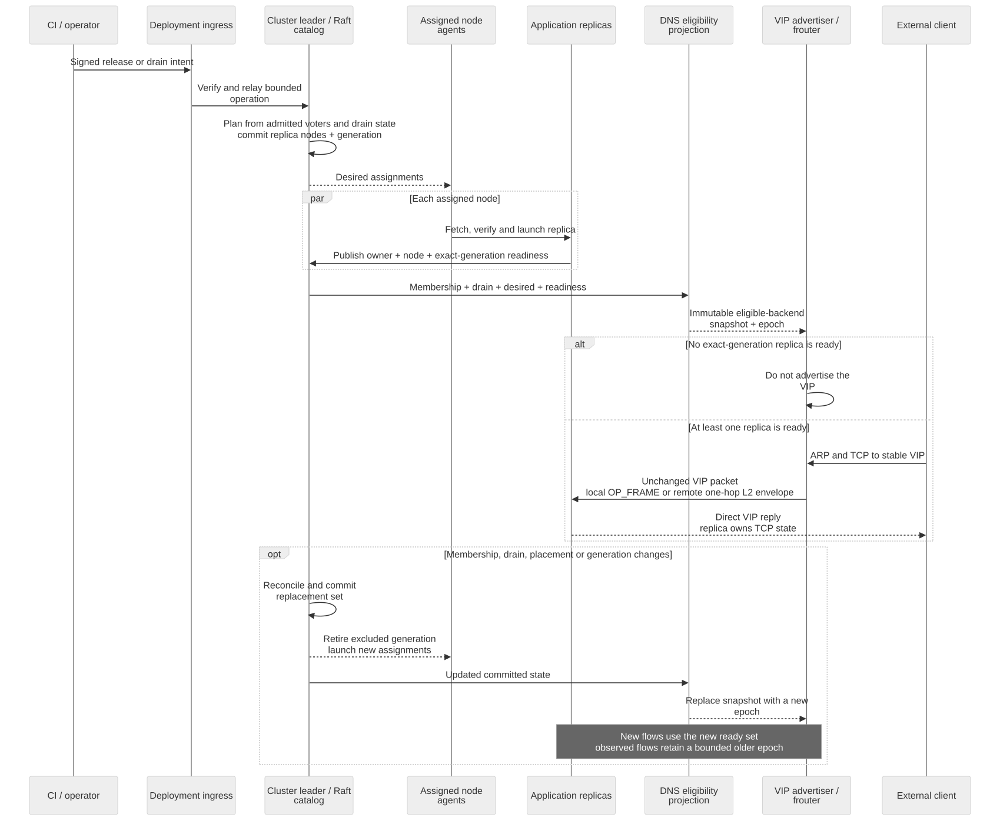

# Distributed L2 ingress and cluster-wide TCP services

Charlotte can expose independently placed TCP services as stable IPv4
`VIP:port` identities while letting admitted cluster members own different
connections. The ingress path does not
terminate TCP. It selects a backend and, when that backend is remote, wraps the
unchanged IP packet in a compact one-hop Charlotte Ethernet envelope before
returning the same moved memory object to the NIC driver. The selected
backend's `smoltcp` instance therefore owns the sole TCP state and replies
directly to the client.

```text
client -> VIP advertiser/frouter -- one-hop L2 envelope --> backend tcpip
client <----------------------- direct VIP reply -------- backend tcpip
```

## A cluster facade, not only a load balancer

Charlotte supports two complementary network identities. A node's DHCP or
static address deliberately identifies that node and remains useful for
node-specific client/server protocols, diagnostics, and infrastructure
integration. A cluster service VIP instead identifies a service placed within
Charlotte without revealing which node admits a packet or owns the resulting
connection.

Direct Server Return is commonly described as a load-balancing technique, and
this implementation does distribute five-tuples across eligible nodes. Its
more important architectural effect for Charlotte is indirection: the external
contract is `VIP:port`, while ingress ownership and execution placement may
move independently behind it. Individual node addresses remain mechanisms of
the cluster, not part of the cluster-addressed application's public identity.

Each service declaration binds a VIP and port to an optional deployed
application name. DNS then intersects admitted members with that application's committed placement
and exact-generation readiness registration. A moved or replaced application
does not remain in the newly derived policy through a stale registration:
eligibility becomes empty after the new placement commits and reappears only
when the target node publishes the matching deployment generation. Routers
learn that policy asynchronously, so this statement describes the committed
projection, not instantaneous convergence at every packet path. Omitting the
application name retains the original platform-service mode in which every
admitted, non-draining member is a backend.



The diagram separates reconciliation from forwarding. Signed operations,
membership, placement, and readiness change a replicated eligibility epoch;
the frame router consumes an immutable projection of that state without making
a Raft call for each packet. Consequently, cluster management decides who may
receive new connections, while DSR decides which eligible replica owns a
particular five-tuple and leaves TCP state at that replica.

## Identities and authority

The service identity is IPv4 address, IP protocol and port. The ingress
identity is whichever committed node currently advertises the VIP. The
execution identity is the backend selected for a five-tuple. They need not be
the same node.

The platform launcher can place the canonical `vips` bootstrap table, and the
operations authority can replace it cluster-wide with a signed committed
policy. Applications receive
socket capabilities; they cannot alter ingress policy, claim readiness for a
different deployment generation, or change cluster membership.

DNS owns the operational Raft member. Its local `OP_INGRESS_MEMBERSHIP`
operation materializes an immutable snapshot containing stable node keys and
the discovery-associated MAC route for every admitted voter. The snapshot
separates that trusted/routable member set from the subset eligible for new
flows. Its argument carries the stable packed service identity, so a table
revision cannot redirect an outstanding query to another service. Every
service has an independent eligibility epoch. When a backend name is configured, that subset contains only nodes selected
by the committed replica set and carrying an active per-node catalog
registration for the exact deployment generation. It therefore yields any
subset from zero through the desired replica count as agents become ready.
DNS returns no snapshot unless every committed member has a route.
Discovery therefore supplies reachability but cannot admit a backend. During
joint consensus the admitted set is the intersection of the old and new voter
sets: a joiner enters only after finalization, while a departing node stops
receiving new work as soon as the joint change commits.

A committed, operator-signed node-shutdown intent attenuates ingress authority
before local teardown: its target remains in the admitted member set, so
existing bindings and authenticated one-hop delivery can continue during the
grace interval, but is removed from the new-flow backend set. If the Raft
leader is draining, the lowest stable eligible node key becomes the temporary
VIP advertiser until membership or leadership catches up. No unsigned local
knob can put a node into or take it out of this state.

## Packet path

`frouter` remains the single owner of `net::OP_RECV`. It polls DNS membership
asynchronously and never calls Raft on the packet path. It extracts protocol,
source and destination IPv4 addresses, and source and destination ports in
place. A fixed deterministic rendezvous hash scores that key against each
stable node key. Input ordering and Rust process-local hash randomization
cannot affect the winner.

If the winner is local, the moved frame follows the existing
`socket::OP_FRAME` path. If remote, `frouter` maps the same memory object
writable, shifts the network packet by eight bytes, and emits EtherType
`0x88b8` with the ingress MAC as source and the backend MAC as destination.
The envelope retains the external source MAC and original EtherType. The
backend accepts that envelope only from a MAC in its current committed member
snapshot, removes it in place, restores the original Ethernet fields, and
delivers the frame directly to its local protocol route. IP, TCP, TCP options,
sequence numbers and payload bytes never change. Every participating node's
TCP/IP service installs the VIP as a `/32` address, separately from its DHCP or
static node address; DSR policy nevertheless forwards new flows only to the
ready backend subset. The selected backend accepts the packet and replies with
the VIP as IP source.

Raft's Vote, AppendEntries and InstallSnapshot traffic uses the separate
private EtherType `0x88b7`. Keeping consensus heartbeats and election votes out
of the reliable-message service prevents application traffic from blocking
cluster liveness. Admission handshakes and DNS application/control messages
continue over `relmsg`. A durable join fence resets standalone log,
state-machine and queued transport state before an anchor's history is
accepted. Append retries that overlap a compacted snapshot are normalized at
the snapshot index, so an old prefix cannot be appended after a retained
suffix.

## Epochs and failure semantics

The load-balancing epoch is a deterministic fingerprint of the committed Raft
configuration index, service name, deployment generation, service-registration
generation, sorted ready-node set, and replicated shutdown-intent generations.
It changes for membership, placement, readiness, or drain-policy changes, but
not for unrelated catalog traffic.
`frouter` retains four membership snapshots and up to 1,024 local
`FlowKey -> epoch` bindings per assigned service. Retransmitted SYNs and later packets retain the
original epoch. Adding a member consequently affects new flows without
remapping observed connections. When a backend is removed, bindings that
selected it are released so a reconnect can use the active set; bindings
owned by surviving nodes retain their older epoch. A draining backend remains
routable and therefore keeps its observed bindings; new SYNs exclude it.

Those properties hold while the required snapshot remains in the bounded
history and after the router has installed the relevant committed projection.
A successful complete refresh grants a five-second monotonic lease for VIP
advertisement and unbound-flow admission. The normal one-second refresh renews
it. DNS supplies a refresh only when its Raft state has current cluster
evidence: a leader must hold recent quorum contact, while a follower must have
successfully matched and applied a recognized leader's log within the previous
second. A rejected AppendEntries heartbeat does not refresh that evidence. A
failed, incomplete, or source-stale refresh may leave the last complete
snapshot in memory for established flows, but lease expiry suppresses ARP
responses and drops every packet without an existing binding. The two-stage
rule bounds authority after cluster contact is lost: the source witness ages
out within one second and the last router lease within a further five seconds.

Snapshot-history eviction remains independent of the flow-table bound. A live
binding whose epoch leaves history is retained as a fail-closed tombstone;
classification drops its packets instead of falling back to the current
snapshot. FIN or RST may retire the binding, and ordinary bounded flow-table
pressure may still evict old state. That latter loss remains an explicit
availability limit: without distributed connection tracking, an ingress node
cannot always distinguish traffic first observed after advertiser failover from
traffic whose local binding was evicted.

This cache is deliberately not distributed connection tracking. Another
ingress participant with the same epoch independently selects the same backend,
so failure of the VIP advertiser alone does not destroy backend TCP state.
Bindings can be lost through bounded eviction or simultaneous membership
change and ingress failure; that is an explicit first-version limitation.
Failure of the selected backend may terminate its TCP connections.

[`CharlotteClusterIngress.tla`](../tla/CharlotteClusterIngress.tla) composes
membership, placement, exact-generation readiness, drain, router snapshots and
flow epochs. Its safe specification now matches the implemented lease and
fail-closed tombstone contract. Negative configurations retain the former
stale-new-flow admission and history-fallback remapping alongside the
stale-readiness regression.

VIP advertisement follows the leader elected by the existing Raft group when
that identity is an admitted, non-draining ingress participant. It need not be
an application backend: the ingress node can forward a flow to whichever node
the placement/readiness set permits. No node advertises the VIP while the
ready-backend set is empty. Other nodes drop VIP ARP requests, including while
no leader or complete snapshot is known. A new advertiser transmits a
gratuitous ARP reply. Loss of the ingress owner can therefore move advertisement
after an ordinary Raft election without changing the backend set or introducing
a second consensus system.

The forwarding envelope is an isolation marker, not cryptographic link
authentication. The receive path checks its source against committed member
routes, which prevents an unadmitted honest peer from becoming a backend, but
a hostile machine able to spoof an admitted MAC on the same L2 segment could
forge it. This first version therefore assumes the cluster-facing L2 is a
trusted or administratively isolated fabric. Authenticated link envelopes,
switch port controls, or a protected overlay are required before exposing that
segment to mutually untrusted hosts.

## Operations-owned service assignment

Production addresses belong to operations configuration, not to the signed
application descriptor. DNS, `frouter`, and `tcpip` therefore share one
canonical, validated assignment table. Each entry is
`service-name=VIP:port`; an unnamed entry retains the platform-service mode.
The QEMU runner exposes this directly as a repeatable option:

```sh
./scripts/run-aarch64.sh release \
  --cluster-service orders=10.0.2.42:443 \
  --cluster-service payments=10.0.2.43:443
```

DNS evaluates placement and readiness independently for `orders` and
`payments`. The router maintains separate leases, snapshot histories, and flow
tables, while TCP/IP installs both addresses as `/32` identities. ARP policy is
evaluated across every service on a VIP, and address-specific `bind_ipv4` and
`listen_ipv4` socket operations allow applications on different VIPs to use
the same conventional port. An application can resolve all identities assigned
to its full artifact name with the ownership-safe `dns::ingress_assignments`
helper, provided its signed descriptor grants the attenuated DNS connection;
it need not compile an environment address into its executable.

The launch table is a bootstrap default, so members should still receive the
same value before the first policy commit. Runtime changes use `CINGPOL1`, a
complete replacement signed by the independent operations authority. It binds
a monotonic sequence, cluster ID, UTC validity interval, and canonical table.
A request can enter through any member; the leader re-verifies signature,
cluster and trusted UTC during the admission window, then commits the envelope
through Raft. The committed desired policy remains active until replacement;
expiry does not withdraw a live VIP. Lower
sequences and conflicting bytes at an existing sequence are rejected; exact
retries return the existing generation. An empty signed table explicitly
withdraws every cluster identity.

After application, DNS serves only the committed table. `frouter` reconciles
states by packed `ServiceId` and backend artifact, preserving snapshots and
flows only for unchanged bindings and dropping state for withdrawn or rebound
identities. `tcpip` independently
reconciles its `/32` addresses. Applications using exact-address listeners
poll `dns::ingress_assignments` and rebind when their assignment changes.
Catalog-v14 snapshots retain the signed policy and replay fence.

Both bootstrap and committed formats currently hold at most 16 entries. This
guarantees that 16 maximum-length names fit the 1 KiB table bound and is not a
DSR or Raft limit.

## Bounds, diagnostics and validation

The implementation supports up to 16 bootstrap- or Raft-configured IPv4/TCP services and
at most 64 admitted members. Signed node shutdown supplies the first graceful
drain trigger; a standalone service-drain operation and automatic failed-member
removal are not implemented. Service-specific replica sets and multiple VIPs
are implemented; IPv6 neighbour advertisement and transparent TCP state
migration remain extension points. Application state restoration can
support reconnect-and-resume semantics, but application serialization does not
include TCP sequence, retransmission or congestion-control state.

The frame-router status reply and shared status page expose the first service's current epoch,
admitted-member, eligible-backend and derived draining counts, advertiser node
key, aggregate local/remote/drop counters, total retained flow-binding count,
and configured service count. Unit tests
cover deterministic selection, distribution, join, drain and removal
behaviour, ingress replacement, exact packet preservation and ARP construction.
The AArch64 SLIRP demonstrator serves the HTTP keyhole
through `10.0.2.42:80`, proving VIP ARP, local selection and direct smoltcp
delivery.

`scripts/run-distributed-ingress-test.sh` builds a three-guest stream-LAN plus
an independent host-side Ethernet/TCP participant. The fixture waits for one
stable three-voter configuration, establishes flows selected across all three
backends, kills the Raft leader/VIP advertiser, observes replacement
advertisement and gratuitous ARP, and issues HTTP on the already established
connections. It then opens fresh five-tuples and requires a complete HTTP
exchange with a surviving backend, covering reconnect after loss of the
original advertiser and one connection owner. A failed voter remains eligible
until an explicit committed membership change removes it, so the probe uses a
bounded family of new flows: some may still select the failed node, while at
least one must reach a live member. The observed two-survivor election can need
multiple split-vote rounds, so faster failover remains a tuning and pre-vote
work item rather than a claimed property.

For an operational AArch64 bootstrap, pass the same assignment to every member:

```sh
./scripts/run-aarch64.sh release --cluster-service 10.0.2.42:80
```

This option configures the runtime service; it does not register a verifier.
To bind new-flow eligibility to a deployed application and its readiness fence,
name the assignment:

```sh
./scripts/run-aarch64.sh release \
  --cluster-service orders=10.0.2.42:8080
```

Before `orders` is committed, ready, and installed in a complete router
snapshot, no freshly initialized node advertises this VIP. During a move, the
committed policy makes new flows wait for the new exact generation and retained
epochs preserve observed flows. A router that cannot refresh can presently
continue using retained epochs for bound flows, but its five-second lease stops
VIP advertisement and admission of unbound traffic.

To replace bootstrap policy without restarting nodes, derive the cluster ID,
sign a bounded policy off-cluster, verify it, and notify any member:

```sh
cluster-sign cluster-id charlotte
cluster-sign ingress-policy-sign ingress.cing 7 NOT_BEFORE_UNIX EXPIRES_UNIX \
  CLUSTER_ID operations-private.hex \
  orders=10.0.2.42:443 payments=10.0.2.43:443
cluster-sign ingress-policy-verify ingress.cing CLUSTER_ID operations-public.hex
cluster-sign ingress-policy-notify ingress.cing 127.0.0.1:8081
cluster-sign ingress-policy-status 127.0.0.1:8081
```

Use `--clear` instead of assignments to create an authenticated withdrawal.

Run the complete multi-node validation separately:

```sh
./scripts/run-distributed-ingress-test.sh
```
