A coherent CharlotteOS figure set answers eleven different questions, from broad structure down to resource
lifetime, external integration, and application delivery.

### 1. System layering

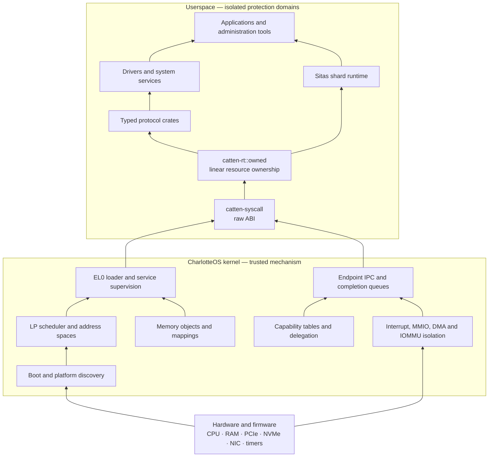

The kernel supplies isolation and bounded mechanisms; service policy, storage, networking, naming, consensus, and
applications remain outside it.

### 2. Kernel anatomy and userspace boundary

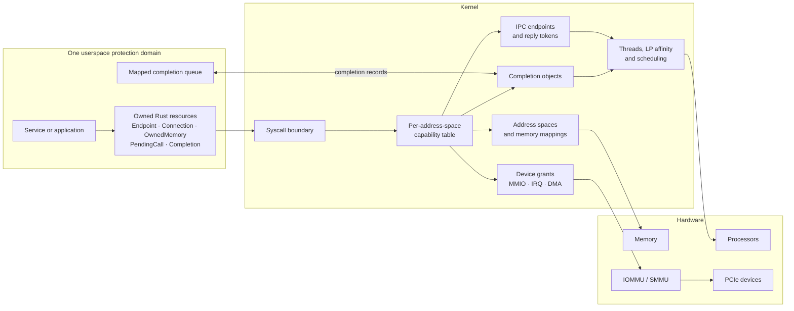

Capabilities are scoped to an address space; userspace cannot directly name another domain’s kernel objects.

### 3. Steady-state service composition

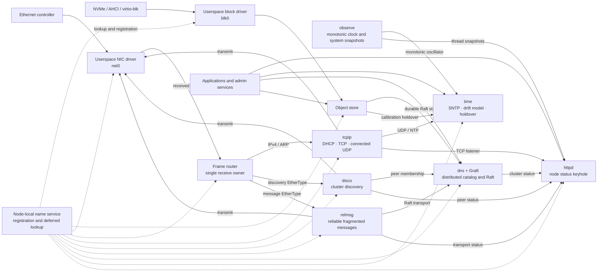

Launch order is not the dependency mechanism: services register with the name service and deferred lookups wait
until dependencies appear.

### 4. Ordinary boot versus optional testing

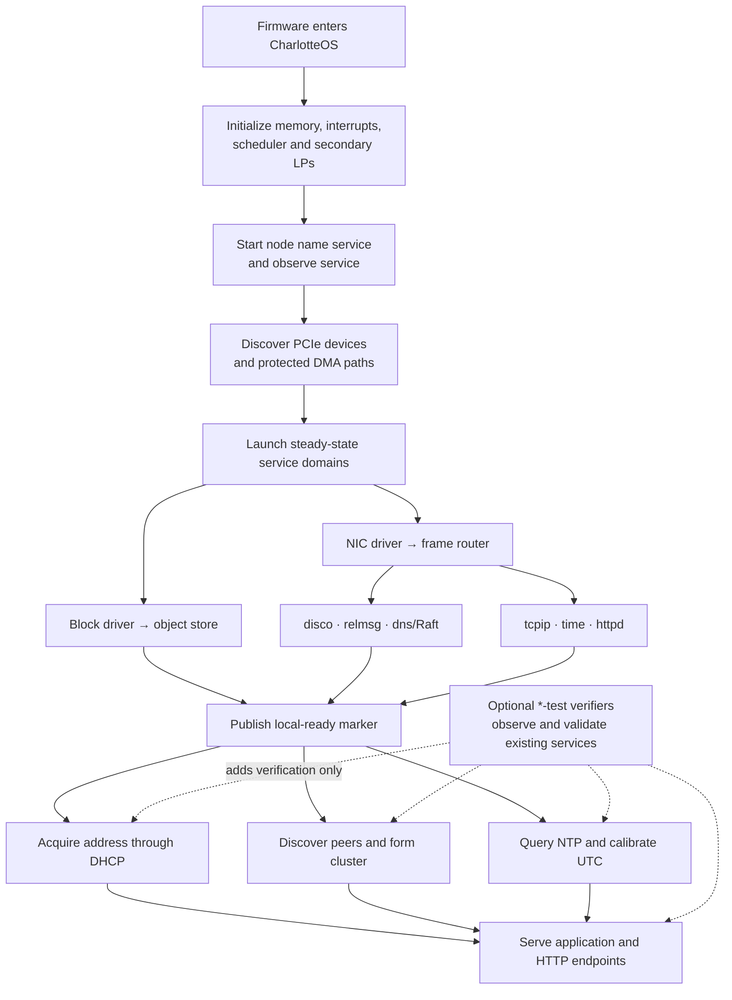

Networking, DHCP, discovery, cluster formation, UTC synchronization, and HTTP are normal boot behavior. Test
switches add validators; --no-network removes the network-dependent composition.

### 5. Capability-safe IPC call

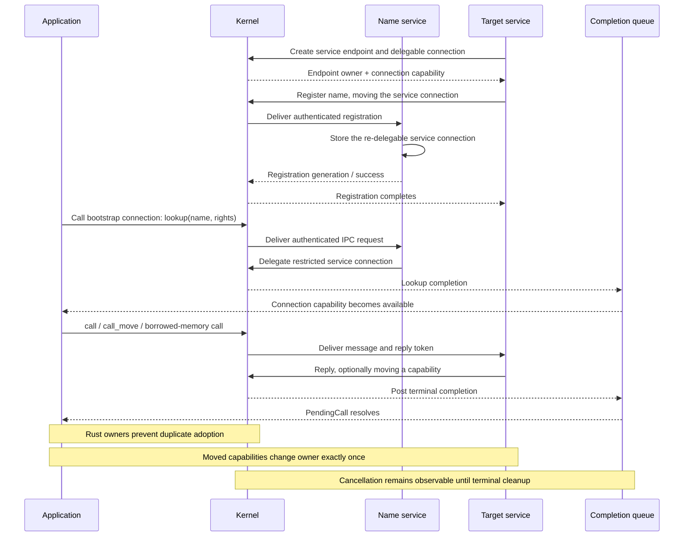

This depicts why application code uses catten_rt::owned: Rust ownership mirrors capability ownership across the ABI.

### 6. Two-node cluster

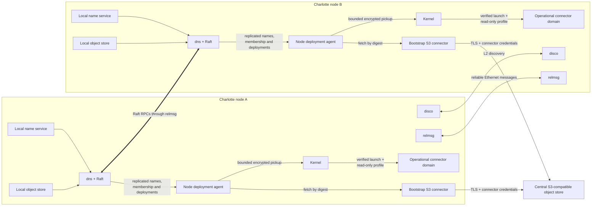

This separates three kinds of state: node-local connection registration, locally durable Raft state, and immutable
deployment artifacts and encrypted operational profiles held in a central S3-compatible store. The replicated catalog
contains desired deployment state plus compact, signed ciphertext references—not connector credentials. The selected
node fetches digest-pinned inputs through a separately provisioned bootstrap S3 connector before the bounded pickup
crosses into the kernel’s trusted verification, decryption, and loader path.

### 7. Secrets and attenuated external-service capabilities

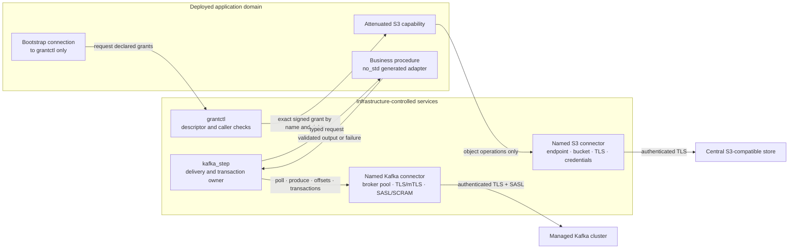

Network locations, trust roots, user names, passwords, and Kafka transactional authority stay in infrastructure-owned
connector profiles. The application receives only the narrow capability named by its signed deployment descriptor.
For a transactional Kafka step, `kafka_step` owns the delivery and transaction resources and invokes the procedural
application; the application never receives the Kafka connector capability.

### 8. Signed atomic release admission and rollout

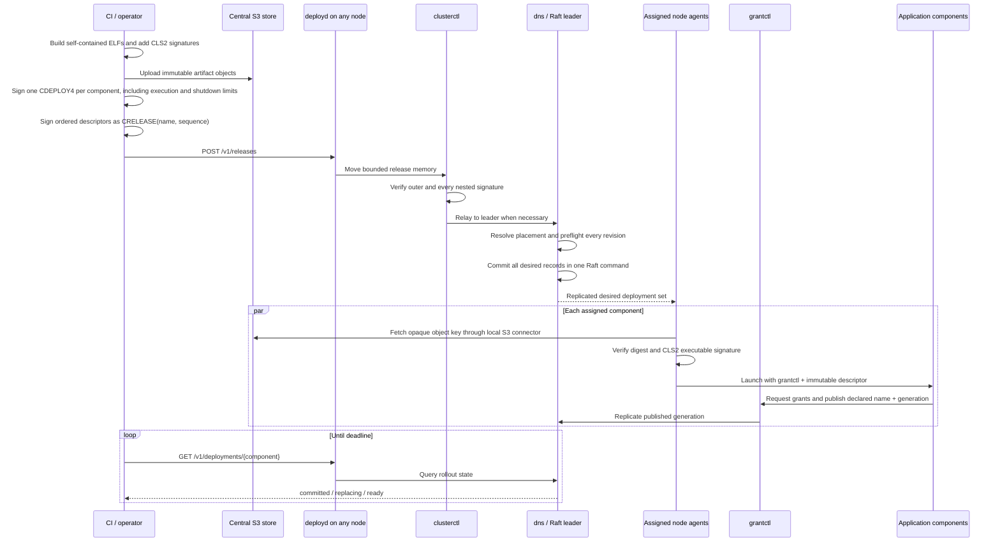

The `CRELEASE` envelope binds a monotonic release identity to the exact ordered `CDEPLOY4` bytes. Admission is atomic:
all component revisions enter the replicated desired state or none do. Readiness is deliberately not claimed to be
simultaneous—fetch, verification, launch, capability acquisition, and publication occur independently after commit.
Coordinated rollback, progress deadlines, and failure-domain-aware rescheduling remain controller work.

### 9. Privileged operational-profile pickup

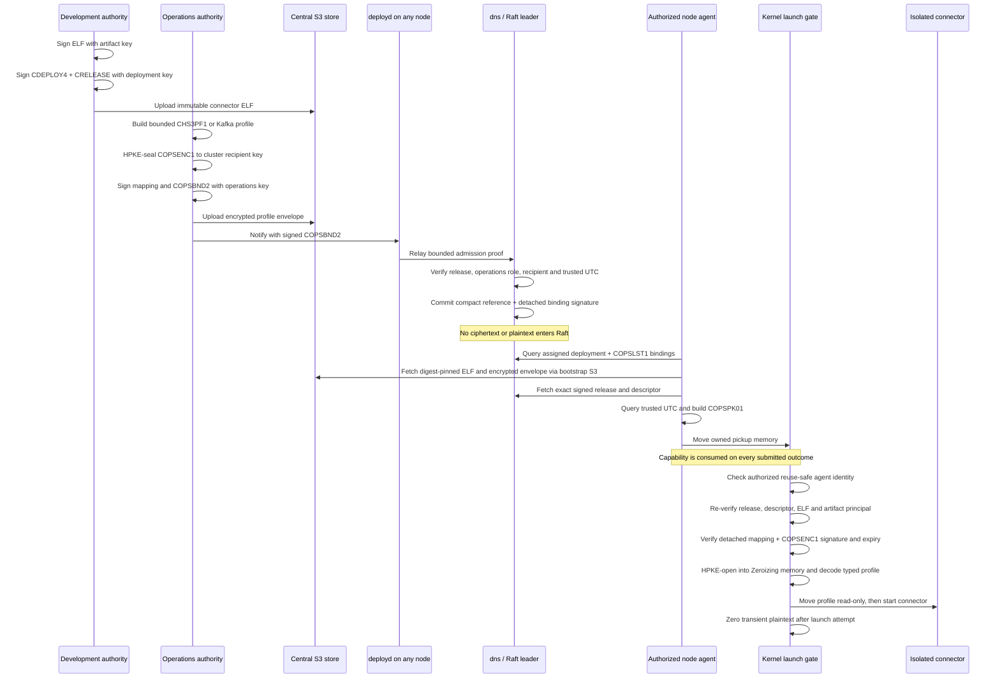

The application and node agent never receive plaintext infrastructure credentials. Only the kernel’s privileged
launch gate opens the envelope; the connector receives one immutable, policy-bounded profile. The bootstrap S3
connector is provisioned separately because the mechanism used to retrieve operational profiles cannot configure
itself without introducing a circular dependency.

### 10. Role-separated deployment trust and capability chain

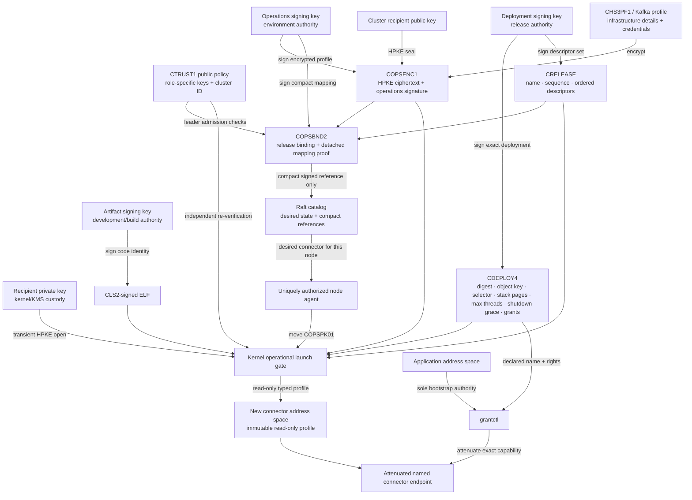

Development can choose code and logical requirements but cannot select production credentials. Operations can bind
those requirements to managed infrastructure but cannot replace application bytes. Raft establishes cluster-wide
ordering, the reuse-safe node-agent identity controls entry to the launch gate, the kernel retains the recipient private
key and re-verifies every role, and `grantctl` exposes only the descriptor-authorized endpoint to the application. No
single key or mechanism substitutes for the others.

### 11. Durga-to-Charlotte application generation

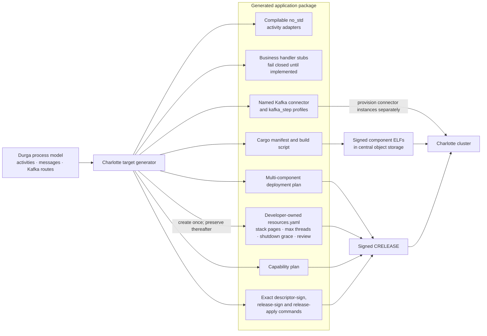

Durga now generates the Charlotte-specific scaffolding and an actionable component release plan, but it does not invent
business behavior: developers still implement the generated fail-closed handlers. Deployment also remains blocked until
the retained execution-resource values have been reviewed. The present `CRELEASE` binds concrete executable deployment
decisions. A richer semantic bundle could additionally bind the original process model, schemas, provenance,
communication graph, replica policy, affinity rules, and update strategy. Connector profiles are infrastructure inputs,
not application-visible release secrets; descriptors bind only the names and rights an application may request.
Per-thread stack pages and maximum active threads originate in the retained, developer-reviewed
`charlotte/resources.yaml`, are signed into `CDEPLOY4`, and are enforced exactly for the protected domain rather than
guessed or silently clamped by the cluster.

### 12. Bounded cooperative domain shutdown

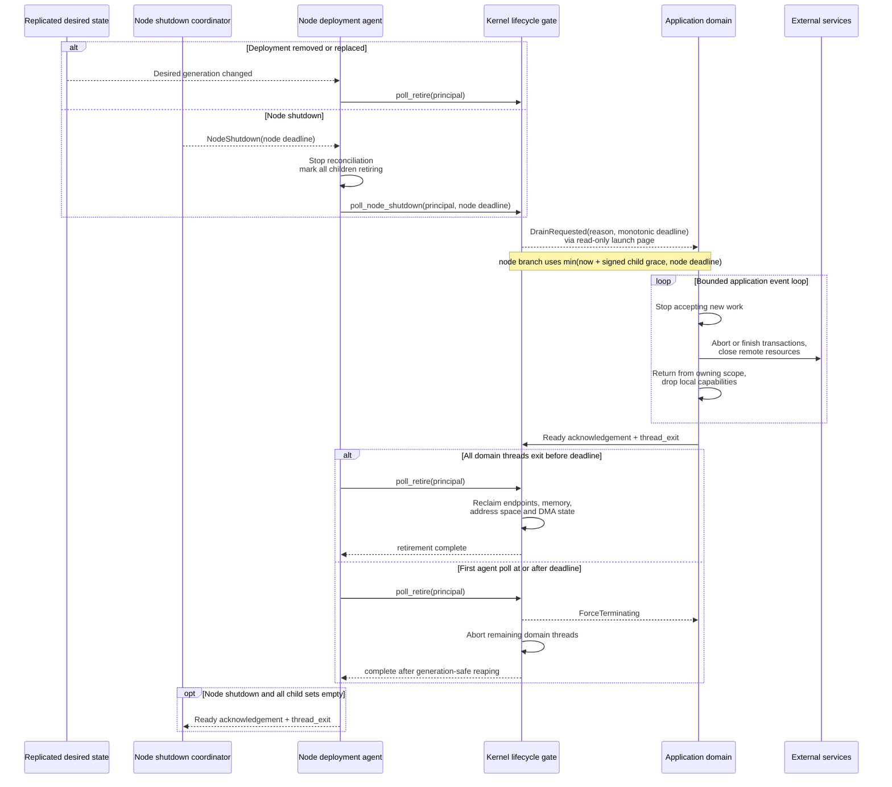

The cooperative request is kernel-authenticated because the application maps its launch page read-only. The signed
`shutdownGraceMillis` value is bounded by admission policy; the application cannot clear the request or extend its
deadline. `thread_exit` does not unwind Rust, so the generated and hand-written application pattern returns from the
resource-owning serving function before calling `ShutdownRequest::complete()`.
For node shutdown, the agent stops admitting new generations and propagates the enclosing deadline to every ordinary
deployment and operational connector before acknowledging its own request.
