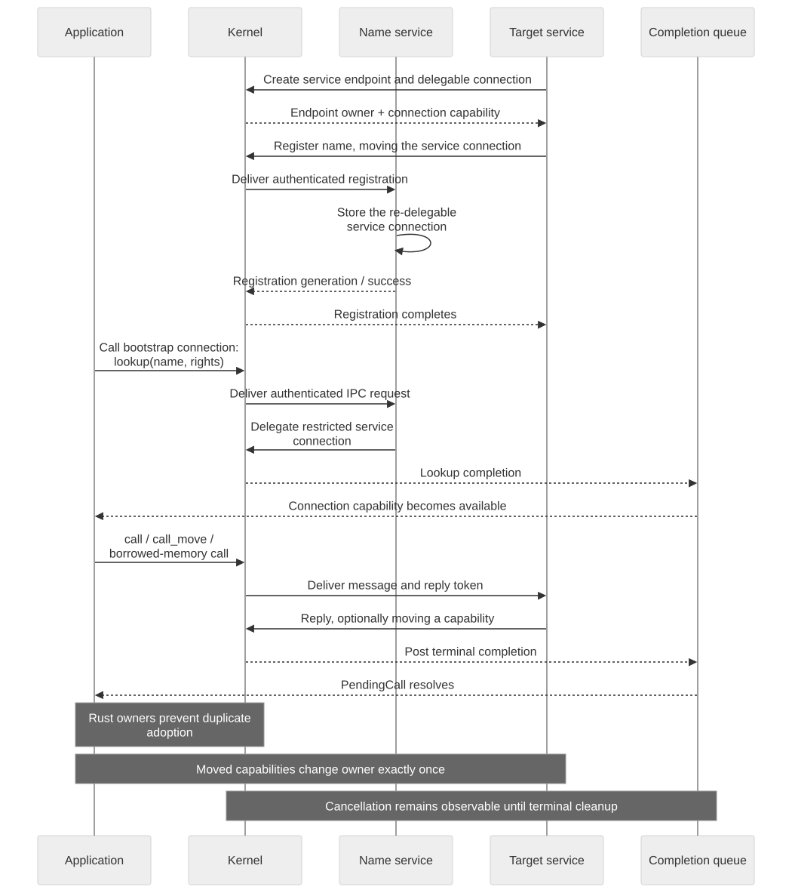

# Userspace resource ownership

CharlotteOS application code uses Rust ownership to mirror kernel capability
ownership. Every closeable resource has exactly one owning Rust value. Normal
error propagation then performs cleanup automatically.

The raw functions in `catten-syscall` describe the register ABI. They are not
the normal service-development API. Use `catten_rt::owned` in services and
applications.



## Resource types

| Resource | Owner | Drop behavior |
|---|---|---|
| Memory object | `OwnedMemory` | Closes the capability |
| CPU mapping | `MappedMemory<ReadOnly>` or `MappedMemory<Writable>` | Unmaps, then closes the memory |
| Immutable launch profile | `LaunchMemoryRef` / `MappedLaunchMemory` | Borrows the launch grant; mapping unmaps without closing it |
| Endpoint | `Endpoint` | Closes the endpoint |
| Owned connection | `Connection` | Closes the connection |
| Launch-owned connection | `ConnectionRef` | Does not close the launch grant |
| Pending IPC call | `PendingCall` | Cancels/closes the call and revokes loans |
| Received request | `IncomingMessage` | Releases every unconsumed attachment |
| Reply authority | `ReplyToken` | Closes an unused reply token |
| Completion | `Completion` | Cancels, waits for terminal state, then closes |
| Asynchronous buffer read | `ReadOperation` | Cancels and waits before releasing the Rust borrow |
| Remote TCP/IP socket | `socket::OwnedSocket` | Best-effort protocol close; `close(self)` reports errors |
| Verified client TLS stream | `tls_client::OwnedTlsStream` | Drops TLS state, socket, and both record buffers in dependency order; `close(self)` reports shutdown errors |
| Scoped application domain | `DeployedArtifact` | Fences retirement by signed artifact principal; `poll_retire` reports drain completion and `Drop` requests best-effort retirement |
| MMIO/interrupt/DMA | `MmioRegion`, `Interrupt`, `DmaTransfer` | Reverses the exclusive device operation |

All owning types are non-`Copy` and `#[must_use]`. Moving a value transfers
ownership. Dropping it releases ownership.

## Memory and IPC example



The target service first creates its endpoint and transfers a re-delegable
connection to the name service. Applications can then resolve an attenuated
connection and perform calls whose transient resources remain owned until a
terminal completion.

```rust
let memory = OwnedMemory::allocate(1)?;
let mut mapping = memory.map_writable().map_err(|(_, error)| error)?;
mapping.as_mut_slice()[..payload.len()].copy_from_slice(payload);
let memory = mapping.unmap().map_err(|(_, error)| error)?;

// Success transfers memory. Submission failure returns the still-owned value.
let reply = connection
    .call_move(OP_SEND, payload.len() as u64, memory)
    .map_err(|(_, error)| error)?;
let result = reply.wait()?;
```

There is no `memory_close` branch. A mapping owns its memory object, and the
compiler prevents moving the memory until `unmap` consumes the mapping.

For a borrow, pass `&memory` or `&mut memory` to `call_borrow_read` or
`call_borrow_write`. `PendingCall<'memory>` retains that borrow until the reply
is observed or the call is dropped, preventing concurrent CPU access.

## Server example

```rust
match endpoint.try_receive()? {
    None => {} // queue drained
    Some(message) => {
        if let Some(reply) = message.reply {
            match message.opcode {
                OP_STATUS => reply.reply(status)?,
                _ => reply.reply(ERR_BAD_OPCODE)?,
            }
        }
    }
}
```

`IncomingMessage` owns its received memory, connection, and reply token.
Ignoring an attachment is safe: it is released when the message is dropped.
Reply methods consume `ReplyToken`, making double replies impossible.

Services that authorize requests from the caller's artifact identity or
supervisor role must receive with `Endpoint::receive_authenticated()` (or its
non-blocking `try_receive_authenticated()` form). These methods preserve the
kernel-authenticated sender generation, principal, and roles in
`IncomingMessage`. The legacy `receive` methods intentionally leave that
authority envelope empty for ABI compatibility and must not be used as an
authorization source.

## Multi-step and remote operations

An operation spanning reactor iterations must own its resources:

```rust
struct RequestAttempt<'connection> {
    receive: PendingCall<'static>,
    socket: socket::OwnedSocket<'connection>,
    deadline_ticks: u64,
}
```

Store the operation in `Option<RequestAttempt>`. Taking or replacing the value
cancels the pending call and closes the socket on every exit path. Declare or
explicitly drop dependent fields in the required shutdown order.

A remote ID is not a kernel capability. Releasing it requires a protocol call,
which can block or fail. Its owner therefore provides `close(self)` for normal
operation and uses `Drop` only as a leak-prevention fallback. Errors from
`Drop` cannot be reported.

For TLS clients, use `catten_services::tls_client::OwnedTlsStream`. Its
constructor consumes an `OwnedSocket` and requires a server DNS identity, DER
trust anchor, synchronized Unix time, entropy service reference, and bounded
socket retry policy. The wrapper is deliberately the only owner of the
self-referential TLS connection and record buffers. Do not reproduce its raw
buffer-pointer lifetime pattern in individual services or add plaintext retry
after a failed handshake.

Deployment agents use `launch_scoped_artifact_named`, which consumes both the
ELF and signed descriptor memory and returns `DeployedArtifact`. Keep that
owner in the reconciliation record until `poll_retire` returns `Ok(true)`.
Do not keep only the returned ASID or call the retirement syscall directly:
the principal-bound owner prevents one rollout from retiring another domain
after ASID reuse.

## Raw boundary rules

Raw adoption is occasionally necessary at a launch or hardware ABI boundary:

```rust
// SAFETY: this field transfers the capability once; raw_memory is not reused.
let memory = unsafe { OwnedMemory::from_raw(raw_memory) }?;
```

Every `from_raw` needs an ownership comment. Do not adopt borrowed grants.
Launch-owned connections should use `Context::bootstrap_connection()`, which
returns `ConnectionRef`. Immutable profile objects should use
`Context::profile_memory()` and `LaunchMemoryRef::map_read_only()`; do not adopt
the capability as `OwnedMemory`. The launcher has already attenuated it to
kernel-enforced read-only rights, and domain teardown reclaims the grant.

Drivers may retain small raw regions for contracts not represented by the
owned layer. Wrap their outward-facing resources and explain why the operation
cannot use `MmioRegion`, `Interrupt`, `DmaTransfer`, or another owned type. A
raw handle must never be managed simultaneously by an owned wrapper.

The kernel-side profile launch path follows the same aggregation rule through
`ProfileLaunchTransaction`. It owns the not-yet-running `LoadedDomain` and any
profile memory still held by `KERNEL_ASID`. Its explicit abort path closes the
source object and target address space, which also reclaims connections or
objects already delegated there; `Drop` repeats that cleanup best-effort. Add a
new pre-start resource to this transaction instead of appending an `expect`
after allocation. Capability records carry a typed
`ProfileCapabilityMetadata` length, never an ad hoc meaning in generic flags.

## Review checklist

- Does every allocated, returned, or received capability immediately acquire
  one owner?
- Can every `return`, `?`, timeout, and cancellation path rely on `Drop`?
- Does a move consume its owner only after successful submission?
- Does a borrow remain live through the terminal reply?
- Are mappings represented by typed slices rather than persistent addresses?
- Does each reply token have at most one consuming reply?
- Does a long-lived operation aggregate every resource it must cancel?
- Is every `from_raw`, `into_raw`, or direct close confined to a documented
  boundary?
- Are aborts safe because the kernel reclaims the protection domain, without
  relying on destructors running under `panic = abort`?
