# CharlotteOS test paths

CharlotteOS has two intentionally different test environments. Pure logic
should run on the development host. Kernel behavior and EL0 entry-point wiring
must run on the CharlotteOS target, normally under QEMU.

## Host-testable logic

Run every host-side Rust suite and tool self-test with:

```sh
scripts/run-host-tests.sh
```

The runner currently covers:

| Component | What is tested |
|---|---|
| `charlotte-authorization` | principal binding, role separation, default deny, attenuation, policy and service fencing, one-shot redemption, and bounded state |
| `charlotte-protocol-disco` | discovery encoding, decoding, and malformed input |
| `charlotte-protocol-msg` | v3 framing, checked parsing, 32-bit message lengths and fragmentation offsets, typed IPC envelopes, and session fencing |
| `charlotte-protocol-net` | NIC status decoding |
| `catten-graft` | Raft election, membership, joining, snapshots, persistence projections, and wire format |
| `charlotte-smoltcp` | receive-queue bounds and clock progression |
| `cluster-sign` | digest, signed metadata, and placement-policy self-tests |

The script invokes Cargo from a temporary directory. This is necessary because
the repository's `.cargo/config.toml` asks Cargo to rebuild `core`, `alloc`, and
`compiler_builtins` for freestanding targets. If an ordinary host test is
started from the repository tree, Cargo discovers that target configuration
and may link a second copy of `core`. The wrapper keeps the pinned toolchain and
absolute manifests while preventing the bare-metal configuration from leaking
into host tests. It discovers crates containing `#[test]` and fails if such a
crate disables its harness, so a new suite cannot silently fall outside the
inventory. CI calls the same wrapper.

## Target-only tests

The `catten` kernel, `catten-user`, and the binaries in `catten-services` are
`no_std`/`no_main` target programs. Cargo's host test harness is not their
execution environment. Their target declarations therefore retain
`test = false`; kernel and service integration behavior is exercised by
`scripts/run-aarch64.sh` and the boot-time self-test registry.

The runners' ordinary runtime configuration is intentionally separate from
their verifier selection. They attach a NIC by default, so DHCP, discovery,
cluster, TCP/IP, HTTP, and time services run even when no network-test feature
is compiled. `--net-test`, `--dhcp-test`, `--disco-test`, and related options
register additional target verifiers; `--no-network` is the explicit runtime
opt-out. Tests should never be the mechanism that enables a production
capability.



The two-guest `--relmsg-test` verifier sends and compares a 70,000-byte
payload. This intentionally crosses v2's 65,535-byte limit and exercises the
v3 IPC envelope, fragmentation, adaptive retry, reassembly, and cumulative
delivery acknowledgement end to end.

`--s3-test --timeout 240` is an explicitly test-only integration fixture. It
adds a local TLS RustFS Docker container, a provisioned S3 service profile, and
an in-guest PUT/HEAD/GET/DELETE verifier. Network, DHCP, time synchronization,
and the S3 client itself are ordinary services; the switch supplies the
ephemeral external server, test credentials/CA, and pass/fail observer. The
VirtIO RNG device and entropy service are part of ordinary QEMU operation, not
test-only support. See
[S3 client service](../reference/s3-client.md#rustfs-integration-test).

`--deployment-ingress-test --timeout 240` extends the same fixture with the
release path. The host uploads the signed `greet` ELF to RustFS, signs and
wraps its `CDEPLOY4` descriptor in a signed `CRELEASE` envelope, atomically
admits the release, and waits on the management API until the exact desired
generation owns the active service name on its assigned node.

The two-guest `--deploy-test` exercises the runtime retirement paths. It moves
the lifecycle-aware `greet` domain between nodes and requires an acknowledged
cooperative exit, then returns the assignment with a test-injected zero grace
period and requires forced termination, generation-safe reaping, and continued
reachability through the replacement generation.

For a deterministic test that does not require networking or cluster
formation, use:

```sh
./scripts/run-aarch64.sh release --shutdown-test --no-network \
    --fresh-storage --timeout 120
```

The isolated verifier registers both probes with the real deployment-domain
retirement state machine. One drops an owned endpoint and acknowledges a
propagated `NodeShutdown` request. The other is deliberately unresponsive: its
signed child grace expires before the enclosing node deadline, so it must be
forcibly terminated and reclaimed. The test also requires the distinct
acknowledged/forced node-shutdown counters to advance. The same switch is
available through `scripts/run-x86_64.sh`. Three additional cooperative probes
exercise the generic node-service coordinator and require ingress, dependent
service, and storage phases to remain strictly gated; hardware-root domain
ownership must not become available until all three phases are reclaimed. A
fourth probe represents a hardware adapter: the device coordinator must publish
its request, observe the distinct `DEVICE_QUIESCED` acknowledgement and thread
exit, and only then reclaim its domain.

The verifier then exercises the production steady-state owners, not only the
probes. It drains and reclaims the real object store, transfers the actual NVMe,
VirtIO RNG, and (on an ordinary network-enabled run) VirtIO NIC domains, and
requires every retained driver to finish its device-specific flush, drain, and
reset path before the test can complete. AHCI, VirtIO block, and E1000E use the
same lifecycle contract and are compile-checked; their shutdown paths still
need dedicated platform fixtures for runtime fault injection.

The network-enabled shutdown fixture also exercises lifecycle-aware deployment
ingress, HTTP ingress when present, and UTC time domains. They are idle at the
drain boundary, so the test proves that their bounded socket/NTP waits observe
the request and release their owned resources without delaying the later
storage and device phases. `--http-test` separately sends a real host request
through the bounded receive path and validates the complete response.
The shutdown fixture also requires TCP/IP and the frame router to release
their protocol sockets, deferred reply tokens, pending frame transfers, and
NIC connection before the VirtIO NIC is reset. It deliberately begins the
production drain before publishing the boot-ready marker and asserts that
HTTP, time, and TCP/IP interrupt that startup wait and acknowledge normally;
per-phase outcome counters distinguish this from forced termination.

The ordinary no-network AArch64 suite exercises the ownership-aware object
store with the real NVMe service: a 12 KiB PRP-list block round trip, a 2 MiB +
4 KiB persistent object round trip, and Raft recovery across a process restart.
This catches regressions in the same owned memory, mapping, borrowed-call, and
reply-token paths used by the final shutdown flush.

`--kafka-test --timeout 300` similarly adds a disposable three-broker Apache
Kafka KRaft cluster with ephemeral verified TLS listeners and an in-guest verifier.
The verifier covers the TLS handshake, idempotent production, bounded
read-committed consumption, aborted-record filtering, and an atomic
consume-transform-produce transaction with the consumer offset included. The
runner creates a fresh single-partition `charlotte-events` topic and removes
the fixture and its volumes on exit. See
[Kafka client service](../reference/kafka-client.md#docker-integration-test).
Use `--kafka-coordinator-test` to hard-stop the transaction coordinator chosen
by Kafka, or `--kafka-fencing-test` to start a second connector with the same
transactional identity and require the stale producer to fail closed.

Both architecture runners source `scripts/lib/boot-common.sh` for dependency
validation, Limine configuration resolution, payload hashing, atomic FAT image
construction, and authoritative self-test verdict validation. To create only a
mount-free UEFI boot image from an already-built kernel, use
`scripts/create-boot-image.sh`; the Justfile's `create-image` recipe delegates
to the same implementation.

`catten-rt`, `catten-syscall`, and `charlotte-launch` also retain disabled
standalone harnesses. They contain target runtime/ABI support and currently
contain no dormant `#[test]` functions. Their host-compatible portions are
compiled as dependencies of the `catten-graft` and `charlotte-smoltcp` suites.

At the 12 August 2026 audit, `charlotte-protocol-net` was the only component
that had an actual Rust unit test hidden by `test = false`. Its harness is now
enabled and included in the shared runner. `charlotte-protocol-disco` already
had an enabled harness, but was missing from CI; it is now included as well.

## Rule for new service logic

Keep the thin syscall loop and process entry point in an EL0 binary. Put policy
evaluation, codecs, state machines, bounds, and other deterministic behavior in
a dependency-free or narrowly dependent `no_std` library with an ordinary host
test harness. The authorization implementation follows this rule: the policy
engine is host-tested independently, while connection minting remains target
code and must not be enabled until the kernel supplies an authenticated,
generation-aware caller identity.
