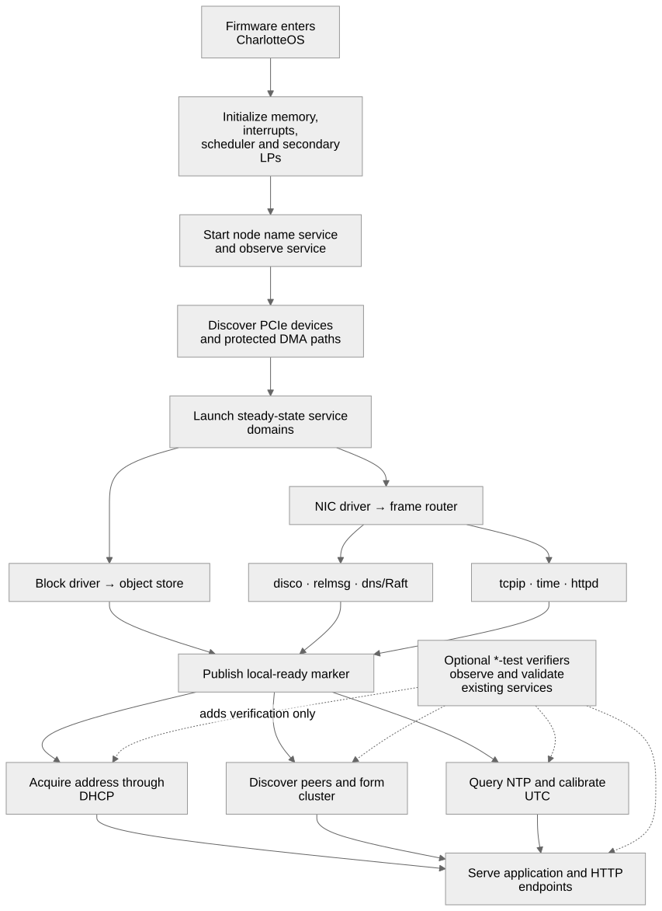

# CharlotteOS test paths

CharlotteOS has two intentionally different test environments. Pure logic
should run on the development host. Kernel behavior and EL0 entry-point wiring
must run on the CharlotteOS target, normally under QEMU.

## Host-testable logic

Run every host-side Rust suite and tool self-test with:

```sh
scripts/run-host-tests.sh
```

The runner currently covers:

| Component | What is tested |
|---|---|
| `charlotte-authorization` | principal binding, role separation, default deny, attenuation, policy and service fencing, one-shot redemption, and bounded state |
| `charlotte-protocol-disco` | discovery encoding, decoding, and malformed input |
| `charlotte-protocol-msg` | v3 framing, checked parsing, 32-bit message lengths and fragmentation offsets, typed IPC envelopes, and session fencing |
| `charlotte-protocol-net` | NIC status decoding |
| `catten-graft` | Raft election, membership, joining, snapshots, persistence projections, and wire format |
| `charlotte-smoltcp` | receive-queue bounds and clock progression |
| `charlotte-launch` | checked user-address mapping ranges, alias/kernel/null rejection and overflow boundaries |
| `catten-services` | shared authorization/client logic, resource adapters and total monotonic deadlines |
| `cluster-sign` | restricted key-file handling, digest, signed metadata, and placement-policy self-tests |

The script invokes Cargo from a temporary directory. This is necessary because
the repository's `.cargo/config.toml` asks Cargo to rebuild `core`, `alloc`, and
`compiler_builtins` for freestanding targets. If an ordinary host test is
started from the repository tree, Cargo discovers that target configuration
and may link a second copy of `core`. The wrapper keeps the pinned toolchain and
absolute manifests while preventing the bare-metal configuration from leaking
into host tests. It discovers crates containing `#[test]`; library targets
containing such tests must enable their host harness. A `test = false` library
can otherwise cause Cargo to skip those unit tests while still successfully
running documentation tests. Check the test names/counts when adding a suite.
Freestanding binary targets keep their harness disabled. CI calls the same
wrapper.

## Target-only tests

The `catten` kernel, `catten-user`, and the binaries in `catten-services` are
`no_std`/`no_main` target programs. Cargo's host test harness is not their
execution environment. Their target declarations therefore retain
`test = false`; kernel and service integration behavior is exercised by
`scripts/run-aarch64.sh` and the boot-time self-test registry.

The runners' ordinary runtime configuration is intentionally separate from
their verifier selection. They attach a NIC by default, so DHCP, discovery,
cluster, TCP/IP, HTTP, and time services run even when no network-test feature
is compiled. `--net-test`, `--dhcp-test`, `--disco-test`, and related options
register additional target verifiers; `--no-network` is the explicit runtime
opt-out. Tests should never be the mechanism that enables a production
capability.

### Scoped-launch security verifier

```sh
CATTEN_HTTP_HOST_PORT=18081 CATTEN_DEPLOY_HOST_PORT=17445 \
  scripts/run-aarch64.sh --security-test --instance security-grants --fresh-storage --timeout 100
```

This verifier needs ordinary networking and TCG/KVM, not HVF. It cannot be
combined with isolated shutdown, upgrade or ingress suites. Fixture generation
creates fresh, independent artifact and deployment signing roots in a private
directory under ignored `target/security-test`. Private key files are mode 0600;
only public keys, signed descriptors and the signed probe ELF enter the test
kernel. These roots test the configurable launcher path; they do not provision
production trust or replace the bundled platform-service development root.

The application receives its admitted descriptor and grant-controller
connection, without a name-service connection. A second valid descriptor names
the same ELF but widens tcpip rights. The controller must reject this replacement
policy, undeclared services, excess rights and re-delegation of client authority.
Positive controls establish publication and ordinary calls. Missing targets and
cancelled requests must not prevent acquisition of the available endpoint;
a separately hosted silent endpoint tests the publication helper's deadline.

The primary probe performs 384 cancelled requests in each of two launches. A
concurrent probe submits at least 512 more. All fifteen result bits (`0x7fff`) must
pass, publication generations must advance, and the retired descriptor must no
longer attest. The ordinary boot suite, network verifier and security verifier
register 19 tests in this configuration.

The eleventh bit exercises aggregate memory-object admission: the primary
holds many one-page allocations until allocation is refused, completes scalar
IPC while its allocation budget is full, drops the owning batch, and acquires
and calls its service again. Synchronous memory-object tests separately check
page and object-count ceilings, transfer/rollback sponsorship, late unpin after
retirement, and the platform progress pool.

The twelfth bit fills completion-timer capacity with owned hour-long timers,
drops the batch within five seconds, churns 64 additional hour-long timers and
waits for a short timer after recovery. Synchronous timer-admission tests also
exercise platform reserve, deferred event reclamation and exact numeric
namespace reuse. See [completion-timer budgets](../reference/completion-timer-budgets.md).

The thirteenth bit fills the application's endpoint budget, checks scalar IPC
while it is full, drops the owning batch and performs 128 create/drop cycles.
Synchronous tests check queue backing limits and resize rollback, platform
reserve, retained delegated records, unobserved-return cleanup, and forced
ASID reuse. See [endpoint budgets](../reference/endpoint-budgets.md).

The same thirteenth bit now fills connection admission and submits 512
outstanding calls to a larger queue, using owning batches. Dropping the calls
must permit a successful request; dropping the connections must permit another
128 mint/drop cycles. Kernel fixtures separately exercise retained completed
calls, all attachment variants' pre-transfer rejection, failed-attachment
rollback, live loans after rejected replies, observed/unobserved returns,
queued delegation cancellation, retirement publication fencing and ASID reuse.
Ordinary/total node saturation uses counters, not full registry allocation.
A host owner test checks token cancellation without closing its grant source
on a resource-limited reply. See [IPC record budgets](../reference/ipc-record-budgets.md).

The fourteenth bit fills shared completion-record capacity with owned
endpoint-close watches. Timer submission must fail while the record budget is
full, scalar IPC must still work, and closing the watched endpoint must allow
all watches to complete and a short timer to run. Synchronous tests cover
retained strong references and detached results, ordinary/total record pools,
platform progress, CQ replacement, retirement and a stale captured close after
exact numeric ASID/capability reuse. See
[completion-record budgets](../reference/completion-record-budgets.md).

Kernel-only CQ admission tests additionally exhaust queue counts and kernel
backing bytes, check failed replacement preserves pending data and capabilities,
reject physical-ring aliases without resetting the ring, and exercise retirement
and generation reuse. A signed domain load fails partway through installing its
five CQs, returns the staged charges and frees its ASID; trusted platform
preparation then succeeds using the reserve. These are synchronous tests, not
another EL0 probe bit. See
[completion-queue budgets](../reference/completion-queue-budgets.md).

The fifteenth bit drops a full batch of owned endpoint-close watches while its
endpoint remains live, then churns 128 more watches within five seconds. A new
watch must still be pending until the endpoint closes; a short timer checks
recovery. Synchronous registration tests cover entry limits, rollback,
detached notification storage, callback reentrancy, a late callback after
cancellation, retirement and reuse. See
[close-watch budgets](../reference/close-watch-budgets.md).

Thread-exit fixtures keep that mask unchanged. Synchronous kernel tests fill a
128-entry target, check transactional rejection, run 512 cancel/rearm cycles,
observe normal/stale-generation exit, reenter registries during callbacks, and
exercise retained tokens, shared-account exhaustion and cancellation before
owner installation. Actual address-space/capability reuse checks late-install
rejection, and failed worker setup must not execute or notify. The scheduled
CQ verifier cancels/rearms 128 watches against a live target, joins its eventual
exit, runs 32 immediate-return workers and verifies deferred cancellation of a
held worker. These are kernel fixtures, not additional real-EL0 quota probes or
physical allocator-failure injection.

Kernel completion-callback fixtures check 128-entry source saturation, full-batch
notification with retained owners, 512 cancel/rearm cycles, shared-watch rejection,
reentrant/late delivery, buffer preservation, producer cancellation, rollback
with retained objects and exact namespace reuse. Injected entry-allocation failure
checks charge/weak-reference rollback and recovery; it does not exhaust the
allocator or inject every allocation failure. Both actual boot-status sources
also check 64-entry limits, rearming and detached notification before schedulers
start. The scheduled verifier checks 64 publication and 64 result timeout cycles
with an isolated waiter sponsor, then races registration against 32 immediate
workers. The scoped mask remains unchanged. See
[kernel callback budgets](../reference/completion-callback-budgets.md).

Deferred IRQ host tests cover per-route coalescing under a flood, retirement
watermarks, fresh publication after claim, binding identity exhaustion,
concurrent stale publishers and competing claimers. The device kernel fixture
delivers more than twice the former shared queue capacity before route reuse,
checks that retired readiness cannot reach the replacement and verifies a
fresh wake/ack. Another fixture detaches a CQ wake, reuses its exact numeric
ASID/CQ and checks that notification cannot select replacement waiters or
change replacement work generation. Both this callback and an actual deferred
IRQ callback reenter completion/device registries. Live driver IRQ rounds
remain part of the device/UART tests.
These are not exhaustive controller MMIO or cross-LP mask/rearm checks. See
[interrupt wake storage](../reference/interrupt-wake-storage.md).

Mailbox kernel fixtures exercise the actual syscall dispatch path with 512
mixed sender/receiver handles, over-limit rejection, receiver reuse at capacity,
slot recovery and 1,024 open/close cycles. Serial-exhaustion injection checks
staged refund without damaging existing authority. Real domain handles test
retirement and late publication after ASID reuse; a retained charge cannot
credit the replacement. Isolated production counters check ordinary/node
ceilings and the platform reserve. No extra real-EL0 quota probe was added;
the scoped mask remains `0x7fff`. See
[mailbox capability budgets](../reference/mailbox-capability-budgets.md).

Shared capability-admission fixtures fill 4,096 actual entries across all six
object kinds. They cover hidden staging, cancellation, quota rejection without
serial consumption, source escrow/rollback at full capacity, committed source
revocation and exact-number namespace replacement. Real domain registration,
retirement and ASID reuse test stale-token publication and captured-generation
rejection. Mailbox dispatch and completion/timer submissions reject aggregate
pressure below their family ceilings, refund staged family charges and recover
when a slot is freed. An isolated counter test checks shared node/ordinary
limits without filling the live pool. Every capability kind now has bounded
allocation; the temporary bypass and its permissive fixture are removed. No extra EL0
quota probe or atomic IPC-vector admission test is implied; the scoped mask
remains `0x7fff`. See
[shared capability admission](../reference/capability-admission.md).

Device fixtures reject MMIO/IRQ/DMA grants at the shared ceiling, recover real
MMIO mapping and IRQ grants after freeing a slot, and fence exact ASID/handle
reuse. Fake DMA backends verify admission before creation, creation-failure
refund, retirement before publication and exactly-once destroy, including a
simulated destroy failure. These do not test real IOMMU ACK-timeout/quarantine.
Observer fixtures check quota recovery, stale generations and cancelled startup
claims using isolated atomics, without resetting the already-live observer.
Pre-bootstrap connection and observer rejection reclaim the entire unstarted
fixture namespace and delegated metadata. Real boot still exercises successful
observer launch and telemetry access. These are kernel fixtures, not new real
EL0 quota probes or production hardware pressure tests.

Real-domain IPC shared-admission fixtures check endpoint/direct-grant rejection
and family refunds, receiver reply admission under namespace pressure, unchanged
queue/result bytes and active loans, retry/cancellation and one-way receive at
the ceiling. Invalid/read-loaned result pages return speculative reply authority
without consuming queued work. A paused reservation checks rejection after
retirement before publication. This is kernel registry/ABI testing, not a new
EL0 quota probe or exhaustive concurrent retirement exploration.

Call-side fixtures reject all scalar/vector variants at the caller ceiling,
reject receiver attachment admission after staged call metadata, and test a
connection+copy with one versus two receiver slots. Paused copy-only/four-mode
calls test caller/receiver retirement before joint publication; every staged
IPC/memory handle remains inaccessible and original sources/charges recover.
Invalid copied buffers and mapped-source move/write-loan rejection refund
metadata. A prepared call survives sponsor teardown and exact ASID/handle reuse;
late failure returns old charges without changing a successor's pending call.
Returned-connection pressure preserves its solicited reply/loan for retry, and
observed returned authority survives pending-call close. These are kernel
fixtures, not new real-EL0 quota probes, allocator-failure injection or an
exhaustive concurrent proof.

Memory-object fixtures also fill spare shared-namespace slots in real domains.
They check allocation/copy/read-loan/write-loan rejection, source access and
backing refunds, prepared-move cancellation at the source ceiling, successful
two-object commit and all-or-none rejection after destination retirement.
Paused source retirement checks rollback to original slots for cleanup. Source
and destination teardown/reuse fixtures assert exact numeric ASID/capability
reuse, old-frame retention until cancellation, and unchanged successor budgets
and authority. Existing IPC vector/reply tests exercise the integrated move
owners.

Additional fixtures pause hidden copies and both loan modes, attempting guessed
handle lookup/map/write/close, physical queries and DMA/copy pinning. They check
private-copy refunds, snapshot independence, loan cancellation at the source
ceiling, read-only source mapping, mixed-mode retirement, and exact source/target
ASID/capability reuse. Real kernel vector calls exercise all four modes, failure
after each prepared kind, denied private-copy backing after a staged loan,
mapped vector loans on reply/cancellation, reply-token close and queued endpoint
close. Queued copies/moves are reclaimed, delivered ownership is retained, and
both vector loans end. Kernel snapshot/write/DMA checks reject owner access
forbidden by committed loans. These deterministic kernel fixtures are not a new
EL0 quota test or exhaustive concurrent-retirement proof.

Boot runners require a complete newline-terminated authoritative result before
stopping QEMU. The shared parser accepts LF or CRLF, recognizes complete failed
verdicts as terminal, and requires zero failed/pending counts and bitmaps for
success. Its host tests reject every partial prefix of a successful record,
malformed/truncated results and kernel panics, and allow a later partial log
line after an already complete verdict. The poll loop caches completion, so
long application holds do not repeatedly launch the parser.

Real-domain fixtures use `register_user_address_space`, not direct insertion
into `ADDRESS_SPACE_TABLE`. This initializes the same generation, limits,
accounting and capability namespace as production domain creation. Adversarial
IPC scenarios using pseudo-domain IDs allocate no unused real address spaces.

Completion/CQ waiter tests keep the fifteen-bit scoped mask unchanged. Kernel
tests cover source/domain/node admission and rollback, detached entries,
promotion and ASID reuse; the scheduled CQ verifier checks Running/Ready/new
rejection, wake/reap cleanup despite a retained Waker and 64 completion/CQ timeout cycles.
Host owner tests check retry and Drop after timed admission failure. Comprehensive
allocator-failure and arbitrary callback-capture accounting remain outside this coverage.
See [scheduler waiter budgets](../reference/scheduler-waiter-budgets.md).

IPC waiter tests also leave the scoped mask unchanged. They cover source
ceilings, 512 cancel/rearm cycles, reentrant notification after message/reply/
source closure, reply-token cancellation, revocation of a live loan and retired
sponsorship. The scheduled verifier checks 64 reply/readiness timeout cycles,
non-mutating full-source rejection, and forces untimed receive/reply recovery
by withholding the helper's message/reply until an admission retry is recorded.
The reply helper checks that its loan is still available before replying and
the caller checks it is revoked on return. These are kernel-only fixtures.

Blocking-lock fixtures likewise keep the scoped mask unchanged. Synchronous
tests check mutex/reader/writer ceilings, cancel/rearm, detached charges,
source destruction, retirement, reentrant callbacks, expired writers and
final-reader notification. Scheduled tests force each lock fallback counter
before allowing remote contention to park, then verify acquisition/release and
64 timed cleanup cycles. Holders poll while a peer runs; they never explicitly
park/yield with a data guard. These tests do not establish fairness, owner-death
recovery, production use or allocation-failure coverage.

Timer waiter fixtures leave the scoped mask unchanged too. They cover source
limits/rollback, 512 cancel/rearm cycles, callback reentrancy, expired callbacks,
cancelled-event suppression, event destruction with retained tokens and retired
sponsorship. Scheduled tests run 64 normal sleeps and 64 competing-watchdog
cleanup cycles. A pre-filled timer source forces the normal sleep path into its
runnable fallback and checks elapsed time; rejection leaves state/constraints
unchanged. This is not a forced-quota EL0 syscall or timer-queue capacity test.

Scheduler timer-event fixtures separately allocate 1,024 sorted nodes, test
reuse and iterative removal, and keep the quantum inline while anonymous
admission is full. Shared node/ordinary saturation is counter-only. They cover
platform promotion, retirement, exact ASID reuse and an injected node-allocation
failure. Scheduled tests substitute only their current kernel thread's sponsor
to force event rejection before parking, check generic/CQ waits and synthetic
timed-completion status 3 with the pending capability retained, then cancel and
close it. Sleep/watchdog cycles reconcile event charges; busy-local cancellation
retains its charge until purge. A cancellation-owner fixture simulates relocation
before publication, not actual remote-LP reclamation. See
[scheduler timer-event budgets](../reference/scheduler-timer-budgets.md).

The scoped application verifier does not force ASID reuse, restart the grant
controller, inject allocation failures or prove many-client fairness. It does
not exercise the complete S3/Raft release pipeline with independent roots, or
establish production key custody.

The HTTP verifier also runs EOF and idle-client availability probes before the
node/cluster JSON checks. Use an isolated instance and unused forwarded ports:

```sh
CATTEN_HTTP_HOST_PORT=18080 CATTEN_DEPLOY_HOST_PORT=17444 \
  scripts/run-aarch64.sh --http-test --instance security-http --fresh-storage --timeout 75
```

`scripts/tests/test-http-keyhole-liveness.py` checks EOF and abortive peer-close
recovery, and that an idle client is timed out while subsequent metrics
requests are attempted. Transport retries are bounded and spaced to span that
idle budget. The
five-second request deadline bounds this serial listener's per-client delay;
it does not establish resilience against a sustained connection flood.



The two-guest `--relmsg-test` verifier sends and compares a 70,000-byte
payload. This intentionally crosses v2's 65,535-byte limit and exercises the
v3 IPC envelope, fragmentation, adaptive retry, reassembly, and cumulative
delivery acknowledgement end to end.

The cluster-wide TCP data path has a dedicated host-visible fixture:

```sh
./scripts/run-distributed-ingress-test.sh
```

It creates a shared stream-backed L2 segment with three guests and an
independent host-side Ethernet/TCP client. The test requires committed stable
three-voter membership, deterministic selection across all three backends,
remote one-hop frame forwarding, leader/VIP-advertiser loss, replacement
gratuitous ARP, and a request completed over a previously established flow on
a surviving backend. It then requires a fresh connection and complete HTTP
exchange with a live backend, demonstrating reconnect after the failed
advertiser also took one backend connection with it. `--cluster-ingress-test`
is used only by this harness; ordinary operation is enabled by giving every
member the same repeatable `--cluster-service [NAME=]VIP:port` bootstrap policy.

`--s3-test --timeout 240` is an explicitly test-only integration fixture. It
adds a local TLS RustFS Docker container, a provisioned S3 service profile, and
an in-guest PUT/HEAD/GET/DELETE verifier. Network, DHCP, time synchronization,
and the S3 client itself are ordinary services; the switch supplies the
ephemeral external server, test credentials/CA, and pass/fail observer. The
VirtIO RNG device and entropy service are part of ordinary QEMU operation, not
test-only support. See
[S3 client service](../reference/s3-client.md#rustfs-integration-test).

`--deployment-ingress-test --timeout 240` extends the same fixture with the
release path. The host uploads the signed `greet` ELF to RustFS, signs and
wraps its `CDEPLOY5` descriptor in a signed `CRELEASE` envelope, atomically
admits the release, and waits on the management API until the exact desired
generation owns the active service name on its assigned node.

The two-guest `--deploy-test` exercises the runtime retirement paths. It moves
the lifecycle-aware `greet` domain between nodes and requires an acknowledged
cooperative exit, then returns the assignment with a test-injected zero grace
period and requires forced termination, generation-safe reaping, and continued
reachability through the replacement generation.

`./scripts/run-distributed-ingress-test.sh` forms a three-member cluster and
also validates the placement-control reporting path. Before failover, one
leader must seed fresh filtered capacity state for all three members. After the
VIP advertiser/leader is stopped, a surviving leader must rebuild fresh state
for both remaining reporters; replicated samples from the former term do not
extend the leader-local lease. The fixture continues to check established-flow
survival, gratuitous ARP, and reconnect after backend loss.

For a deterministic test that does not require networking or cluster
formation, use:

```sh
./scripts/run-aarch64.sh release --shutdown-test --fresh-storage --timeout 120
```

The isolated verifier registers both probes with the real deployment-domain
retirement state machine. One drops an owned endpoint and acknowledges a
propagated `NodeShutdown` request. The other is deliberately unresponsive: its
signed child grace expires before the enclosing node deadline, so it must be
forcibly terminated and reclaimed. The test also requires the distinct
acknowledged/forced node-shutdown counters to advance. The same switch is
available through `scripts/run-x86_64.sh`. Three additional cooperative probes
exercise the generic node-service coordinator and require ingress, dependent
service, and storage phases to remain strictly gated; hardware-root domain
ownership must not become available until all three phases are reclaimed. A
fourth probe represents a hardware adapter: the device coordinator must publish
its request, observe the distinct `DEVICE_QUIESCED` acknowledgement and thread
exit, and only then reclaim its domain.

The verifier then exercises the production steady-state owners, not only the
probes. It drains and reclaims the real object store, transfers the actual NVMe,
VirtIO RNG, and (on an ordinary network-enabled run) VirtIO NIC domains, and
requires every retained driver to finish its device-specific flush, drain, and
reset path before the test can complete. AHCI, VirtIO block, and E1000E use the
same lifecycle contract and are compile-checked; their shutdown paths still
need dedicated platform fixtures for runtime fault injection.

The network-enabled shutdown fixture also exercises lifecycle-aware deployment
ingress, HTTP ingress when present, and UTC time domains. They are idle at the
drain boundary, so the test proves that their bounded socket/NTP waits observe
the request and release their owned resources without delaying the later
storage and device phases. `--http-test` separately sends a real host request
through the bounded receive path and validates the complete response.
The shutdown fixture also requires TCP/IP and the frame router to release
their protocol sockets, deferred reply tokens, pending frame transfers, and
NIC connection before the VirtIO NIC is reset. It deliberately begins the
production drain before publishing the boot-ready marker and asserts that
HTTP, time, and TCP/IP interrupt that startup wait and acknowledge normally;
per-phase outcome counters distinguish this from forced termination.
The same assertion covers deployment ingress/control/agent and
DNS/reliable-messaging/discovery, so every planned high-level production phase
must report one acknowledged exit and no unacknowledged or forced exit before
device ownership can transfer.

On AArch64 this fixture is also the terminal-poweroff test. After the
authoritative success record, the kernel selects the SMC/HVC conduit from the
ACPI FADT and invokes PSCI `SYSTEM_OFF`. The runner treats an early QEMU exit as
an error and accepts a powered-off guest only when both records are present.
The x86-64 switch currently validates drain and device quiescence but does not
yet exercise an ACPI S5 transition.

The ordinary no-network AArch64 suite exercises the ownership-aware object
store with the real NVMe service: a 12 KiB PRP-list block round trip, a 2 MiB +
4 KiB persistent object round trip, and Raft recovery across a process restart.
This catches regressions in the same owned memory, mapping, borrowed-call, and
reply-token paths used by the final shutdown flush.

`--kafka-test --timeout 300` similarly adds a disposable three-broker Apache
Kafka KRaft cluster with ephemeral verified TLS listeners and an in-guest verifier.
The verifier covers the TLS handshake, idempotent production, bounded
read-committed consumption, aborted-record filtering, and an atomic
consume-transform-produce transaction with the consumer offset included. The
runner creates a fresh single-partition `charlotte-events` topic and removes
the fixture and its volumes on exit. See
[Kafka client service](../reference/kafka-client.md#docker-integration-test).
Use `--kafka-coordinator-test` to hard-stop the transaction coordinator chosen
by Kafka, or `--kafka-fencing-test` to start a second connector with the same
transactional identity and require the stale producer to fail closed.

Both architecture runners source `scripts/lib/boot-common.sh` for dependency
validation, Limine configuration resolution, payload hashing, atomic FAT image
construction, and authoritative self-test verdict validation. To create only a
mount-free UEFI boot image from an already-built kernel, use
`scripts/create-boot-image.sh`; the Justfile's `create-image` recipe delegates
to the same implementation.

Long-running external harnesses can retain a live guest for post-failure
inspection without depending on architecture-specific command-line switches.
Set `CATTEN_QEMU_DEBUG_STUB=1` and pass `--gdb-port PORT` to expose the QEMU GDB
stub, `CATTEN_QEMU_PID_FILE=PATH` to record the QEMU process ID,
`CATTEN_QEMU_MONITOR=1` to create the instance's monitor socket, and
`CATTEN_QEMU_NET_DUMP=1` to capture packets when networking is enabled. The
Kafka broker soak harness enables these controls and, on client or readiness
failure, detaches from its still-running runner instead of killing the guest.
Its `--cleanup-on-failure` option restores teardown behavior for unattended
automation.

`catten-rt`, `catten-syscall`, and `charlotte-launch` also retain disabled
standalone harnesses. They contain target runtime/ABI support and currently
contain no dormant `#[test]` functions. Their host-compatible portions are
compiled as dependencies of the `catten-graft` and `charlotte-smoltcp` suites.

At the 12 August 2026 audit, `charlotte-protocol-net` was the only component
that had an actual Rust unit test hidden by `test = false`. Its harness is now
enabled and included in the shared runner. `charlotte-protocol-disco` already
had an enabled harness, but was missing from CI; it is now included as well.

## Demand-backed heap tests

Demand-heap admission fixtures check isolated node/ordinary saturation and
platform headroom, provisional refund and account promotion, real zeroed
backing, a reduced one-page domain quota, repeated touch, retired commitment,
exact ASID reuse and post-teardown refunds. A kernel-only mapper adapter rejects
before publication and verifies that the real frame and reservation are freed.
These are synchronous kernel tests, not a new scoped EL0 quota bit or forced
physical exhaustion. See [heap admission](../reference/heap-admission.md).

## Loader backing tests

Loader admission fixtures check quota/duplicate mapping, zeroed and filled
backing, mapping rejection rollback, retirement and exact ASID reuse. A signed
name-service image fails after partial mapping at an injected one-page ceiling;
normal retry reuses the freed ASID and releases all image/runtime backing and
CQs on teardown. Layout fixtures check bounded headers, adaptive-heap exclusion
and oversized BSS planning. This does not inject physical exhaustion or add a
scoped EL0 quota bit. See [loader admission](../reference/loader-admission.md).

Constructor-failure injection verifies that `RootAllocationFailed` returns
before namespace publication, consumes no frames/backing charges and preserves
ASID capacity. The x86-only root fixture tests rejected allocation and successful
inactive-PML4 teardown; AArch64 cannot execute that architecture-specific test.

## Page-table lifetime tests

The synchronous VM fixture creates two private, never-installed hierarchies
aliasing one data frame across three sparse leaf tables per root. Sixteen
unmap/remap rounds must retain stable table counts, reject duplicate/repeated
operations and block promotion over empty tables, preserve the other domain's
translations, and return every private table at teardown. See
[page-table lifetime](../reference/page-table-lifetime.md).
The higher-half VM fixture also flushes the final kernel page before releasing
its backing, guarding against exclusive-end overflow in range invalidation.
This checks physical ownership/reuse, not a concurrent hardware-walk race or
failed cross-LP shootdown. AArch64 guest execution does not execute x86 code.

## Translation-frame preparation tests

Per-walker fault adapters reject each private-tree allocation prefix, then check
retry and empty-table reuse with zero fresh-allocation allowance. A sparse
second branch fails after one table, retains its partial ownership, then
completes without rebuilding the prefix. Assertions check exact physical counts,
alias data preservation, unchanged active hardware roots, complete private
teardown and unchanged heap/image charges. ARM additionally rejects hardware-tag
admission after frame preparation and checks that no root/tag is published.
Scope/floor predicates and both zeroed-owner Drop paths are checked separately.
These fixtures retain no additional frames. See
[table preparation](../reference/page-table-preparation.md). They do not force
real exhaustion or prove publication unwind, hardware-walk races or x86 progress.

## Kernel data-retirement tests

Boot fixtures warm a retained kernel table subtree, then compare actual data
counts across detach, injected failed invalidation, successful retry and repeated
release. Partial allocation/map failures and a real foreign `AlreadyMapped`
leaf exercise rollback ownership. Bounds reject before mutation. The Drop
fallback fixture intentionally quarantines one 4 KiB page; this is a specified
test reservation, not a successfully released frame. See
[kernel data retirement](../reference/kernel-frame-retirement.md).

The x86-only fake IPI sender checks that failed delivery never decrements the
acknowledgement barrier. This compiles on x86 but requires its guest to execute;
it does not trigger a real delivery failure or the fatal halt path. Live
cross-LP virtual reuse, unresponsive recipients and lifecycle-lock retirement
remain separate validation work.

## Memory-object retirement tests

Memory-object retirement fixtures run in the single-mutator boot phase. They
inject the final copy/DMA unpin between detach and invalidation, check frame and
charge retention, borrower authority fencing, and scratch reuse after every
mapping barrier. Real collision leaves exercise clean and failed rollback,
installed-prefix retention and physical-identity checks. Partial detach, a
failed barrier, rejected scratch completion and abandoned receipts deliberately
retain **seven data pages and five object charges** for the guest lifetime, in addition to the kernel-range
fixture's one page. No test-only recovery bypass frees them. See
[memory-object retirement](../reference/memory-object-retirement.md). These are
interleaving fixtures, not concurrent hardware stress or x86 progress proofs.

The lock-separated detach fixture maps 35 pages and checks its three 16/16/3
frame batches. It exercises ordinary unmap, mapped-loan revoke and owner cleanup,
asserts registry/table guards are available at detach callbacks, rejects an
oversized prefix before table work, and injects the last copy unpin before the
first batch. Exact frame/charge counts return after completion, with no additional
quarantine. The outer lifecycle/IPC serialization is intentionally retained.

The scratch-completion fixture rejects one of two borrower range completions
after all invalidations. It verifies last-copy/DMA-unpin retention, safe reuse
of the completed range, non-reuse of the rejected range, loan fencing and charge
retention after all three domains close. It accounts for one of the seven
quarantined pages above. Six standalone host tests exercise the production
scratch allocator, including exact release rejection, metadata-preflight failure
and a 6,000-operation first-fit bitmap-oracle trace. Release does not allocate.
See [scratch admission](../reference/scratch-admission.md) for the remaining
registry-admission and generation-lease boundaries.

## Final address-space retirement tests

Final-root retirement guest fixtures inject metadata-preflight rejection before
namespace/backing retirement, then check detached-root frame/heap-charge
retention, lifecycle/table guard availability during invalidation, registration
without leased-slot/tag reuse, exact physical release and stale-handle rejection.
Failed barrier and abandonment permanently retain two private roots, each with
one charged heap page and its private translation frames. Their frame counts
are logged. These are additional to earlier quarantine probes, not recovered
through test-only cleanup. Twelve standalone host tests exercise the kernel's
generic slot owner, including table/generation identity, destructor ownership,
interleaved completion, preflight rejection and fail-closed completion metadata.
`scripts/run-host-tests.sh` runs them even though the kernel disables Cargo's
test harness. See [final root retirement](../reference/address-space-retirement.md).
These fixtures do not prove x86 recipient progress or complete lock-safe teardown.

Live-operation fixtures check overlapping leases, busy-close non-mutation,
retained mappings/tag/charges, continued admission, explicit release and
stale/detached acquisition rejection. Five new host tests check live counts,
identity, counter limits, vector growth and abandonment/table destruction.
Abandonment retains one additional live root with a charged heap page and private
table frames. Its namespace remains present and close stays busy. No production
masking guard was removed. See
[live address-space operations](../reference/live-address-space-operations.md).

## Owning-root physical-release tests

Both architectures share a boot fixture using their private production
destructor adapter. It rejects each of six releases (four private tables, heap
and image backing), then all six, before calling the real allocator. Assertions
check exact frame counts, continued cleanup, no second release, whole-account
charge retention, borrowed-root protection and a foreign leaf's independent
owner. Normal cleanup returns every owned frame and both charges. The seven
failure cases permanently reserve **12 physical frames and seven page charges
in each heap/image pool**; no recovery bypass frees them. These add to earlier
quarantine fixtures. See [root release](../reference/address-space-retirement.md#physical-release-and-charges).
They do not exercise real allocator corruption, panic/unwind recovery,
provisional frame rollback or x86 hardware progress.

## Joint backing-preparation tests

Serialized boot fixtures check heap/image admission, tracking and allocation
rejection; unused-owner Drop; map rejection; fill/zero preservation; and
successful ownership transfer. Failed-release adapters verify domain ceilings,
ordinary/platform pool identity, mixed live/quarantined root refunds, exact
generation reuse and non-reuse of retained physical frames. Installed-leaf
fixtures simulate interruption before and after account commit, refusing any
deallocation of uncertain publication. Abandoned charge receipts retain counts.
Twelve physical frames and six page charges in each heap/image pool remain
permanently retained, additional to earlier probes. See
[joint backing preparation](../reference/kernel-backing-preparation.md).
These simulate failure states, not real OOM, allocator corruption, panic
unwinding or x86 shootdown execution.

## Rule for new service logic

Keep the thin syscall loop and process entry point in an EL0 binary. Put policy
evaluation, codecs, state machines, bounds, and other deterministic behavior in
a dependency-free or narrowly dependent `no_std` library with an ordinary host
test harness. The authorization implementation follows this rule: the policy
engine is host-tested independently, while connection minting remains target
code and must not be enabled until the kernel supplies an authenticated,
generation-aware caller identity.
