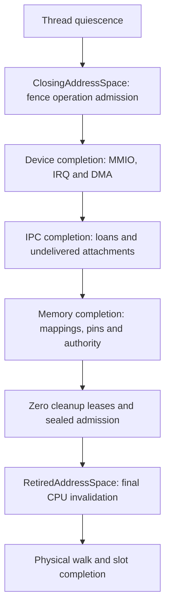

# Cleanup ownership and recovery strategy

Initial inventory reviewed 2026-10-08 against revision `ec8a5383`; updated
2026-10-09 through prepared capability-namespace metadata qualification. This is the cross-category
coverage map and implementation plan for SEC-18, with SEC-07 accounting
dependencies. It documents current owners separately from required controller
behavior. It adds no recovery API and does not close either finding.

The unit of **design** is a resource/operation category. The unit of **custody**
is one exact owned operation, which may retain several objects and roots.
An IPC cancellation, for example, cannot be split into independent retries for
its token, loans and roots. They form one completion transaction.

## Common lifecycle

Every category must identify these boundaries, even when its representation
differs:

1. Admit resources and retirement storage before publication. Capture exact
   generations, sponsorship, root dependencies and any hardware identity.
2. Claim the operation and fence competing access under subsystem serialization.
   Detach authority or mappings only while a complete owner retains the work.
3. Leave serialization before waiting, invalidating, draining hardware, invoking
   notifications or releasing physical backing. Check the caller's outer guard
   and IRQ context as well as the callee's own guards.
4. Obtain category-specific completion evidence. CPU invalidation, DMA drain,
   scratch completion and thread quiescence are distinct proofs.
5. Consume physical ownership exactly once. Refund only confirmed released
   backing; retain original charges for uncertain or rejected release.
6. Publish completion and return slot/authority admission only where that
   category's proof permits it. Restart/reassignment is a separate policy step.

Three outcomes need different treatment before successful completion:

| Outcome | Permitted continuation |
| --- | --- |
| Unstarted admission rejection | Explicit rollback may restore the exact source and refund unused reservations. A new application operation may subsequently be attempted. |
| Pending or safely retryable work | Continue only with the returned/still-held complete owner and its recorded phase. Retaining backing alone is insufficient. |
| Uncertain cleanup, abandonment or partial physical release | Keep fences and original charges. No adoption from IDs, timeout-based refund, force-clear or replay of physical addresses. |

Quarantine is a safety outcome, not implemented recovery. The ability to call a
function twice is not proof of a valid retry contract.

## Composition order

The current final-root path composes earlier cleanup rather than repairing it:

An error before final detachment leaves the closing lifetime fenced. The
final-root registry cannot recover that earlier operation. Conversely, successful
root retry must not silently turn a supervisor's cached teardown failure into
restart permission. Each completed sub-operation must remain recorded when a
later phase fails; restarting the entire sequence can repeat irreversible work.

## Receipt coverage map

These 18 rows cover the identified CPU-memory, IPC, device and domain-teardown
owner families. They group composing types, not individual allocations. Each
row names its current continuation boundary and a concrete remaining gap.
Source links identify implementation anchors; category contracts contain the
existing regression evidence. **No row means that all its caller contexts have
been qualified.** G1–G7 below are the remaining shared work items.

| ID and category | Current owner / completion boundary | Current continuation and gap |
| --- | --- | --- |
| C01: live root retention | [`AddressSpaceOperation`](../../crates/catten/src/memory/operation.rs), backed by `SlotLease`; explicit `release` completes the exact generation's count. | A dependency, not a cleanup engine. Drop retains the count. Abandoned counts cannot be decremented by a controller. Caller must also own backing, authority and scratch. Whole-domain abort owns its exact executor before root admission; pending abort requests defer retirement/migration through root completion, then the final mask releases that executor. Abandonment retains both fences; broader kernel-operation contexts remain G1/G2/G7. |
| C02: staged domain close | [`ClosingAddressSpace`](../../crates/catten/src/memory/retirement.rs), `ClosingSlot`, `RetirementProgress` and `CloseProgress`. | Pending returns the same owner. Cleanup errors consume the request and leave its fence/root retained; no general error-owner retry API. Cleanup admission seals only after exact device/IPC/memory completion and zero leases; G2/G5. |
| C03: detached final root | [`RetiredAddressSpace` and root registry](../../crates/catten/src/memory/retirement/recovery.rs), with `id_table::RetiredEntry` and linear slot completion. | Complete failed-invalidation owner has bounded explicit retry: eight slots, two attempts, checked serials. Physical rejection/abandonment is terminal. Trusted kernel hook only; no operator controller or supervisor reconciliation; G5/G6. |
| C04: detached kernel range | [`RetiredKernelRange`](../../crates/catten/src/memory/allocators/memory.rs). | Same mutable receipt can retry failed invalidation before `release_started`. Incomplete detach rejects; physical failure/interruption is terminal. Inline 256-extent preparation, 16-frame release batches. Drop now only records atomic diagnostics; a guarded-drop fixture preserves backing. No retained-owner controller adapter; caller context/dependencies remain G1/G2. |
| C05: memory mapping retirement | [`MappingRetirementPin` and `RetiredObjectMappings`](../../crates/catten/src/memory/object.rs). | Pin, detached mapping records and peer leases prevent early release. Consuming completion does not return a retry owner on detach/invalidation/scratch error. Metadata Drop can destroy mapping storage while pins/counts remain; G1/G2. |
| C06: loan revocation | [`LoanRevocation` and `LeasedRevocation`](../../crates/catten/src/memory/object/revocation.rs). | `cancel_prepared` restores only unstarted admission. Started `finish` consumes the owner; error retains Revoking/pin, not a retry receipt. Direct ordinary error explicitly releases its root leases; abandonment retains them. Other adapters have their own lease policy; G2. |
| C07: reply completion | [`PreparedReply` and `ReturnedConnection`](../../crates/catten/src/ipc/reply.rs), loans, returned-connection claim and returned-memory `PreparedTransfer`. | Ordinary error restores unstarted receipts and unpublished returns, releases leases and leaves failed loan backing fenced. Abandonment retains the reply/source claim and lease counts. Successful publication jointly installs outputs before result visibility; polling visibility can precede final producer root-lease completion. The scheduled waiter fixture drains exact roots under a deadline on mutation-free busy-close rejection. No failed-operation custody adapter; G1/G2. |
| C08: call/reply cancellation | [`PreparedCancellation`](../../crates/catten/src/ipc/cancellation.rs). | Queue/token remain claimed during unlocked revocation. Ordinary failure marks `cleanup_failed`, restores unstarted loans and releases admitted leases without publishing a terminal result. Abandonment retains claim/roots/pins. Consumed failed loan cannot be retried from token IDs; G2. |
| C09: endpoint close | [`PreparedEndpointClose`](../../crates/catten/src/ipc/endpoint_close.rs). | Owns one server lease and processes existing queue storage one call at a time. Ordinary rejection clears the endpoint claim and releases the server lease, but failed call/loan fences remain. Abandonment retains claim/root. No whole-endpoint replay after partial progress; G2/G4. |
| C10: namespace IPC cleanup | [`namespace_close::close_with`](../../crates/catten/src/ipc/namespace_close.rs), borrowing the closing root and composing per-token cancellation. | Pending is resumed by C02. Physical error retains failed token/backing and prevents final-root progress. No separately movable namespace receipt; loan-free removal still uses IPC serialization and metadata destruction; G2/G4. |
| C11: namespace memory cleanup | [`PreparingNamespaceObject`, `PreparedNamespaceObject`, `NamespaceObjectClosed` and `NamespaceMemoryClosed`](../../crates/catten/src/memory/object/namespace_close.rs). | Admit mapped peers in existing records before moving mappings; cancel only unstarted admission. Pending preserves C02. Physical/scratch failure consumes the receipt and retains pins, affected peer counts and closing fence; no controller retry; G1/G2. |
| C12: namespace device cleanup | [`PreparedNamespaceDevices` and `NamespaceDevicesClosed`](../../crates/catten/src/device/retirement.rs). | Borrows C02; owns the detached admitted namespace `RetiredEntry` and its ordered capability nodes. Detachment only relinks existing nodes; confirmed post-guard completion carries current unified authority in its original charged retirement owner, then explicitly releases payload and authority nodes before the empty namespace node. Confirmed records are removed one at a time; error/abandonment retains unfinished records/authority. Outer lifecycle/device guards leave before finish, but backend guards are separate. Borrowed owner is not a static custody payload; G2/G3. |
| C13: explicit device/MMIO close | [`PreparedClose`](../../crates/catten/src/device/close.rs) and [`close_cap_with`](../../crates/catten/src/device/mod.rs), an operation lease and reset-visible MMIO descriptor claim. | Non-DMA close owns descriptor, exact root and both detached metadata owners together. Uncertain MMIO retains descriptor, scratch, root count and original authority charge after logical detachment; only confirmed completion disposes metadata and then releases the root. Guarded IRQ abandonment retains its detached payload/authority without touching a successor route. DMA close retains its original payload cell and authority under the shared in-flight claim through backend destruction; ordinary rejection completes its public claim without extracting/reinserting metadata, while abandonment retains the exact root/claim. Confirmed success revalidates the exact cap/domain, then consumes authority and payload once. Public DMA map/unmap/close retains an exact root/capability claim in [`DmaOperation`](../../crates/catten/src/device/mapping.rs); explicit close/namespace preparation rejects its busy claim before extraction. Ordinary completion releases it explicitly; abandonment retains root and authority. Endpoint reset claims also exclude overlapping BAR/ECAM MMIO close and namespace preparation before authority mutation. No uniform typed close receipt; IRQ route removal has a distinct serialized boundary. All three grant categories now prepare device namespace/payload nodes fallibly in shared `GrantAdmission` before local guards/hardware, with exact root/reservation ownership. Successful close detaches payload and unified authority nodes for post-guard disposal before root completion. Unified authority preparation now joins the grant before local guards, retaining captured generation and memory-budget admission checks. Other authority callers, backend registries and wider context proof remain required; G1/G2/G3/G4. |
| C14: DMA domain and requester retirement | [`vt_d::destroy_domain`](../../crates/catten/src/device/vt_d.rs), [`amd_vi::destroy_domain`](../../crates/catten/src/device/amd_vi.rs), [`smmu::destroy_domain`](../../crates/catten/src/device/smmu.rs), [`Maintenance` / `DetachedDomain`](../../crates/catten/src/device/detached_domain.rs), [`Preparing`](../../crates/catten/src/device/domain_creation.rs), admitted domain slots and pins. | Explicit destruction moves the complete domain and actual command engine after descriptor detachment, before maintenance. Empty engine admission fences all ordinary backend mutation/reset with `OperationInFlight`; the empty domain cell and nonzero source remain. Configuration/drain waits run outside backend guards. Ordinary hardware rejection restores the actual engine state and exact retiring domain under one original hold; abandonment retains both and permanently fences the unit. Confirmed maintenance returns the engine before unlocked physical release; rejected physical release restores the frozen domain without allocation, and physical abandonment retains its domain claim. Creation rejection uses this same destruction path through C18 after local guards leave. Explicit DMA close now also carries C13's exact root and original claimed capability cell through maintenance/physical release, with no rejection reinsertion. Requester reset now retains an exact endpoint config/BAR/ECAM claim inside C18; config/device/lifecycle/backend holds leave polling through complete-unit creation ownership. Ordinary config/MSI and overlapping MMIO access reject it; activation follows exact busy-cap publication. Reset uncertainty/abandonment retains the complete grant without destructor writes. Private domain construction errors now travel in C18's complete grant; known-private backing/metadata cancellation leaves lifecycle/device/backend/config guards first. Boot unit initialization now claims its existing typed slot and leaves serialization before allocation, control, waits and private cancellation; uncertain control/publication or abandonment retains the complete unit and claim. Ordinary map/unmap and installed-prefix rollback move the complete domain, actual engine and pending pin into `MappingMaintenance`; walking/maintenance run unlocked, exact restoration precedes confirmed post-guard unpin. Failed unmap quarantines without allocating reinsertion; abandonment retains backend and public claims. Initial creation owns the complete installed unit in its existing claimed slot outside lifecycle/backend holds; reject absent engines or any detached domain cell before extraction, preserving physical finalization. Restore exact state on ordinary return; abandonment retains all fields and permanently fences the unit. General metadata admission and wider contexts remain G1/G4; custody/policy G6 and concurrency/physical evidence G7. |
| C15: IOMMU table backing | [`dma_tables::Tables` and `PreparingRegion`](../../crates/catten/src/device/dma_tables.rs). | Table/region fallback retains backing, original scope/charge and ledger storage without physical/heap allocator, pool, guards or logging, including reservation-only abandonment. Region interruption fences its exclusively borrowed parent. Ordinary private cancellation/prefix rollback is explicit across all three backends; successful release also disposes ledger metadata explicitly. Published backing still needs typed backend completion and `Frozen` forbids partial physical retry. Domain-private constructor errors now retain a typed `PrivateDomain` in the enclosing grant; physical/metadata cancellation occurs after local guards, and physical rejection retains the frozen private payload/root/authority. Boot unit preparation/cancellation now uses the existing slot's `Vacant`/`Claimed`/`Installed` fence and a complete typed owner outside serialization; started control or published failure is terminally retained; explicit domain destruction and C18's published creation rejection release backing/ledger storage outside it while retaining C14's complete owner/slot claim. Map/unmap walkers now borrow complete domain/engine/pending-pin ownership outside backend serialization; failed-unmap pin quarantine needs no exceptional reinsertion. Initial creation/reset, constructor allocation and registry preparation now run under complete-unit ownership outside local lifecycle/backend holds; general metadata admission/destruction and wider contexts remain G1/G4; explicit destruction's maintenance is now also outside its backend guard. No generic table retry or custody. |
| C16: thread retirement and stack pair | [`ReapBatch` / thread retirement](../../crates/catten/src/cpu/scheduler/threads/mod.rs), [`RetirementList`](../../crates/catten/src/klib/collections/retirement_list.rs), [`Stacks`](../../crates/catten/src/memory/thread_stack/stacks.rs) and [`StackSlot`](../../crates/catten/src/memory/thread_stack.rs). | Both architectures use pinned IRQ-enabled owner-LP reapers and defer active contexts. Physical pair release is explicit and one-shot; failed pairs retain the entire thread/context in their existing node and subsequent scans never retry. Stack/context fallback has no physical cleanup; slot/root/charge fallback retains original admission. Ordinary constructor/publication/submission rejection explicitly releases after local guards. General thread metadata/callback Drop, outer constructor/syscall masks and growth's enclosing guard remain G1. The abort sweep owns its executor through mutual/remote requests, timer wake and peer scanning, then masks exact local self-request/root completion/executor release. No failed-pair recovery adapter; historical timeouts and broader operation contexts remain unresolved; snapshots and global phase/shootdown counters are not completion proofs; G1/G2/G7. |
| C17: provisional CPU backing | [`PreparingUserBacking`](../../crates/catten/src/memory/preparation.rs), [`PreparingTable`](../../crates/catten/src/memory/translation.rs), [`PreparingUserFrame`](../../crates/catten/src/memory/mod.rs), `PreparingKernelFrame` in C04, and `PreparingStackPage` / `PreparingGrowthPage` in C16. | Joint heap/image, raw-frame and private/shared-table Drop now only retain captured backing/admission, including reservation-only abandonment, without locks/free/logging. Shared charge fallback uses an atomic diagnostic. Ordinary errors cancel/rollback explicitly, including Arm hardware-tag rejection; physical rollback still borrows the table/account. Initial/growth stack fallback and implicit slot destruction now also retain without cleanup; ordinary constructor/growth rejection cancels explicitly. Published stack-pair physical release is now explicit in C16; outer ordinary rollback contexts remain work. Borrowed account/table context prevents simply moving these owners to a global registry; G1/G2. |
| C18: publication rollback and detached memory | [`PreparedTransfer`, `PreparedSource`, `ChargedFrames` and `RetiredMemory`](../../crates/catten/src/memory/object.rs), [`PreparedCall` / `PreparedConnection`](../../crates/catten/src/ipc/mod.rs), [`MemoryAttachments`](../../crates/catten/src/ipc/attachments.rs), [`PreparingDomain`](../../crates/catten/src/service/loader.rs), `PreparingNamespace` in [`capability`](../../crates/catten/src/capability.rs), [`PreparingRecord` / `RetiredRecord`](../../crates/catten/src/capability/record.rs), and `PreparedDmaDomain` in C13. | Prepared source rollback is exact; hidden destinations are not externally usable. Unified `PreparingNamespace` now retains its fallible node/account; user preparation precedes lifecycle/table/ASID publication, ordinary unused storage cancels post-guard, and Drop retains both allocations. Complete namespace detachment retains entries/original charges until explicit disposal outside `CAPABILITIES`; authority records now use the same fallibly prepared nodes. Preparation owns its original charge through rejection; detached record nodes retain charges until explicit post-capability-unlock disposal. Batch moves keep source retirement in the exact escrow/transfer through payload completion and memory-registry unlock. New preparation/retirement Drop is inert; active token Drop and outer teardown/subsystem contexts remain G1/G4. Detached `RetiredMemory` Drop quarantines; its consuming release has no physical retry. All MMIO/IRQ/DMA grants share retaining `GrantAdmission` for exact-root/reservation, fallibly prepared namespace/payload nodes and unified `PreparedReservation` storage before local guards. Captured generation/closing/memory-budget admission checks precede reservation; DMA retains its typed backend obligation beside it. Publication only relinks admitted device storage, and unused-node/reservation disposal leaves local guards. DMA grant preparation retains every dependency without implicit field destruction. Backends borrow its `DmaCreation` and record the admitted domain before reachable descriptor publication, including errors. Publication or published-creation rejection uses one-shot explicit rollback outside local lifecycle/device guards; failure retains all three. Creation releases lifecycle after exact admission and rechecks captured generation/closing state under lifecycle before publication; its complete-unit claim leaves backend holds through reset/construction/configuration. The same containing grant now retains its exact endpoint reset claim before writes, through busy capability publication; activation/cancellation are explicit and hardware uncertainty/abandonment retains every dependency. Confirmed backend cleanup precedes reset cancellation. Other preparation destructors can acquire registries, release backing or invoke whole-domain teardown. Private domain roots/CD/MSI prefixes and metadata now stay in `DmaCreation` through rejection; one-shot private release/disposal precedes grant refund/root completion outside local guards. Unit boot preparation now owns its existing slot claim and complete payload through unlocked cancellation or terminal retention; complete-unit creation now releases local lifecycle/backend holds through domain construction and initial creation/reset waits; general metadata admission and inner fallback remain separate; copy submission outside IPC and this scoped grant correction are not universal destructor/context proofs; G1/G4. |

Generic `id_table` retirement/lease tokens and `retirement_list` nodes underpin
several rows; they do not establish the payload's quiescence. `FrameRelease`
governs root account refund, not controller authority. Capability reservations
and escrow govern publication rollback, not hardware recovery. None should be
wrapped as an independently retryable object while its containing operation owns
the physical progress.

Existing contracts and evidence: [live operations](live-address-space-operations.md),
[final roots](address-space-retirement.md), [root retry](root-recovery.md),
[kernel ranges](kernel-frame-retirement.md), [memory/IPC](memory-object-retirement.md),
[thread retirement](thread-retirement.md), [stacks](stack-admission.md),
[translation](translation-admission.md), [IOMMU admission](iommu-table-admission.md)
and [hardware quiescence](hardware-quiescence.md).

### Entry boundaries checked in this review

| Entry | Observed local boundary | Qualification still needed |
| --- | --- | --- |
| `DomainAbortSweep::begin` / `run` / rejection | Exact executor admission precedes root admission; short LP/thread guards leave before lifecycle. Scheduling, wake and reaping use the same retirement-ready predicate. Root completion precedes executor release under the final mask. Drop retains inline executor ownership without cleanup. | This category does not protect arbitrary kernel operations. Abandoned/terminal callers retain their root/stack/fences permanently; no recovery controller exists. Force-request callback outer contexts and general scheduler metadata remain G1/G2/G7. |
| `DomainTeardown::poll` → `ClosingAddressSpace::poll` | Supervisor documents guard-free entry; Pending retains one owner, terminal error is cached. Close prepares under lifecycle/table and finishes device, loan and mapping work after leaving its own guards. | Every deployment/node/device/loader caller and exceptional field drop; cached-error correlation; backend inner guards. |
| `recovery::retry` → final root release | IRQ-enabled check precedes claim. Registry guard leaves before invalidation/physical walk and completion disarms abandonment before reuse. | Absence of unrelated nonmasking guards is a caller obligation, not enforced by the IRQ check. Operator policy is absent. |
| `PreparedClose` / `mapping::close_with` → MMIO/IRQ/DMA cleanup | Exact root admission precedes lifecycle/device claim. MMIO authority detaches; DMA retains its original payload/authority under the shared busy claim. Local guards leave before physical work. DMA ordinary rejection clears the exact claim without extracting/reinserting metadata, then completes its root lease. Confirmed backend success precedes exact cap/domain revalidation and authority/payload consumption; abandonment retains the root/claim. | Heap-held synthetic rejection proves lookup-only error completion; real QEMU rejected-drain and pre/post-maintenance probes qualify the public claim. Device payload and unified authority nodes now detach into their containing close owner for explicit post-guard destruction before root completion. MMIO charge follows invalidation/scratch uncertainty; IRQ abandonment retains both metadata owners. Namespace cleanup carries original admitted nodes plus current authority retirement. Other capability-table callers, backend registry admission/destruction, every outer caller and cross-LP interruption remain G1/G4/G7. |
| `PreparedDmaDomain` / `DmaCreation` → creation/publication rejection / fallback | Root operation precedes lifecycle/subsystems; reservation is borrowed through publication and retained with the registered backend domain's rollback obligation, recorded before any reachable descriptor. Published creation errors return with that obligation armed. Ordinary rejection explicitly destroys after local lifecycle/device guards leave, then refunds and finishes the root. Rejection/abandonment retains reservation metadata and root count; no destructor invokes hardware, registry, allocator or logging. | Fake-backend fixtures qualify adapter ordering and guarded implicit field retention; real NVMe fixtures qualify success and injected creation rejection after real configuration, including config availability and disabled bus mastering during actual maintenance/physical cleanup. Endpoint reset claims now retain config/BAR/ECAM exclusion through busy-cap publication; config/device guards leave polling and no reset destructor touches hardware. Explicit activation/cancellation and uncertain reset retain the containing grant. RAM config plus complete-grant guarded fixtures retain two additional roots/reservations, with no new table/data charge. Complete-unit creation now releases local lifecycle/backend holds through reset, construction and configuration; root close can stage Pending and rejects publication before activation. Unrelated enclosing masks/guards, inner provisional fallback and general metadata admission remain G1/G4. No publication retry/custody interface. |
| `PreparingRecord` / `RetiredRecord` → authority publication/detach/disposal | Fallible storage precedes `CAPABILITIES`; prepared insertion, escrow/restoration and detach do not allocate or destroy nodes. Original charges remain with the node through explicit release. Batch move source retirement stays in its exact transfer until payload completion and memory unlock. New owner fallback retains all fields without locks or heap work. | Captured admission can hold lifecycle/subsystem guards; ordinary remove and active token Drop leave only their local capability guard before disposal. Per-operation probes preserve already masked entry state; they do not qualify every outer caller. Guarded abandonment retains two original ordinary charges after root reuse. No retry/custody; G1/G4/G7. |
| `PreparedReply` / `PreparedCancellation` → `LoanRevocation::finish` | Root admission precedes IPC; claim persists while IPC/lifecycle/registry/table guards leave for loan finish. | Outer caller masks, metadata/implicit field destruction, and custody of consumed failures. Ordinary error and abandonment have different lease policies. |
| `PreparedNamespaceObject::finish` | Peer leases precede record detachment; fixed frame batches avoid registry/table nesting. Completion releases peers only after scratch/backing success. | Exceptional mapping-storage destruction and outer context; per-phase retry ownership is absent. |
| `PreparingUserBacking::new` / `map_with` / Drop | Production heap first-touch and image loader retain the exact table borrow. Ordinary tracking/allocation rejection refunds explicitly; mapper rejection explicitly rolls back. Fallback Drop only mutates captured account counts and disarms tokens; probes hold the table, allocator and original pool simultaneously. | Ordinary physical rollback still occurs under the known table guard. Thread metadata fallback and outer ordinary rollback callers remain unqualified; this scoped fallback change does not close C17/G1. |
| `PreparingTable::allocate` / `publish` / Drop | x86 root/intermediate and Arm intermediate publication follow zeroing without further fallible work. Arm lazy-root tag rejection explicitly cancels. Fallback and implicit shared charge Drop use only the captured account/atomic state; probes hold both table guards, allocator and private/shared pools. | Explicit cancellation/constructor refunds still borrow the table/account; no global custody owner exists for those borrows. Simulated interruption does not qualify all architecture caller contexts or stack wrappers. |
| `PreparingStackPage` / `PreparingGrowthPage` / implicit `StackSlot` destruction | No allocator, table/pool/root lookup, callback or logger on fallback. Ordinary initial/growth mapping rejection cancels after its local address-space table guard leaves. Growth failure/abandonment fences the borrowed containing stack; slot/page cancellation consumes exact admission explicitly. | `grow_current_user_stack` retains the master thread-table write guard through growth, including ordinary physical rollback. Outer constructor callers and thread metadata/implicit allocation destruction still need qualification; published stack/context physical fallback is now inert. No complete retry owner survives abandoned provisional cleanup. |
| `PreparingRegion` / `Tables` fallback → implicit ledger destruction | Region fallback only fences its captured parent; table fallback forgets its ledger storage to avoid implicit heap deallocation. Guarded probes hold backend registries, lifecycle, both CPU table guards, heap/physical allocators and original pool simultaneously. Ordinary metadata/allocator rejection explicitly refunds the unused region; private prefix preparation explicitly cancels. | Domain-private constructor rollback now retains the complete grant and typed payload until unlocked cancellation; unit boot initialization similarly retains its typed payload and slot claim through unlocked preparation/cancellation. Domain allocation/ledger preparation now runs under a complete installed-unit claim outside backend/lifecycle holds; internal field destruction and general metadata admission remain separately qualified. Explicit domain destruction now disposes its ledger outside that guard through C14's complete owner. Partial physical failure/unknown handoff is terminal, not an admitted retry owner. Started control/published-unit failure retains the complete payload and claim but has no recovery adapter; G1/G3/G4 remain. |
| backend `destroy_domain` → maintenance → `Tables::release` | The registry marks retiring, publishes a rejecting descriptor, then moves the complete domain and actual command engine into `Maintenance`. Empty engine admission fences ordinary backend mutation/reset. Maintenance executes outside the guard; exact engine state and rejected domain restore together without allocation. After confirmed completion the engine returns and `DetachedDomain` owns unlocked table/ledger/pin cleanup. Physical finalization uses a registered-state hold even if another domain owns the engine. | Real QEMU pre-maintenance/post-drain probes verify backend/lifecycle/device/physical/heap guard availability, caller IRQ state and competing create/map/unmap/destroy/reset exclusion. Private RAM register/ring tests cover stale epochs, timeout producers, ring pressure and Intel busy-command preservation. Map/unmap/prefix maintenance now also extracts complete domain/engine/pending-pin ownership, with an exact public root/capability claim and post-restoration unpin. Creation now claims the complete installed unit outside backend/lifecycle holds and rejects any detached cell, including physical finalization; general registry-node admission/destruction and full enclosing contexts remain G4/G1; reentrant probes are not cross-LP stress. |
| `DomainAbortSweep::run` → exact executing self-request → root-operation completion | Caller TID/generation is captured in a short local mask, then deferred during peer requests. Final local request qualifies LP handle, generation and root with no peer scan, IPI, staging or allocation. Its short mask survives scheduler guard release through scalar root-lease completion and preserves enclosing IRQ state. | A scheduled two-thread EL0 fixture rejects stale identity/root, requests the peer and yields eight times before self-request; masked completion retains the outgoing handle/Arm CPU ownership, and normal teardown closes the exact root. Concurrent sweeps/unrelated remote aborts may interrupt earlier; outer resource/drop contexts and historical timeout causation remain G1/G2/G7. |
| `reap_dead_threads` → explicit pair release → `RetiredEntry::release` | Production rejects a masked caller before claiming nodes. Both architectures run pinned IRQ-enabled workers; Arm IRQ-tail yield no longer reaps. Exact node remains owned across metadata notification and stack release outside staging/table guards. Only confirmed pair completion destroys it; failure requeues the same terminal owner. | Boot fixtures use a private never-admitted-context adapter. Thread metadata fallback, general metadata deallocation and every constructor/syscall caller's outer masks/guards still need qualification. This is terminal retention, not retry custody. |

This table records source observations, not a proof that all entries are safe.
In particular, no universal destructor safety claim follows from the common
lifecycle above. Existing physical-release destructors need explicit context
qualification or replacement under G1.

### Coverage boundary

This is an owner-family inventory, **not completion of R18-1's full call-chain
audit**. It does not yet enumerate every outer lock, interrupt state, allocation
or implicit field destructor at every production call site. CQ/completion/timer/
waiter/watch cancellation, scheduler migration storage, IRQ infrastructure,
kernel heap/arena metadata, supervisor upgrade/observer preparation and service
local/protocol owners must be included in that wider audit. Their existing
admission contracts do not automatically qualify their exceptional destructors.
R7-1's byte/principal allocation inventory is also still separate work.

Inherited boot roots/stacks and runtime shared kernel/IOMMU unit backing are
explicit lifetime exclusions from *ordinary domain recovery*, not exclusions
from locking or admission review. Boot-fixture serialized adapters are evidence
fixtures and cannot become production recovery fallbacks. Physical platform
qualification remains R18-6; this plan targets QEMU first.

## Shared recovery controller contract

The following is the **required design**, not an implemented controller.
Share custody and policy machinery; keep physical operations and proofs typed.
Do not introduce an erased callback plus scalar object ID as a recovery owner.

| Shared responsibility | Required rule |
| --- | --- |
| Admission and custody | Fixed/admitted storage, original sponsor and a complete owner. Capacity rejection returns that owner after unlock. Never allocate an unbounded spill queue or reserve anew after failure. |
| Identity | Category-qualified, registry-qualified, nonwrapping ticket/serial; any external reference also binds the boot/node identity. A diagnostic ticket is not mutation authority. |
| Claim and attempt | One exclusive attempt, stable abandonment storage and finite per-category quota. Claim only after policy/context checks; unlock before adapter work. Busy/stale/masked/terminal rejection cannot change physical state. |
| Phase-aware outcome | Adapter returns the same complete owner only for a proven retryable phase, or a consuming completion proof. Fenced, exhausted, physical-partial and abandoned outcomes remain distinct terminal states. Do not invent a completion receipt from an error code. |
| Dependencies | Retain exact root/peer/loan/device owners as one operation until their completion rules allow release. Borrowed namespace receipts need a containing owned transaction, not lifetime erasure or a pointer to a dropped parent. |
| Drop and interruption | No wait, physical release, logger, arbitrary callback or lock acquisition in the custody/attempt Drop path. Disarm abandonment under serialization before publishing a reusable slot. Adapter and implicit field destructors need their own context proof. |
| Scheduling | Bounded attempts and work admission, no busy loop; a finite frame batch is not a latency guarantee. Establish a measured deadline and essential-service progress budget per adapter. Never enable IRQs under an unknown outer mask. |
| Diagnostics | Capability-scoped bounded snapshots distinguish waiting, running, exhausted, completed, quarantined and abandoned state, plus capacity loss. State counts and original-charge counts are not cumulative recovery/refund totals. Diagnostic addresses are never adoption inputs. |
| Mutation authorization | Separate authority from `SystemObserver`. Authorize target/category/action under authenticated node/operator identity, bind freshness and exact failure episode, limit submission and retain an auditable outcome. Remote mutation waits for SEC-08/10 transport/identity boundaries. |
| Supervisor reconciliation | Correlate completion to the exact teardown episode and its dependencies. Explicitly reconcile cached failure only after every required proof; independently authorize restart/reassignment. Root recovery alone does not acknowledge device reset or thread shutdown. |

The existing root registry supplies a working custody/claim example, not a
universal capacity or quota policy. Extract common storage/claim code only when
a second fully owned adapter demonstrates reuse. An enum of typed owners or a
generic custody container is acceptable then; a universal destructive `Drop`
or unconditional `retry` trait is not. Category budgets must include retained
quarantine and fit the node and eventual logical-principal ceilings (R7-3).

No controller may recover lost owners, clear Revoking/closing/in-flight fences,
force-decrement leases, refund uncertain backing or retry a partial physical
walk. A future stronger reset/reboot contract requires separate platform proof;
it is not a fallback transition in this controller.

## Named gaps and acceptance gates

These work items replace adding registries category by category without a
coverage decision. They refine existing R18/R7 deliverables; they add no new SEC
finding numbers or closure claims.

| Gap | Required change and acceptance evidence |
| --- | --- |
| G1: destructor and outer-context qualification | Inventory all production callers/implicit field drops for C01–C18 and the wider coverage boundary. Start with remaining C16/C17/C15/C18 destructors; joint heap/image, raw-frame/table and initial/growth stack/slot fallback plus C04 logging are corrected in the scoped evidence below. Published stack physical destruction is now explicit, and IOMMU table/region fallback also retains ledger storage; thread metadata fallback and ordinary rollback callers remain separate. Move unsafe cleanup to explicit admitted owners or prove the specific context; abandonment must retain state without cleanup. Test rejection/abandonment while the relevant guards are held. Keep Arm worker qualification distinct from masked boot-fixture adapters. Complete R18-1 only when the call-site inventory has no unexplained entry. |
| G2: recoverable owner boundaries | For each row, classify every phase as unstarted rollback, Pending, owner-preserving retry or terminal retention. Consumed failed receipts in C02/C05–C12/C16 cannot enter custody today. Where retry is justified, return/retain the complete typed transaction with recorded progress and dependencies; otherwise document permanent fencing. Test no repeated detach/scratch completion/physical release and no stale-generation access. Do not make every category retryable. |
| G3: backend phase separation | In all three IOMMU backends, own/fence the domain and command completion state before releasing backend serialization for maintenance and table teardown. Preserve command queues after timeout and requester fences through reset. Explicit destruction now moves its actual engine and domain before unlocked maintenance, restoring exact state on ordinary rejection. Published creation rejection now composes that same unlocked boundary through its enclosing C18 preparation, recorded before hardware publication. Domain-private constructor rollback now also composes C18's exact root/reservation and typed payload before unlocked private release. Boot unit initialization now claims its existing typed slot and performs preparation, control, waits and private rollback outside serialization; started hardware uncertainty and abandonment retain the whole unit and claim without replay. Ordinary map/unmap and installed-prefix cleanup now move the complete domain/engine/pending pin before unlocked walking and maintenance, retaining an exact public root/capability claim. Restore exact state before confirmed post-guard unpin; rejected unmap quarantines without allocating reinsertion. Endpoint reset now uses a logical config/BAR/ECAM claim in C18 through explicit post-publication activation or confirmed post-guard cancellation; config/device holds leave polling and uncertainty/abandonment never invokes hardware from Drop. Complete-unit creation now also claims its existing slot and releases lifecycle/backend serialization through reset/construction/configuration. Reject absent command engines and detached cells before extraction, restore exact state on ordinary return, and revalidate the captured closing root before publication. General metadata admission and full caller contexts remain open. Prove concurrent create/map/unmap/destroy/reset cannot steal the claim; allocator/backend guards must be available at cleanup boundaries. Separate physical table rejection from retryable maintenance rejection. |
| G4: publication and metadata destruction | Enumerate allocation/destruction below IPC/device/lifecycle guards, including prepared transfers, calls, attachments, observer metadata and device registry storage. Explicit DMA close rejection preserves its original cell without extraction/reinsertion. Device payload/namespace nodes now prepare fallibly before local guards and detach into post-guard owning disposal; unified namespace nodes now also prepare fallibly and detach through the same shared `AdmittedMap`. Unified authority records now prepare fallibly before capability serialization and detach owning nodes for post-capability-unlock disposal. Batch source retirement survives in its containing transfer until payload completion and memory unlock. Device unified preparation/retirement now joins its complete grant/close owner outside local guards, including exact memory-budget policy and original charge retention. Other active reservation/escrow Drop, outer namespace/subsystem callers and backend registry metadata remain separate. Admit storage before mutation and move destruction outside serialization where required; preserve source escrow and hidden delivery. Validate success and ordinary rollback plus abandonment. Coordinate with R7-1/2 rather than declaring logical admission a general heap bound. |
| G5: supervisor completion correlation | Preserve exact teardown episode/dependency state through custody and cached errors. Add an explicit completion reconciliation path with tests for stale tickets, concurrent polls, a completed root with failed earlier cleanup, and recovery without authorized restart. Never clear a cached error solely because an ASID is absent or reusable. |
| G6: common custody and authorized policy | After G1–G3 establish a second eligible complete owner, reuse bounded custody/claim/diagnostic primitives instead of creating another unrelated registry. Define target authority, freshness, quotas and outcome admission before exposing mutation. Test capacity/serial exhaustion, competing claims, unauthorized/stale requests and terminal rejection. SEC-08/10 remains a dependency for external operator access. |
| G7: integrated qualification | Run the R18-5 concurrency matrix with R7 pressure/progress constraints on VT-d, AMD-Vi and SMMUv3. Include actual outstanding I/O for R18-4, maintenance timeout, lost/stale CPU acknowledgement, peer close, interrupted publication and partial release. Assert exact charges, no early reuse and measured essential progress; per-category isolated successes are insufficient. |

### Implementation order and stopping criteria

Scoped progress: the [2026-10-09 abandonment change](../reports/audits/2026-10-09-security-preparation-abandonment.md)
separates ordinary rollback from `PreparingUserBacking` fallback. The fallback
retains frames and exact original charges without pool/allocator/table access,
even before allocation; ordinary constructor errors refund unused reservation
and explicit cancellation reports physical failure. `RetiredKernelRange` fallback
no longer logs. These update C17/C04 under G1 without adding any custody registry.

The [table/raw-frame abandonment change](../reports/audits/2026-10-09-security-table-abandonment.md)
extends that fallback contract to private/shared table preparation and raw
frames, with explicit normal cancellation and Arm hardware-tag rejection.
Guarded probes retain eight physical frames and eight table charges, including
two reservation-only charges. User-stack phase counters and fixture timeout
snapshots improve evidence for C16 without changing its cleanup owner boundary.

The [stack preparation correction](../reports/audits/2026-10-09-security-stack-preparation-abandonment.md)
extends the same retention rule to initial/growth page preparation and implicit
slot/lease/charge destruction. Explicit cancellation preserves normal allocation
and mapping rejection, including ordinary growth allocation failure. Guarded
probes retain sixteen original roots/slots and 272 reservation pages, with ten
provisional frames; successful committed-prefix cleanup cannot refund abandoned
growth admission. No extra registry or retry authority is introduced. Published
stack retirement was the next boundary; the correction below makes physical
release explicit. Outer constructor callers and growth's enclosing master
thread-table guard remain C16/C17/G1/G2 work.

The [published stack-pair correction](../reports/audits/2026-10-09-security-published-stack-retirement.md)
removes physical cleanup from stack/context field destruction. Both architectures
use IRQ-enabled pinned workers, retaining failed complete pairs in their existing
nodes with a one-shot phase fence. Ordinary rejection explicitly cleans up after
local serialization; thread-context allocation precedes generation/backing.
Guarded pair abandonment retains two roots/slots and 34 reservation/data pages;
a rejected kernel pair stays in its original node through repeated scans.
Metadata fallback, outer ordinary caller contexts and growth's enclosing guard
remain G1; no new custody registry or retry claim is introduced.

The [IOMMU preparation correction](../reports/audits/2026-10-09-security-iommu-preparation-abandonment.md)
extends fallback retention to both table ledgers and exclusively borrowed regions.
Ordinary metadata/allocator rejection and private construction-prefix failures
cancel explicitly across VT-d, AMD-Vi and SMMUv3. Guarded probes retain fourteen
original charges (seven domain), ten frames and their ledger storage without
entering either allocator, the pool or a backend. Confirmed completion disposes
ledger storage explicitly, avoiding a metadata leak on ordinary success. This
updates C15/G1; ordinary rollback and hardware waits still need backend phase
separation under G3. Explicit destruction's published physical release is now
separated as recorded below. No new custody registry or retry claim is introduced.

The [detached DMA-domain correction](../reports/audits/2026-10-09-security-iommu-detached-release.md)
updates C14/C15/G3 across VT-d, AMD-Vi and SMMUv3. Confirmed maintenance precedes
extraction of the complete owner; the original admitted slot and requester fence
remain. Physical release and successful ledger disposal occur outside backend
serialization. Partial rejection restores the frozen owner without allocation;
abandonment retains all metadata and pins, leaving an empty permanently fenced
slot. Guarded private probes retain three additional domain charges/two frames.
No command queue is copied or reset. Creation/map/unmap/initialization waits and
private rollback remain serialized; explicit destroy maintenance is addressed
below. Full G3 and common recovery custody remain open.

The [command-engine correction](../reports/audits/2026-10-09-security-iommu-command-maintenance.md)
extends C14/G3 to explicit destruction's hardware maintenance. The containing
owner moves the actual engine, not a queue/tail/epoch snapshot, and fences all
ordinary backend mutation while it is absent. Timeout restores the exact engine
and retiring domain without allocation. Abandonment retains both and the unit
fence; no automatic engine restoration runs in Drop. Confirmed maintenance
restores the engine before unlocked physical cleanup, whose finalization remains
available during another domain's maintenance. Intel additionally rejects
submission while an older invalidation register is busy. Private RAM timeout
probes restore all their charges/backing; the existing guarded complete-owner
probe now retains command metadata too, without adding frames/charges. Creation,
map/unmap, initialization and private rollback remain serialized G3 work.

The [DMA grant rollback correction](../reports/audits/2026-10-09-security-dma-grant-rollback.md)
updates C18/G1 without adding a family or custody registry. The publication owner
now retains its exact user-root operation, capability reservation (including its
implicit namespace Arc destruction) and registered backend rollback obligation.
Normal rejection releases the grant's local lifecycle/device guards before
one-shot explicit destruction. Only confirmed destruction refunds the staged
authority and completes the root. Failed/abandoned cleanup retains the complete
preparation; the owner rejects another rollback attempt. Guarded fake-backend
fixtures retain four original roots/reservations and prove successor isolation.
Real QEMU NVMe paths still exercise normal grant/retirement/reset. The
backend-error handoff is extended by the creation correction below. Private
construction/reset contexts, payload metadata admission and every unrelated
outer caller context remain separate work.

The [published-creation rollback correction](../reports/audits/2026-10-09-security-dma-creation-rollback.md)
extends C18/C14/C15/G3. All three backends borrow the enclosing creation owner
and record the admitted domain before a reachable descriptor. Creation failure
marks retiring/publishes abort, then returns without rollback waits, table release
or logging beneath the backend. Explicit grant cancellation uses C14's unlocked
maintenance/physical phase only after lifecycle/device/config guards leave.
Failed cancellation retains the original root/reservation and registered retiring
domain; confirmed completion refunds/closes normally. Armed owner reuse rejects
before initialization/reset/allocation. Fake failed cleanup retains one additional
root/reservation (five total grant fixtures); actual QEMU NVMe configuration
followed by injected rejection confirms real drain, disabled bus mastering,
config/registry availability, charge refund and root close. Initial creation/reset
waits and private construction rollback remain serialized; this adds no custody
registry, owner-family row or generic retry authority.

The earlier Intel user-stack timeout reproduced in the initial IOMMU follow-up
execution: ASID 90, root generation 6 remained leased after a null-read fault,
with 14 tests passed and one failed. User-half aggregate starts/releases each
advanced by seven without additional recorded rejection; that does not identify
a particular pair or prove kernel/admission completion. The first failed
execution and this recurrence remain evidence for C16/G1/G2/G7. Exact staged-node
snapshots now retain the thread generation, captured root, LP, started fence and
reported pair failure (kernel validation/detach/physical/unconfirmed classified
separately). Global x86 shootdown outcomes are independent atomic observations,
not correlated completion receipts. Missing snapshots can mean an in-flight
batch. These diagnostics never retry, extend a deadline, clear a lease or imply
that fresh-run success resolves the cause.

The [published-creation follow-up](../reports/audits/2026-10-09-security-dma-creation-rollback.md)
also records a fresh AMD recurrence: ASID 95, generation three remained leased
after divide-by-zero; 14 tests passed and one failed. User-retirement starts and
releases again advanced together, with no new recorded rejection or staged-node
snapshot. An unchanged-artifact AMD repeat passed all fifteen tests; both results
remain evidence. `OperationsInFlight` can denote any retained root operation,
so the fixture's stack-lease label does not identify the owner.

The [abort-sweep self-handoff correction](../reports/audits/2026-10-09-security-abort-handoff.md)
addresses the identified source window: the caller is deferred while peers are
requested, then its exact local self-request and root-operation completion share
one short IRQ-state-preserving mask. A real EL0 fault with a spinning peer forces
eight pre-handoff scheduler boundaries; stale-generation/wrong-root requests
reject, the caller remains live, and normal thread/root teardown completes.
This changes neither retry nor deadline/count policy and adds no family or custody
registry. It qualifies this self-request boundary, not earlier unrelated remote
interruption or concurrent sweeps. The original intermittent captures remain
unresolved; successful executions do not establish historical causation.

The [concurrent abort-executor correction](../reports/audits/2026-10-09-security-abort-executor.md)
extends C01/C16 to an explicit executing-lifetime owner acquired before the root
lease. Mutual or unrelated abort requests remain pending while that owner is
live. Run-queue selection, exact wakes and retirement share a retirement-ready
predicate; migration/placement preserve its captured LP. The root completes
before the final mask releases the executor. Ordinary root/publication rejection
releases the executor explicitly; abandonment retains it with the root and stack,
without a destructor or force-cleared count. Two real faulting executors request
each other, wait on timers and yield eight times each before completing and
closing the exact root. This qualifies abort-sweep progress for that episode;
broader retained kernel operations and historical timeout causation remain open.
An additional AMD run stopped before these scheduled checks when a device
creation rollback's single heap `try_lock` rejected. The capture identifies
contention, not the holder. Callback probes now bound global lock availability
without yielding or changing entry IRQ state; a caller-retained lock still fails.
This improves C14/G1/G3 evidence without claiming full outer-context safety.
A later Intel run passed the executor/fault checks but rejected immediate server
root close in an asynchronous IPC waiter fixture. C07 publishes reply visibility
before its final lease releases; that fixture now retains exact roots and drains
mutation-free busy-close rejection under a shared five-second deadline. The
captured individual operation remains unidentified; no count/fence is cleared.

The [private-domain construction correction](../reports/audits/2026-10-09-security-dma-private-rollback.md)
extends the same C18/C14/C15 owner boundary to never hardware-published roots,
CDs, MSI prefixes and metadata. Constructor errors return complete typed payloads;
VT-d context-table rejection retains that private payload too. `DmaCreation`
keeps it beside the original root operation and authority reservation until
post-guard cancellation. Physical failure/abandonment retains all of them and
cannot retry. This is unstarted rollback, not hardware maintenance/recovery or
new custody. Real QEMU prefix/complete-preparation rejection checks exact refund
and root close, while guarded complete-payload retention and partial-release
fixtures preserve their charges. At that checkpoint unit initialization still
needed separation; the correction below replaces it. Domain allocation/reservation
preparation, initial waits/reset fallback and full outer contexts remain
G1/G3/G4/G7; the eighteen-family/seven-gate map is unchanged.

The [unit-initialization correction](../reports/audits/2026-10-09-security-iommu-unit-initialization.md)
removes lazy initialization below ordinary DMA callers. Boot claims each existing
typed backend slot, then allocates/prepares the complete unit and waits outside
its registry. Known-private errors cancel backing/metadata before clearing that
claim. A started hardware control write, published failure, partial release or
abandonment retains the complete unit and claim; even unpublished tables cannot
authorize control replay. No new registry, recovery controller or family row is
added. Real boot prefixes/complete preparation and successful hardware waits
are qualified on QEMU; synthetic guarded/partial/uncertain retention adds five
unit charges/four frames. Domain creation/reset, map/unmap and metadata/context
work remained G1/G3/G4/G7 at that checkpoint; neither finding nor the historical intermittent episodes
are closed.

The [mapping-maintenance correction](../reports/audits/2026-10-09-security-dma-mapping-maintenance.md)
extends C13/C14/C15 without a new row or registry. Public `DmaOperation` retains
exact root/capability admission while `MappingMaintenance` owns the complete
domain, actual engine and detached pending pin. Walkers and hardware waits leave
backend serialization; one original hold restores exact domain/engine before
confirmed unpin. Failed unmap quarantines without exceptional allocating
reinsertion, and abandonment retains every field and claim without cleanup.
Real map/unmap/prefix probes and rejected-unmap/actual-retirement evidence qualify
these boundaries on QEMU. A synthetic containing owner adds one domain-table
charge/frame and two separately charged data frames, plus their exact root and
authority. Initial creation/reset, constructor allocation/registry metadata,
outer contexts, concurrency/outstanding I/O and custody remain G1/G3/G4/G6/G7;
SEC-18 and the eighteen-family/seven-gate inventory remain open and unchanged.

The [PCI reset-claim correction](../reports/audits/2026-10-09-security-pci-reset-claim.md)
composes C13/C14/C18's exact grant/root/reservation with the endpoint's existing
config cell. Captured BAR/ECAM exclusion survives released config/device guards,
uncertain reset and abandonment. Ordinary config/MSI and overlapping MMIO access
reject it. Explicit activation follows busy-cap publication; confirmed backend
cleanup precedes unstarted/confirmed-reset cancellation. No destructor touches
hardware or clears a claim. Real QEMU staged exclusion, reset wait and final
publication probes qualify this scope; RAM-backed guarded grants retain two
additional roots/reservations without new table/data charges. Wider lifecycle/
backend creation/reset holds remained open at that checkpoint and are addressed
below; preparation metadata, concurrency/outstanding I/O and custody remain open. No row, registry, recovery controller or finding closure
is added; the eighteen-family/seven-gate strategy remains unchanged.

The [complete-unit creation correction](../reports/audits/2026-10-09-security-dma-creation-phases.md)
extends C14/C15/C18 without a new row or registry. The existing installed-unit
slot stays claimed through unlocked reset, construction and initial configuration;
the retaining owner carries the actual engine, tables, registries and existing
pins. Admission rejects absent engines and any detached domain cell, preserving
an older domain's physical-finalization access. Ordinary return restores the same
unit; abandonment retains it and the complete grant. Lifecycle leaves after exact
root/reservation admission and rechecks captured generation/closing state before
publication. Real boundaries and staged-close rejection qualify this scope;
synthetic guarded retention adds two table charges/frames, two independently
charged data frames and an exact root/reservation. General metadata admission,
inner fallback, wider contexts, concurrency/outstanding I/O and custody remain
G1/G2/G4/G6/G7. SEC-18 and the eighteen-family/seven-gate map remain unchanged.

The [DMA close-claim correction](../reports/audits/2026-10-09-security-dma-close-claim.md)
extends C13/C14 through the existing shared `DmaOperation` owner. The original
capability record remains claimed through backend destruction; no failure path
extracts or reinserts its metadata. Ordinary rejection preserves authority and
clears only the exact public claim after backend restoration/retention. Confirmed
success consumes authority/payload before root completion. Abandonment retains
root/claim; no new receipt, registry or owner family is introduced. Heap-held
synthetic rejection, staged root-close completion and real maintenance/physical
boundaries qualify this scope. General grant admission, successful metadata
removal, wider contexts and cross-LP/physical evidence remain G1/G4/G7. No extra
fixture table/data/root retention is added, and SEC-18 remains partial.

The [prepared device-registry correction](../reports/audits/2026-10-09-security-device-registry-storage.md)
extends C12/C13/C18 and G4 through the existing retirement-list node machinery.
All three grant categories retain their exact root, original reservation and
prepared namespace/capability nodes in shared `GrantAdmission`; DMA preserves
its typed reset/private/registered obligation alongside them. Publication and
detachment only relink nodes. Successful close and namespace completion dispose
owning nodes after local guards; failure/abandonment retains the original nodes.
Host allocation/deallocation tracing and guest rejection/relink/disposal probes
qualify this scope. No new family or registry is introduced. Unified capability
metadata, backend registry storage, byte/principal admission, wider contexts and
pressure/progress evidence remain open; SEC-07/18 and the eighteen/seven map are
unchanged.

The [unified namespace-storage correction](../reports/audits/2026-10-09-security-capability-namespace-storage.md)
extends C18/G4 with the same shared `AdmittedMap`. User namespace node/account
preparation precedes local lifecycle/table guards and ASID publication; inert
fallback retains both allocations, while ordinary unused storage cancels
explicitly. Final namespace removal owns its complete detached node and original
account through post-`CAPABILITIES` destruction. Real generation namespaces
cannot be recreated by captured admission, and late tokens retain their original
account identity. Host tracing and heap-held guest publication/detachment plus
preparation rejection and guarded abandonment qualify this scope. At that checkpoint individual authority records remained open; the next correction
below addresses their local storage boundary. Containing outer guards, backend
metadata and byte/progress admission remain open; the eighteen/seven map and SEC-07/18 counts are unchanged.

The [authority-record storage correction](../reports/audits/2026-10-09-security-capability-record-storage.md)
extends C18/G4 with the same admitted nodes for all six kinds. Fallible storage
preparation precedes capability serialization and charge/serial mutation. Both
preparation and detached retirement retain original charges on abandonment,
including root teardown/reuse. Batch move publication carries source retirement
in the exact escrow until the containing transfer completes payload work and
leaves the memory registry. Ordinary release follows capability unlock; active
token Drop and wider lifecycle/IPC/device callers still require qualification.
Six-kind rejection, heap-held admission/publication/detach, mixed-batch rejection,
late cancellation and guarded retention probes plus real NVMe boundary probes
qualify that scope. No additional family or registry is introduced; backend
storage, byte/progress admission and finding counts remain unchanged.

The [device authority-context correction](../reports/audits/2026-10-09-security-device-authority-context.md)
extends C12/C13/C18/G4 through those existing owners. Shared `PreparedReservation`
retains all fallible authority storage before local grant guards, and captured
memory-budget policy is still checked under lifecycle. Device close carries its
unified retirement node/charge through payload completion and post-guard disposal,
finishing the exact root last. Non-DMA claim/cleanup phases now live in one inert
owner; uncertain MMIO and IRQ abandonment retains the complete operation. Five
terminal probes retain five roots/authority charges and four scratch pages, while
ordinary success and staged close complete explicitly. Heap-held grant admission/
close detach, allocation rejection and real NVMe context probes qualify local
boundaries. Wider callers, backend metadata and byte/progress/custody work remain
open; the eighteen-family/seven-gate map and finding counts are unchanged.

1. **Complete the context inventory and owner classification (G1/G2).** Record
   every known family and wider call-site exclusion. Prioritize stack reaping,
   provisional backing and hardware preparation, which still contain unqualified metadata fallback or ordinary physical
   rollback contexts. This checkpoint is reached only when each production entry has its
   outer guards/IRQ state, phase result and destructor behavior accounted for.
2. **Separate backend work and qualify one further complete receipt (G3).**
   C04 kernel ranges are a candidate for shared custody, but only when their
   caller retains the enclosing stack/admission dependencies where applicable
   and their Drop/context issues are resolved. Do not register a range alone
   and thereby lose its stack reservation/root. Backend recovery remains typed.
3. **Consolidate custody and reconciliation (G5/G6), with G4 storage admission.**
   Reuse the tested claim/serial/terminal-state protocol. Implement trusted local
   policy first; external authenticated control is a separate security milestone.
   No checkpoint authorizes a general quarantine reclamation operation.
4. **Execute combined QEMU pressure/recovery evidence (G7).** Keep physical
   qualification explicitly open. SEC-18 closure still requires all its original
   deliverables, including R18-6; this map does not reduce their acceptance bar.

Every subsequent cleanup/recovery change must update its row, named gap and
evidence. Add a row only for a newly introduced owner family or a genuinely
different completion contract. A new object instance is not a new work item.
