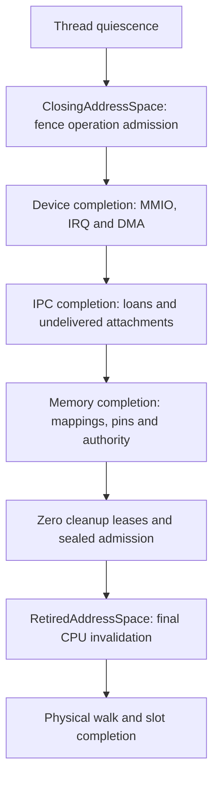

# Cleanup ownership and recovery strategy

Initial inventory reviewed 2026-10-08 against revision `ec8a5383`; updated
2026-10-09 for heap/image abandonment and kernel-range diagnostics. This is the cross-category
coverage map and implementation plan for SEC-18, with SEC-07 accounting
dependencies. It documents current owners separately from required controller
behavior. It adds no recovery API and does not close either finding.

The unit of **design** is a resource/operation category. The unit of **custody**
is one exact owned operation, which may retain several objects and roots.
An IPC cancellation, for example, cannot be split into independent retries for
its token, loans and roots. They form one completion transaction.

## Common lifecycle

Every category must identify these boundaries, even when its representation
differs:

1. Admit resources and retirement storage before publication. Capture exact
   generations, sponsorship, root dependencies and any hardware identity.
2. Claim the operation and fence competing access under subsystem serialization.
   Detach authority or mappings only while a complete owner retains the work.
3. Leave serialization before waiting, invalidating, draining hardware, invoking
   notifications or releasing physical backing. Check the caller's outer guard
   and IRQ context as well as the callee's own guards.
4. Obtain category-specific completion evidence. CPU invalidation, DMA drain,
   scratch completion and thread quiescence are distinct proofs.
5. Consume physical ownership exactly once. Refund only confirmed released
   backing; retain original charges for uncertain or rejected release.
6. Publish completion and return slot/authority admission only where that
   category's proof permits it. Restart/reassignment is a separate policy step.

Three outcomes need different treatment before successful completion:

| Outcome | Permitted continuation |
| --- | --- |
| Unstarted admission rejection | Explicit rollback may restore the exact source and refund unused reservations. A new application operation may subsequently be attempted. |
| Pending or safely retryable work | Continue only with the returned/still-held complete owner and its recorded phase. Retaining backing alone is insufficient. |
| Uncertain cleanup, abandonment or partial physical release | Keep fences and original charges. No adoption from IDs, timeout-based refund, force-clear or replay of physical addresses. |

Quarantine is a safety outcome, not implemented recovery. The ability to call a
function twice is not proof of a valid retry contract.

## Composition order

The current final-root path composes earlier cleanup rather than repairing it:

An error before final detachment leaves the closing lifetime fenced. The
final-root registry cannot recover that earlier operation. Conversely, successful
root retry must not silently turn a supervisor's cached teardown failure into
restart permission. Each completed sub-operation must remain recorded when a
later phase fails; restarting the entire sequence can repeat irreversible work.

## Receipt coverage map

These 18 rows cover the identified CPU-memory, IPC, device and domain-teardown
owner families. They group composing types, not individual allocations. Each
row names its current continuation boundary and a concrete remaining gap.
Source links identify implementation anchors; category contracts contain the
existing regression evidence. **No row means that all its caller contexts have
been qualified.** G1–G7 below are the remaining shared work items.

| ID and category | Current owner / completion boundary | Current continuation and gap |
| --- | --- | --- |
| C01: live root retention | [`AddressSpaceOperation`](../../crates/catten/src/memory/operation.rs), backed by `SlotLease`; explicit `release` completes the exact generation's count. | A dependency, not a cleanup engine. Drop retains the count. Abandoned counts cannot be decremented by a controller. Caller must also own backing, authority and scratch; G2. |
| C02: staged domain close | [`ClosingAddressSpace`](../../crates/catten/src/memory/retirement.rs), `ClosingSlot`, `RetirementProgress` and `CloseProgress`. | Pending returns the same owner. Cleanup errors consume the request and leave its fence/root retained; no general error-owner retry API. Cleanup admission seals only after exact device/IPC/memory completion and zero leases; G2/G5. |
| C03: detached final root | [`RetiredAddressSpace` and root registry](../../crates/catten/src/memory/retirement/recovery.rs), with `id_table::RetiredEntry` and linear slot completion. | Complete failed-invalidation owner has bounded explicit retry: eight slots, two attempts, checked serials. Physical rejection/abandonment is terminal. Trusted kernel hook only; no operator controller or supervisor reconciliation; G5/G6. |
| C04: detached kernel range | [`RetiredKernelRange`](../../crates/catten/src/memory/allocators/memory.rs). | Same mutable receipt can retry failed invalidation before `release_started`. Incomplete detach rejects; physical failure/interruption is terminal. Inline 256-extent preparation, 16-frame release batches. Drop now only records atomic diagnostics; a guarded-drop fixture preserves backing. No retained-owner controller adapter; caller context/dependencies remain G1/G2. |
| C05: memory mapping retirement | [`MappingRetirementPin` and `RetiredObjectMappings`](../../crates/catten/src/memory/object.rs). | Pin, detached mapping records and peer leases prevent early release. Consuming completion does not return a retry owner on detach/invalidation/scratch error. Metadata Drop can destroy mapping storage while pins/counts remain; G1/G2. |
| C06: loan revocation | [`LoanRevocation` and `LeasedRevocation`](../../crates/catten/src/memory/object/revocation.rs). | `cancel_prepared` restores only unstarted admission. Started `finish` consumes the owner; error retains Revoking/pin, not a retry receipt. Direct ordinary error explicitly releases its root leases; abandonment retains them. Other adapters have their own lease policy; G2. |
| C07: reply completion | [`PreparedReply` and `ReturnedConnection`](../../crates/catten/src/ipc/reply.rs), loans, returned-connection claim and returned-memory `PreparedTransfer`. | Ordinary error restores unstarted receipts and unpublished returns, releases leases and leaves failed loan backing fenced. Abandonment retains the reply/source claim and lease counts. Successful publication jointly installs outputs before result visibility. No failed-operation custody adapter; G1/G2. |
| C08: call/reply cancellation | [`PreparedCancellation`](../../crates/catten/src/ipc/cancellation.rs). | Queue/token remain claimed during unlocked revocation. Ordinary failure marks `cleanup_failed`, restores unstarted loans and releases admitted leases without publishing a terminal result. Abandonment retains claim/roots/pins. Consumed failed loan cannot be retried from token IDs; G2. |
| C09: endpoint close | [`PreparedEndpointClose`](../../crates/catten/src/ipc/endpoint_close.rs). | Owns one server lease and processes existing queue storage one call at a time. Ordinary rejection clears the endpoint claim and releases the server lease, but failed call/loan fences remain. Abandonment retains claim/root. No whole-endpoint replay after partial progress; G2/G4. |
| C10: namespace IPC cleanup | [`namespace_close::close_with`](../../crates/catten/src/ipc/namespace_close.rs), borrowing the closing root and composing per-token cancellation. | Pending is resumed by C02. Physical error retains failed token/backing and prevents final-root progress. No separately movable namespace receipt; loan-free removal still uses IPC serialization and metadata destruction; G2/G4. |
| C11: namespace memory cleanup | [`PreparingNamespaceObject`, `PreparedNamespaceObject`, `NamespaceObjectClosed` and `NamespaceMemoryClosed`](../../crates/catten/src/memory/object/namespace_close.rs). | Admit mapped peers in existing records before moving mappings; cancel only unstarted admission. Pending preserves C02. Physical/scratch failure consumes the receipt and retains pins, affected peer counts and closing fence; no controller retry; G1/G2. |
| C12: namespace device cleanup | [`PreparedNamespaceDevices` and `NamespaceDevicesClosed`](../../crates/catten/src/device/retirement.rs). | Borrows C02; owns detached admitted registry storage. Confirmed records are removed one at a time; error/abandonment retains unfinished records/authority. Outer lifecycle/device guards leave before finish, but backend guards are separate. Borrowed owner is not a static custody payload; G2/G3. |
| C13: explicit device/MMIO close | [`close_cap_with` / `close_cap_inner`](../../crates/catten/src/device/mod.rs), an operation lease and reset-visible MMIO descriptor claim. | Uncertain MMIO retains descriptor, scratch and root count after authority detachment. DMA destruction error reinserts its device payload and returns an error. No uniform typed close receipt; IRQ route removal has a distinct serialized boundary. Reinsert/metadata/context proof remains required; G1/G2/G3. |
| C14: DMA domain and requester retirement | [`vt_d::destroy_domain`](../../crates/catten/src/device/vt_d.rs), [`amd_vi::destroy_domain`](../../crates/catten/src/device/amd_vi.rs), [`smmu::destroy_domain`](../../crates/catten/src/device/smmu.rs), registered retiring domains and pins. | Hardware timeout retains backend state; a later backend invocation must still respect table state and command epochs. Completed destruction leaves requester fenced until supported reset. No common phase-aware claim/receipt; hardware wait and table release remain inside backend serialization; G3/G6/G7. |
| C15: IOMMU table backing | [`dma_tables::Tables` and `PreparingRegion`](../../crates/catten/src/device/dma_tables.rs). | Published backing requires explicit backend completion; `Frozen` prevents partial physical retry. Unpublished/region rollback Drop can release backing and take allocator/pool guards. Shared unit tables remain kernel-lifetime owners. No generic table retry; G1/G3. |
| C16: thread retirement and stack pair | [`ReapBatch` / thread retirement](../../crates/catten/src/cpu/scheduler/threads/mod.rs), [`RetirementList`](../../crates/catten/src/klib/collections/retirement_list.rs), [`Stacks`](../../crates/catten/src/memory/thread_stack/stacks.rs) and [`StackSlot`](../../crates/catten/src/memory/thread_stack.rs). | Owning LP defers active contexts; x86 has scheduled IRQ-enabled reapers. Abandoned batches retain nodes/transition. Thread/context/Stacks destruction still drives physical cleanup; failed cleanup retains reservation/root/slot without returning a retry owner. Unpublished slot and initial/growth preparation fallback now retain original admission without guards or cleanup; ordinary cancellation is explicit. ARM enclosing context needs qualification. Atomic user-retirement phase counters and timeout snapshots distinguish observed progress/rejection, without creating a retry owner or fixing the unresolved timeout; G1/G2/G7. |
| C17: provisional CPU backing | [`PreparingUserBacking`](../../crates/catten/src/memory/preparation.rs), [`PreparingTable`](../../crates/catten/src/memory/translation.rs), [`PreparingUserFrame`](../../crates/catten/src/memory/mod.rs), `PreparingKernelFrame` in C04, and `PreparingStackPage` / `PreparingGrowthPage` in C16. | Joint heap/image, raw-frame and private/shared-table Drop now only retain captured backing/admission, including reservation-only abandonment, without locks/free/logging. Shared charge fallback uses an atomic diagnostic. Ordinary errors cancel/rollback explicitly, including Arm hardware-tag rejection; physical rollback still borrows the table/account. Initial/growth stack fallback and implicit slot destruction now also retain without cleanup; ordinary constructor/growth rejection cancels explicitly. Published stack-pair retirement remains C16 work. Borrowed account/table context prevents simply moving these owners to a global registry; G1/G2. |
| C18: publication rollback and detached memory | [`PreparedTransfer`, `PreparedSource`, `ChargedFrames` and `RetiredMemory`](../../crates/catten/src/memory/object.rs), [`PreparedCall` / `PreparedConnection`](../../crates/catten/src/ipc/mod.rs), [`MemoryAttachments`](../../crates/catten/src/ipc/attachments.rs), [`PreparingDomain`](../../crates/catten/src/service/loader.rs), and `PreparedDmaDomain` in C13. | Prepared source rollback is exact; hidden destinations are not externally usable. Detached `RetiredMemory` Drop quarantines; its consuming release has no physical retry. Other preparation destructors can acquire registries, release backing or invoke whole-domain/backend teardown. Copy submission now stages outside IPC, but that is not a universal destructor-context proof; G1/G4. |

Generic `id_table` retirement/lease tokens and `retirement_list` nodes underpin
several rows; they do not establish the payload's quiescence. `FrameRelease`
governs root account refund, not controller authority. Capability reservations
and escrow govern publication rollback, not hardware recovery. None should be
wrapped as an independently retryable object while its containing operation owns
the physical progress.

Existing contracts and evidence: [live operations](live-address-space-operations.md),
[final roots](address-space-retirement.md), [root retry](root-recovery.md),
[kernel ranges](kernel-frame-retirement.md), [memory/IPC](memory-object-retirement.md),
[thread retirement](thread-retirement.md), [stacks](stack-admission.md),
[translation](translation-admission.md), [IOMMU admission](iommu-table-admission.md)
and [hardware quiescence](hardware-quiescence.md).

### Entry boundaries checked in this review

| Entry | Observed local boundary | Qualification still needed |
| --- | --- | --- |
| `DomainTeardown::poll` → `ClosingAddressSpace::poll` | Supervisor documents guard-free entry; Pending retains one owner, terminal error is cached. Close prepares under lifecycle/table and finishes device, loan and mapping work after leaving its own guards. | Every deployment/node/device/loader caller and exceptional field drop; cached-error correlation; backend inner guards. |
| `recovery::retry` → final root release | IRQ-enabled check precedes claim. Registry guard leaves before invalidation/physical walk and completion disarms abandonment before reuse. | Absence of unrelated nonmasking guards is a caller obligation, not enforced by the IRQ check. Operator policy is absent. |
| `close_cap_inner` → MMIO/DMA cleanup | Device payload/claim is taken under lifecycle/device registry; lifecycle leaves before invalidation or backend destroy. | DMA backend serialization; reinsertion allocation on failure; every syscall/fixture caller's outer state. |
| `PreparedReply` / `PreparedCancellation` → `LoanRevocation::finish` | Root admission precedes IPC; claim persists while IPC/lifecycle/registry/table guards leave for loan finish. | Outer caller masks, metadata/implicit field destruction, and custody of consumed failures. Ordinary error and abandonment have different lease policies. |
| `PreparedNamespaceObject::finish` | Peer leases precede record detachment; fixed frame batches avoid registry/table nesting. Completion releases peers only after scratch/backing success. | Exceptional mapping-storage destruction and outer context; per-phase retry ownership is absent. |
| `PreparingUserBacking::new` / `map_with` / Drop | Production heap first-touch and image loader retain the exact table borrow. Ordinary tracking/allocation rejection refunds explicitly; mapper rejection explicitly rolls back. Fallback Drop only mutates captured account counts and disarms tokens; probes hold the table, allocator and original pool simultaneously. | Ordinary physical rollback still occurs under the known table guard. Published stack-pair destructor contexts remain unqualified; this scoped fallback change does not close C17/G1. |
| `PreparingTable::allocate` / `publish` / Drop | x86 root/intermediate and Arm intermediate publication follow zeroing without further fallible work. Arm lazy-root tag rejection explicitly cancels. Fallback and implicit shared charge Drop use only the captured account/atomic state; probes hold both table guards, allocator and private/shared pools. | Explicit cancellation/constructor refunds still borrow the table/account; no global custody owner exists for those borrows. Simulated interruption does not qualify all architecture caller contexts or stack wrappers. |
| `PreparingStackPage` / `PreparingGrowthPage` / implicit `StackSlot` destruction | No allocator, table/pool/root lookup, callback or logger on fallback. Ordinary initial/growth mapping rejection cancels after its local address-space table guard leaves. Growth failure/abandonment fences the borrowed containing stack; slot/page cancellation consumes exact admission explicitly. | `grow_current_user_stack` retains the master thread-table write guard through growth, including ordinary physical rollback. Constructor callers and exceptional thread/context/published-stack destruction still need qualification. No complete retry owner survives abandoned provisional cleanup. |
| backend `destroy_domain` → `Tables::release` | `with_unit` / `with_smmu` holds its mutex through context invalidation/drain and physical table release. Pin collections are consumed after that guard leaves. | Backend mutex separation is not supplied by releasing the outer device/lifecycle guards; G3 is required. |
| `reap_dead_threads_with` → `RetiredEntry::release` → thread/context/stack Drop | Deferred thread list guard leaves before payload destruction. x86 scheduled reapers provide IRQ-enabled execution; active-stack/LP checks prevent premature reclamation. | Other thread destruction/preparation failures. ARM `cond_yield_lp` invokes reaping before restoring its incoming IRQ state; outside the scheduler guards does not mean IRQ-enabled. |

This table records source observations, not a proof that all entries are safe.
In particular, no universal destructor safety claim follows from the common
lifecycle above. Existing physical-release destructors need explicit context
qualification or replacement under G1.

### Coverage boundary

This is an owner-family inventory, **not completion of R18-1's full call-chain
audit**. It does not yet enumerate every outer lock, interrupt state, allocation
or implicit field destructor at every production call site. CQ/completion/timer/
waiter/watch cancellation, scheduler migration storage, IRQ infrastructure,
kernel heap/arena metadata, supervisor upgrade/observer preparation and service
local/protocol owners must be included in that wider audit. Their existing
admission contracts do not automatically qualify their exceptional destructors.
R7-1's byte/principal allocation inventory is also still separate work.

Inherited boot roots/stacks and runtime shared kernel/IOMMU unit backing are
explicit lifetime exclusions from *ordinary domain recovery*, not exclusions
from locking or admission review. Boot-fixture serialized adapters are evidence
fixtures and cannot become production recovery fallbacks. Physical platform
qualification remains R18-6; this plan targets QEMU first.

## Shared recovery controller contract

The following is the **required design**, not an implemented controller.
Share custody and policy machinery; keep physical operations and proofs typed.
Do not introduce an erased callback plus scalar object ID as a recovery owner.

| Shared responsibility | Required rule |
| --- | --- |
| Admission and custody | Fixed/admitted storage, original sponsor and a complete owner. Capacity rejection returns that owner after unlock. Never allocate an unbounded spill queue or reserve anew after failure. |
| Identity | Category-qualified, registry-qualified, nonwrapping ticket/serial; any external reference also binds the boot/node identity. A diagnostic ticket is not mutation authority. |
| Claim and attempt | One exclusive attempt, stable abandonment storage and finite per-category quota. Claim only after policy/context checks; unlock before adapter work. Busy/stale/masked/terminal rejection cannot change physical state. |
| Phase-aware outcome | Adapter returns the same complete owner only for a proven retryable phase, or a consuming completion proof. Fenced, exhausted, physical-partial and abandoned outcomes remain distinct terminal states. Do not invent a completion receipt from an error code. |
| Dependencies | Retain exact root/peer/loan/device owners as one operation until their completion rules allow release. Borrowed namespace receipts need a containing owned transaction, not lifetime erasure or a pointer to a dropped parent. |
| Drop and interruption | No wait, physical release, logger, arbitrary callback or lock acquisition in the custody/attempt Drop path. Disarm abandonment under serialization before publishing a reusable slot. Adapter and implicit field destructors need their own context proof. |
| Scheduling | Bounded attempts and work admission, no busy loop; a finite frame batch is not a latency guarantee. Establish a measured deadline and essential-service progress budget per adapter. Never enable IRQs under an unknown outer mask. |
| Diagnostics | Capability-scoped bounded snapshots distinguish waiting, running, exhausted, completed, quarantined and abandoned state, plus capacity loss. State counts and original-charge counts are not cumulative recovery/refund totals. Diagnostic addresses are never adoption inputs. |
| Mutation authorization | Separate authority from `SystemObserver`. Authorize target/category/action under authenticated node/operator identity, bind freshness and exact failure episode, limit submission and retain an auditable outcome. Remote mutation waits for SEC-08/10 transport/identity boundaries. |
| Supervisor reconciliation | Correlate completion to the exact teardown episode and its dependencies. Explicitly reconcile cached failure only after every required proof; independently authorize restart/reassignment. Root recovery alone does not acknowledge device reset or thread shutdown. |

The existing root registry supplies a working custody/claim example, not a
universal capacity or quota policy. Extract common storage/claim code only when
a second fully owned adapter demonstrates reuse. An enum of typed owners or a
generic custody container is acceptable then; a universal destructive `Drop`
or unconditional `retry` trait is not. Category budgets must include retained
quarantine and fit the node and eventual logical-principal ceilings (R7-3).

No controller may recover lost owners, clear Revoking/closing/in-flight fences,
force-decrement leases, refund uncertain backing or retry a partial physical
walk. A future stronger reset/reboot contract requires separate platform proof;
it is not a fallback transition in this controller.

## Named gaps and acceptance gates

These work items replace adding registries category by category without a
coverage decision. They refine existing R18/R7 deliverables; they add no new SEC
finding numbers or closure claims.

| Gap | Required change and acceptance evidence |
| --- | --- |
| G1: destructor and outer-context qualification | Inventory all production callers/implicit field drops for C01–C18 and the wider coverage boundary. Start with remaining C16/C17/C15/C18 destructors; joint heap/image, raw-frame/table and initial/growth stack/slot fallback plus C04 logging are corrected in the scoped evidence below. Published stack destruction and ordinary rollback callers remain separate. Move unsafe cleanup to explicit admitted owners or prove the specific context; abandonment must retain state without cleanup. Test rejection/abandonment while the relevant guards are held. ARM reaper context must be included. Complete R18-1 only when the call-site inventory has no unexplained entry. |
| G2: recoverable owner boundaries | For each row, classify every phase as unstarted rollback, Pending, owner-preserving retry or terminal retention. Consumed failed receipts in C02/C05–C12/C16 cannot enter custody today. Where retry is justified, return/retain the complete typed transaction with recorded progress and dependencies; otherwise document permanent fencing. Test no repeated detach/scratch completion/physical release and no stale-generation access. Do not make every category retryable. |
| G3: backend phase separation | In all three IOMMU backends, own/fence the domain and command completion state before releasing backend serialization for maintenance and table teardown. Preserve command queues after timeout and requester fences through reset. Prove concurrent create/map/unmap/destroy/reset cannot steal the claim; allocator/backend guards must be available at cleanup boundaries. Separate physical table rejection from retryable maintenance rejection. |
| G4: publication and metadata destruction | Enumerate allocation/destruction below IPC/device/lifecycle guards, including prepared transfers, calls, attachments, observer metadata and DMA reinsertion. Admit storage before mutation and move destruction outside serialization where required; preserve source escrow and hidden delivery. Validate success and ordinary rollback plus abandonment. Coordinate with R7-1/2 rather than declaring logical admission a general heap bound. |
| G5: supervisor completion correlation | Preserve exact teardown episode/dependency state through custody and cached errors. Add an explicit completion reconciliation path with tests for stale tickets, concurrent polls, a completed root with failed earlier cleanup, and recovery without authorized restart. Never clear a cached error solely because an ASID is absent or reusable. |
| G6: common custody and authorized policy | After G1–G3 establish a second eligible complete owner, reuse bounded custody/claim/diagnostic primitives instead of creating another unrelated registry. Define target authority, freshness, quotas and outcome admission before exposing mutation. Test capacity/serial exhaustion, competing claims, unauthorized/stale requests and terminal rejection. SEC-08/10 remains a dependency for external operator access. |
| G7: integrated qualification | Run the R18-5 concurrency matrix with R7 pressure/progress constraints on VT-d, AMD-Vi and SMMUv3. Include actual outstanding I/O for R18-4, maintenance timeout, lost/stale CPU acknowledgement, peer close, interrupted publication and partial release. Assert exact charges, no early reuse and measured essential progress; per-category isolated successes are insufficient. |

### Implementation order and stopping criteria

Scoped progress: the [2026-10-09 abandonment change](../reports/audits/2026-10-09-security-preparation-abandonment.md)
separates ordinary rollback from `PreparingUserBacking` fallback. The fallback
retains frames and exact original charges without pool/allocator/table access,
even before allocation; ordinary constructor errors refund unused reservation
and explicit cancellation reports physical failure. `RetiredKernelRange` fallback
no longer logs. These update C17/C04 under G1 without adding any custody registry.

The [table/raw-frame abandonment change](../reports/audits/2026-10-09-security-table-abandonment.md)
extends that fallback contract to private/shared table preparation and raw
frames, with explicit normal cancellation and Arm hardware-tag rejection.
Guarded probes retain eight physical frames and eight table charges, including
two reservation-only charges. User-stack phase counters and fixture timeout
snapshots improve evidence for C16 without changing its cleanup owner boundary.

The [stack preparation correction](../reports/audits/2026-10-09-security-stack-preparation-abandonment.md)
extends the same retention rule to initial/growth page preparation and implicit
slot/lease/charge destruction. Explicit cancellation preserves normal allocation
and mapping rejection, including ordinary growth allocation failure. Guarded
probes retain sixteen original roots/slots and 272 reservation pages, with ten
provisional frames; successful committed-prefix cleanup cannot refund abandoned
growth admission. No extra registry or retry authority is introduced. Published
stack retirement, constructor failure after publication and growth's enclosing
master thread-table guard remain C16/C17/G1/G2 work.

The first Intel execution also retained a user-stack lease until its fixture
deadline; subsequent traced and untraced executions did not reproduce it. Its
cause remains unresolved. Record that progress failure under C16/G1/G2/G7 rather
than extending the deadline, clearing the lease or treating fresh-run success
as proof of general recovery. The report retains the failed execution evidence.

1. **Complete the context inventory and owner classification (G1/G2).** Record
   every known family and wider call-site exclusion. Prioritize stack reaping,
   provisional backing and hardware preparation, which still contain implicit
   cleanup. This checkpoint is reached only when each production entry has its
   outer guards/IRQ state, phase result and destructor behavior accounted for.
2. **Separate backend work and qualify one further complete receipt (G3).**
   C04 kernel ranges are a candidate for shared custody, but only when their
   caller retains the enclosing stack/admission dependencies where applicable
   and their Drop/context issues are resolved. Do not register a range alone
   and thereby lose its stack reservation/root. Backend recovery remains typed.
3. **Consolidate custody and reconciliation (G5/G6), with G4 storage admission.**
   Reuse the tested claim/serial/terminal-state protocol. Implement trusted local
   policy first; external authenticated control is a separate security milestone.
   No checkpoint authorizes a general quarantine reclamation operation.
4. **Execute combined QEMU pressure/recovery evidence (G7).** Keep physical
   qualification explicitly open. SEC-18 closure still requires all its original
   deliverables, including R18-6; this map does not reduce their acceptance bar.

Every subsequent cleanup/recovery change must update its row, named gap and
evidence. Add a row only for a newly introduced owner family or a genuinely
different completion contract. A new object instance is not a new work item.
