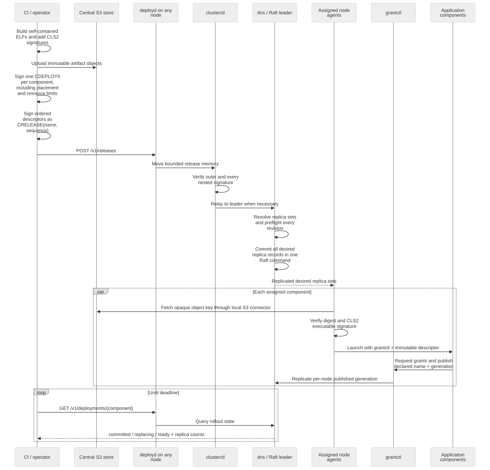

# Signed deployment notification

CharlotteOS has a bounded off-cluster notification path for software already
placed in a centrally managed S3-compatible object store. The management
request carries a signed deployment descriptor, not the ELF and not object
store credentials.

## Operational flow

1. Build a self-contained CharlotteOS ELF and sign its CLS2 note with the
   offline cluster private key.
2. Calculate the SHA-256 of the final signed ELF.
3. Upload those immutable bytes from CI or an operator workstation to the
   central RustFS, Dell EMC ECS, or other compatible store.
4. Create a `CDEPLOY5` descriptor with `cluster-sign deployment-sign`. It binds
   the logical artifact name, exact digest, opaque object key, target node key,
   monotonic sequence, per-thread stack allocation in 4 KiB pages, maximum
   active-thread count, cooperative shutdown grace, placement policy, and
   named capability grants.
5. Submit it with `cluster-sign deployment-notify <descriptor> [host:port]`.
6. Observe the exact generation with
   `cluster-sign deployment-status <artifact-name> [host:port] [wait-seconds]`.

For a release containing several independently signed components, the host
tool can prevalidate every descriptor, submit them, and wait for the complete
set in one invocation:

```text
cluster-sign deployment-apply 127.0.0.1:8081 120 \
  ingest.cdep validate.cdep publish.cdep
```

Artifacts must already have been signed and uploaded. The command rejects a
malformed descriptor or duplicate artifact name before submitting anything,
then reports acceptance and generation-safe readiness for each component.

The normal network-and-storage service set starts `clusterctl`, `agent`, and
`deployd`. `deployd` listens on guest TCP port 7444. The QEMU runners forward
`${CATTEN_DEPLOY_HOST_PORT:-8081}` to that port under the default user network,
so the host tool defaults to `127.0.0.1:8081`.

For the current demonstration service, the final signing steps resemble:

```text
cluster-sign deployment-sign greet.cdep greet releases/greet-42.elf \
  <sha256-of-signed-elf> 0 42 4 1 5000 <private-key-hex> \
  greet=publish
cluster-sign deployment-notify greet.cdep 127.0.0.1:8081
cluster-sign deployment-status greet 127.0.0.1:8081 120
```

For three distinct replicas, bless the ELF with
`FLAG_PARALLEL_INSTANCES`, use node key zero, and add placement options before
the grants:

```text
cluster-sign deployment-sign orders.cdep orders releases/orders-42.elf \
  <sha256-of-signed-elf> 0 42 8 8 15000 <private-key-hex> \
  --replicas=3 --spread-replicas --anti-affinity-group=42 orders=publish
cluster-sign release-sign orders.crelease orders 42 <private-key-hex> orders.cdep
cluster-sign release-apply orders.crelease 127.0.0.1:8081 120
```

A successful notification returns HTTP `202 Accepted` and JSON containing the
committed Raft deployment generation. Repeating the exact same descriptor is
idempotent. A lower signed sequence, or different signed bytes at the same
sequence, returns HTTP `409 Conflict`.

The `4 1 5000` between the deployment sequence and private key in the example means
four 4 KiB stack pages per thread and at most one active thread, including the
bootstrap thread, with five seconds to drain before forced retirement. Valid
`CDEPLOY5` execution values are 1 through 64; shutdown grace is zero through
300,000 milliseconds. All three values are signed and enforced exactly by the kernel; values outside those
ranges are rejected rather than clamped. A thread publication beyond the
signed quota aborts that protection domain under the current fail-closed spawn
ABI. The release pipeline should take all three requirements from the signed,
developer-reviewed component plan. For compatibility, `CDEPLOY1` is interpreted
as four pages and 16 threads, while `CDEPLOY2` retains its signed stack pages
and receives the 16-thread default. `CDEPLOY3` receives the five-second
shutdown compatibility default. `CDEPLOY4` retains all three values and
decodes with singleton placement.

`deployment-apply` is currently release orchestration, not atomic bundle
admission. Each descriptor is a separate Raft entry, so a transport or policy
failure can leave an accepted prefix of the release committed. Rerunning the
same command is safe because identical descriptors are idempotent. A future
signed process-bundle controller must still supply coordinated rollback and
the complete process-level policy described below.

## Atomic component releases

For all-or-nothing admission, wrap the independently signed descriptors in a
signed `CRELEASE` envelope and apply that envelope instead:

```text
cluster-sign release-sign orders.crelease orders 42 <private-key-hex> \
  ingest.cdep validate.cdep publish.cdep
cluster-sign release-verify orders.crelease <public-key-hex>
cluster-sign release-apply orders.crelease 127.0.0.1:8081 120
```

The outer signature binds the release name, monotonic release sequence, and
exact ordered descriptor bytes. Every nested deployment signature is also
verified against the cluster key; current tooling emits `CDEPLOY5`, while the
reader retains `CDEPLOY1` through `CDEPLOY4` compatibility. An envelope is limited
to 16 distinct artifact names and 3,584 bytes so it, its IPC envelope, and the
leader-resolved node assignments remain bounded.

`deployd` accepts the envelope at `POST /v1/releases`. The request can enter
through any member; a follower source-validates and correlates its relay to the
leader. The leader resolves every zero node key and signed placement policy,
then proposes all concrete replica sets as one Raft command. The replicated state machine preflights the release and
all component sequences while holding the deployment map, then changes either
all desired deployments or none. Exact retries return the existing release
generation, and catalog snapshots retain the signed release and replica records.

Atomic admission does not mean simultaneous readiness. Node agents reconcile
the newly visible desired records independently, and `release-apply` waits for
each exact deployment generation. A fetch or launch failure can therefore
leave a release committed but not ready; automatic rollback and rollout policy
remain controller work. `CRELEASE` binds executable deployment decisions, not
yet the BPMN digest, schemas, provenance graph, or other
semantic content of a complete Durga process bundle.



The request may enter through any cluster member. A follower's DNS validates
the reliable-message source as a current peer, relays the bounded request to
the current Raft leader, and correlates the committed result back to the HTTP
request. The release client therefore does not need to discover the leader.

`GET /v1/deployments/{percent-encoded-artifact-name}` reports `committed`,
`replacing`, or `ready`. Readiness is generation-safe: each ready count
represents a distinct desired node whose active distributed registration
carries the exact deployment generation. The JSON response includes
`desired_replicas` and `ready_replicas`; `ready` means the full desired set is
ready. A stale endpoint with the same logical name therefore cannot satisfy a
newer rollout.

A node key of zero asks the cluster to apply the signed placement policy. A
singleton prefers the current Raft leader and moves to a deterministic
fallback when it is draining; fixed replica counts and
`every eligible node` select from admitted, non-draining voters. The leader
reconciles automatic sets after membership changes. A nonzero key remains an
explicit singleton pin. Replica policies must be submitted in a `CRELEASE`, so
the planner can honor cross-component affinity and anti-affinity consistently.
The descriptor name may use the complete
CLS2 limit of 48 bytes; it is no longer restricted by the old scalar-name ABI.

## Cluster ingress policy

Production VIPs are operations data rather than application-descriptor data.
The independent operations authority signs a complete `CINGPOL1` assignment
table, scoped to the cluster ID and a bounded UTC interval:

```text
cluster-sign ingress-policy-sign ingress.cing 7 NOT_BEFORE_UNIX EXPIRES_UNIX \
  CLUSTER_ID operations-private.hex \
  orders=10.0.2.42:443 payments=10.0.2.43:443
cluster-sign ingress-policy-verify ingress.cing CLUSTER_ID operations-public.hex
cluster-sign ingress-policy-notify ingress.cing 127.0.0.1:8081
cluster-sign ingress-policy-status 127.0.0.1:8081
```

`deployd` accepts the envelope at `POST /v1/ingress-policy`. A follower
source-validates and correlates the request while the leader verifies the
operations key, cluster ID, and validity interval against trusted UTC. The
complete replacement then enters Raft. Exact retries are idempotent; lower
sequences and conflicting reuse of a sequence fail. Use `--clear` in place of
the assignment list to sign an explicit empty-table withdrawal. The UTC range
bounds admission and replay of the envelope; a committed policy remains desired
state until a newer record replaces it.

The applied policy supersedes the runner's launch-time bootstrap table. DNS
materializes placement/readiness independently for every named service, the
frame router reconciles its leased epochs and flow tables by stable service
identity, and TCP/IP reconciles the node's `/32` VIP addresses. Catalog-v14
snapshots retain the envelope and replay generation. Applications do not
receive the operations key or production configuration; an application with
an attenuated DNS grant can poll `dns::ingress_assignments` and rebind an
exact-address listener after a change.

`GET /v1/ingress-policy`, wrapped by `ingress-policy-status`, reports the
catalog generation, signed sequence, assignment count, and admission validity
interval without exposing signing material.

## Trust and secret boundary

The HTTP listener is plaintext by design: the Ed25519-signed descriptor is the
authorization and integrity envelope and contains no secret. `clusterctl`
forwards only a structurally valid envelope; the DNS leader verifies its
signature and admission context before proposing state to Raft. Plaintext still
reveals deployment metadata and does not prevent connection-level denial of
service, so production networks should restrict the listener or place it behind
an authenticated TLS gateway when those properties matter.

The descriptor contains only an opaque object key. Endpoint addresses, bucket,
prefix, access credentials, Dell EMC ECS namespace, CA certificate, and TLS
client identity remain in the node's separately provisioned S3 profile. The
application receives neither that profile nor ambient name-service authority.

The encrypted operational-binding foundation now comprises `COPSENC1`, the
separate operator-signed `COPSBND2` admission proof, role-aware public launch
trust, host tooling, leader verification, follower relay and compact
replay-fenced catalog state. It binds an encrypted S3 or Kafka profile to a
cluster, exact release, target connector and central-object-store key. Submit a
bundle with `operations-bundle-notify` to `POST /v1/operations`. Admission fails
closed without trusted UTC and places neither ciphertext nor plaintext in
Raft. The assigned node agent now fetches the digest-pinned envelope through
its separately provisioned bootstrap S3 capability and moves a bounded pickup
package to a deployment-agent-only kernel gate. The kernel re-verifies the
signed release and exact descriptor membership, artifact identity, envelope
context and expiry, opens HPKE into zeroizing memory, validates the selected
S3/Kafka profile codec, and moves the profile read-only into the connector.
Plaintext never returns through agent or application IPC. The bootstrap S3
connector, production recipient-key custody, rotation and readiness-driven
replacement remain separate operational concerns. The trust model, format and
staged integration plan are in
[Deployment secrets and the development/operations boundary](../architecture/deployment-secrets-and-operations.md).

## Node-side pickup

Raft stores the signed descriptor with the assignment. The selected node agent
opens its local `s3` capability, streams the object, checks length and the
descriptor's SHA-256, verifies that CLS2 signs the ELF for the same artifact
name, and transfers both owning memory objects to the kernel. The kernel repeats
the checks and launches the ELF with only `grantctl` and the immutable
descriptor. An exact `publish` grant lets a service publish its endpoint
without obtaining name-service or mint authority.

## Reconciliation and current limits

Each node agent enumerates the replicated desired-deployment set. It can own
up to 64 independently named application domains, launches assignments for
its node, and fences each retirement by the stable artifact principal and
deployment generation. A `DeployedArtifact` owner in `catten_rt::owned`
retains the retirement obligation and requests best-effort retirement on
drop. The limit is a kernel admission bound, not a protocol-name limit.

- The bootstrap S3 connector and credentials must be provisioned before
  notification. It is also the privileged retrieval path for encrypted
  operational envelopes and cannot configure itself without a lower-level
  provisioning source.
- Automatic placement handles leader-preferred singletons, fixed replica sets,
  every-eligible-node policy, affinity/anti-affinity, and membership- or
  drain-driven rescheduling. Capacity-aware selection, named failure-domain
  spreading, multiple instances of one artifact per node, and rolling
  replacement remain future controller work.
- `scripts/run-aarch64.sh --deployment-ingress-test --timeout 240` automates a
  TLS RustFS upload → signed atomic release → S3 pull → scoped launch →
  readiness path.
  It is a development fixture, not a production release controller.

The fixture deploys the bundled `greet` artifact by default and accepts any
externally signed ELF through environment overrides:

```text
CATTEN_DEPLOY_NAME=<artifact> CATTEN_DEPLOY_ELF=<path> \
CATTEN_DEPLOY_OBJECT_KEY=deployments/<file>.elf \
CATTEN_DEPLOY_STACK_PAGES=<n> CATTEN_DEPLOY_MAX_THREADS=<n> \
CATTEN_DEPLOY_GRACE_MS=<ms> \
CATTEN_DEPLOY_GRANTS="<service>=client <artifact>=publish" \
CATTEN_APP_HOST_PORT=<host-port> CATTEN_APP_GUEST_PORT=<guest-port> \
CATTEN_APP_HOLD_SECONDS=<seconds> \
scripts/run-aarch64.sh debug --deployment-ingress-test --timeout 300
```

The ELF must already carry a CLS2 note from the cluster artifact key, since the
fixture signs the descriptor, not the binary. `CATTEN_APP_HOST_PORT` and
`CATTEN_APP_GUEST_PORT` add a SLIRP forward so a host client can reach the
deployed service; `CATTEN_APP_HOLD_SECONDS` keeps the guest alive after
readiness so that client can run before the runner exits. Out-of-tree projects
drive this through `charlotte-kafka-broker/tools/qemu-smoke.sh`, which packages
the artifact, deploys it, and runs the host smoke client end to end.
